# General


### Importing library 

```python
import matplotlib as mpl
import matplotlib.pylab as plt
```


### Font Setting

**1. See font list**

* see all

```python
[f.name for f in mpl.font_manager.fontManager.ttflist]
```

> ['STIXSizeThreeSym', 'DejaVu Sans', ..., 'Franklin Gothic Medium', 'NanumSquareRound']


* see Nanum fonts

```python
[f.name for f in mpl.font_manager.fontManager.ttflist if 'Nanum' in f.name]
```

> ['NanumSquare', 'NanumMyeongjo', ..., 'NanumBarunGothic', 'NanumSquareRound']


**2. Set font**

* 전역 설정

```python
mpl.rc('font', family='NanumGothic', size=10)		# 폰트 설정
mpl.rc('axes', unicode_minus=False)					# 유니코드에서  음수 부호설정

plt.plot([10, 20, 30, 40], [1, 4, 9, 16])
plt.title('한글 제목')
plt.xlabel('엑스 축')
plt.ylabel('와이 축')
plt.show()
```

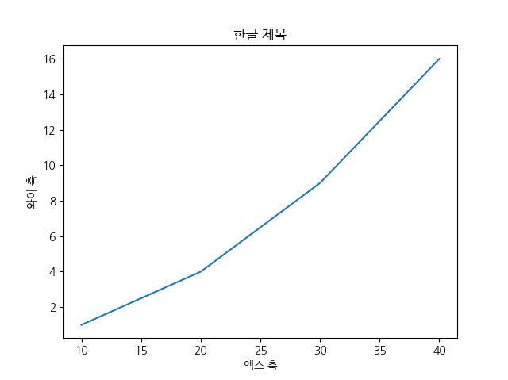

* 지역 설정

```python
font1 = {'family': 'NanumMyeongjo', 'size': 24, 'color':  'black'}
font2 = {'family': 'NanumBarunpen', 'size': 18, 'weight': 'bold','color':  'darkred'}
font3 = {'family': 'NanumBarunGothic', 'size': 12, 'weight': 'light','color':  'blue'}

plt.plot([10, 20, 30, 40], [1, 4, 9, 16])
plt.title('한글 제목', fontdict=font1)
plt.xlabel('엑스 축', fontdict=font2)
plt.ylabel('와이 축', fontdict=font3)
plt.show()
```

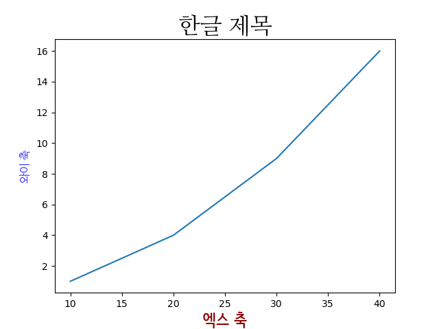


### Creation

```
fig = plt.figure()  # an empty figure with no Axes
fig, ax = plt.subplots()  # a figure with a single Axes
fig, axs = plt.subplots(2, 2)  # a figure with a 2x2 grid of Axes
```

```
import matplotlib.pyplot as plt
fig = plt.figure()
ax = fig.add_subplot(2, 1, 1) # two rows, one column, first plot
```

```
fig2 = plt.figure()
ax2 = fig2.add_axes([0.15, 0.1, 0.7, 0.3])
```


### Subplots

```python
x1 = np.linspace(0.0, 5.0)
x2 = np.linspace(0.0, 2.0)
y1 = np.cos(2 * np.pi * x1) * np.exp(-x1)
y2 = np.cos(2 * np.pi * x2)

ax1 = plt.subplot(2, 1, 1)				# 2,1 에서 1번째, plt.subplot(211)도 가능
plt.plot(x1, y1, 'yo-')
plt.title('A tale of 2 subplots')
plt.ylabel('Damped oscillation')
print(ax1)

ax2 = plt.subplot(2, 1, 2)				# 2,1 에서 1번째
plt.plot(x2, y2, 'r.-')
plt.xlabel('time (s)')
plt.ylabel('Undamped')
print(ax2)

plt.tight_layout()
plt.show()
```

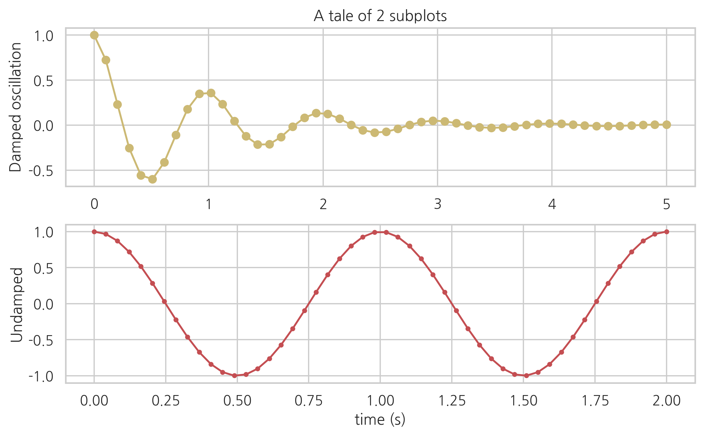


```
fig, axes = plt.subplots(2, 2)

np.random.seed(0)
axes[0, 0].plot(np.random.rand(5))
axes[0, 0].set_title("axes 1")
axes[0, 1].plot(np.random.rand(5))
axes[0, 1].set_title("axes 2")
axes[1, 0].plot(np.random.rand(5))
axes[1, 0].set_title("axes 3")
axes[1, 1].plot(np.random.rand(5))
axes[1, 1].set_title("axes 4")

plt.tight_layout()
plt.show()
```

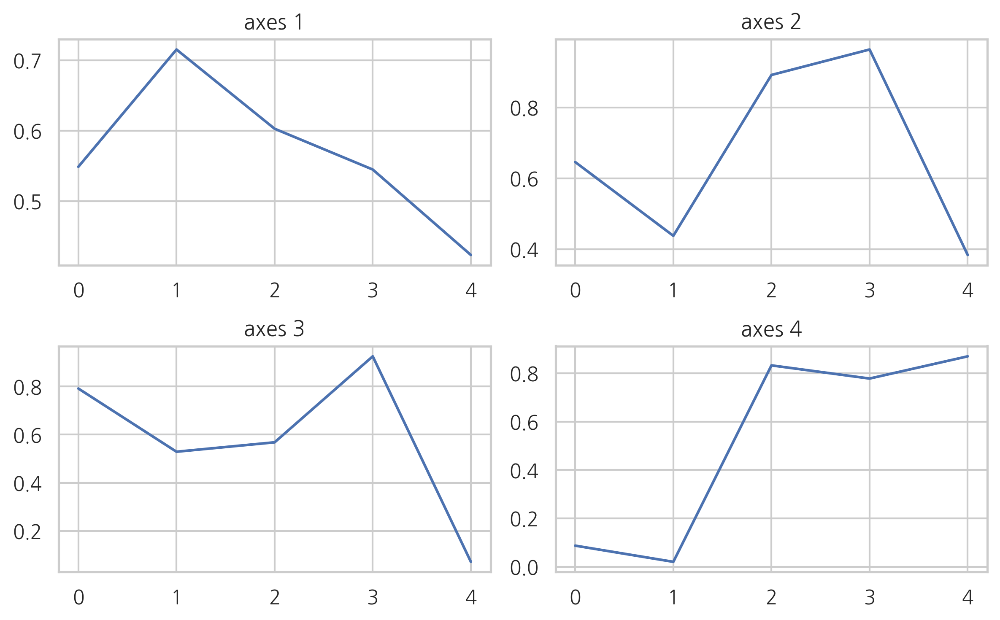


### Figure Properties

```
plt.rcParams["figure.figsize"] = (14,4)
```


### Axes Properties

pass


### Axis properties

**1. change axis limit**

```
Axes.set_xlim()
Axes.set_ylim()

plt.axis()
```


```python
plt.title("Change axis limit")
plt.plot([10, 20, 30, 40], [1, 4, 9, 16])
plt.axis([0, 50, -10, 30])					# [xmin, xmax, ymin, ymax]
plt.show()
```

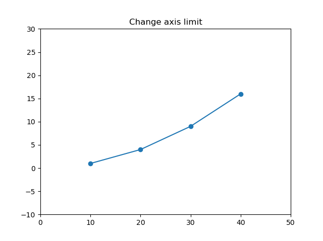

* Alternatives

```python
#1
plt.axis(xmin=0, xmax=50, ymin=-10, ymax=30)

#2
plt.xlim(0, 50)
plt.ylim(-10, 30)
```


**2. change ticks**

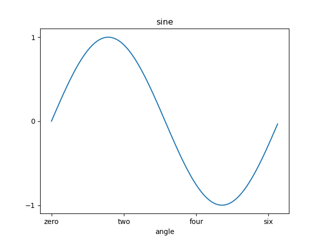

* axis based

```python
fig, ax = plt.subplots()
x = np.arange(0, np.pi*2, 0.05)
y = np.sin(x)
ax.plot(x, y)
plt.xlabel('angle')
plt.title('sine')

ax.xaxis.set_ticks([0,2,4,6])
ax.xaxis.set_ticklabels(['zero','two','four','six'])
ax.yaxis.set_ticks([-1,0,1])

plt.show()
```


* axes  based

```python
x = np.arange(0, np.pi*2, 0.05)
y = np.sin(x)

fig, ax = plt.subplots()
ax.plot(x, y)
ax.set_xlabel('angle')
ax.set_title('sine')

ax.set_xticks([0,2,4,6])
ax.set_xticklabels(['zero','two','four','six'])
ax.set_yticks([-1,0,1])

plt.show()
```


* plt based

```python
x = np.arange(0, np.pi*2, 0.05)
y = np.sin(x)
ax.plot(x, y)
plt.xlabel('angle')
plt.title('sine')

plt.xticks([0,2,4,6],['zero','two','four','six'])
plt.yticks([-1,0,1])

plt.show()
```


* 고오급 스킬

```
ax.xaxis.set_major_locator(mpl.dates.DayLocator())						# major tick 위치를 Day로
ax.xaxis.set_minor_locator(mpl.dates.HourLocator(range(0, 25, 6)))		# minor tick 위치를 6시간 단위로
ax.xaxis.set_major_formatter(mpl.dates.DateFormatter('%Y-%m-%d'))		# major tick label 형식
```


**3. scale**

```
set_xscale(value, **kwargs)
set_yscale(value, **kwargs)
```


```python
y=x=np.linspace(0,1,100, endpoint=False)

fig, axs = plt.subplots(2, 2, tight_layout=True)

# linear
ax = axs[0, 0]
ax.plot(x, y)
ax.set_yscale('linear')
ax.set_title('linear')
ax.grid(True)

# log
ax = axs[0, 1]
ax.plot(x, y)
ax.set_yscale('log')
ax.set_title('log')
ax.grid(True)

# symmetric log
ax = axs[1, 1]
ax.plot(x, y - y.mean())
ax.set_yscale('symlog', linthreshy=0.02)
ax.set_title('symlog')
ax.grid(True)

# logit
ax = axs[1, 0]
ax.plot(x, y)
ax.set_yscale('logit')
ax.set_title('logit')
ax.grid(True)

plt.show()
```

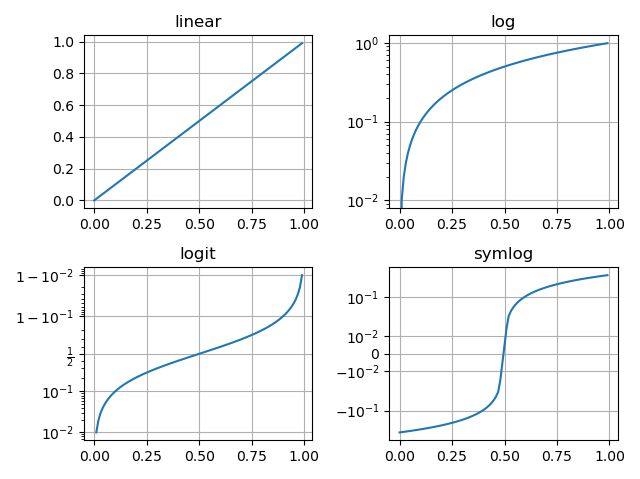


### Text

| Property                                                     | Description                                                  |
| ------------------------------------------------------------ | ------------------------------------------------------------ |
| [`agg_filter`](https://matplotlib.org/api/_as_gen/matplotlib.artist.Artist.set_agg_filter.html#matplotlib.artist.Artist.set_agg_filter) | a filter function, which takes a (m, n, 3) float array and a dpi value, and returns a (m, n, 3) array |
| [`alpha`](https://matplotlib.org/api/_as_gen/matplotlib.artist.Artist.set_alpha.html#matplotlib.artist.Artist.set_alpha) | float or None                                                |
| [`animated`](https://matplotlib.org/api/_as_gen/matplotlib.artist.Artist.set_animated.html#matplotlib.artist.Artist.set_animated) | bool                                                         |
| [`backgroundcolor`](https://matplotlib.org/api/text_api.html#matplotlib.text.Text.set_backgroundcolor) | color                                                        |
| [`bbox`](https://matplotlib.org/api/text_api.html#matplotlib.text.Text.set_bbox) | dict with properties for [`patches.FancyBboxPatch`](https://matplotlib.org/api/_as_gen/matplotlib.patches.FancyBboxPatch.html#matplotlib.patches.FancyBboxPatch) |
| [`clip_box`](https://matplotlib.org/api/_as_gen/matplotlib.artist.Artist.set_clip_box.html#matplotlib.artist.Artist.set_clip_box) | [`Bbox`](https://matplotlib.org/api/transformations.html#matplotlib.transforms.Bbox) |
| [`clip_on`](https://matplotlib.org/api/_as_gen/matplotlib.artist.Artist.set_clip_on.html#matplotlib.artist.Artist.set_clip_on) | bool                                                         |
| [`clip_path`](https://matplotlib.org/api/_as_gen/matplotlib.artist.Artist.set_clip_path.html#matplotlib.artist.Artist.set_clip_path) | Patch or (Path, Transform) or None                           |
| [`color`](https://matplotlib.org/api/text_api.html#matplotlib.text.Text.set_color) or c | color                                                        |
| [`contains`](https://matplotlib.org/api/_as_gen/matplotlib.artist.Artist.set_contains.html#matplotlib.artist.Artist.set_contains) | unknown                                                      |
| [`figure`](https://matplotlib.org/api/_as_gen/matplotlib.artist.Artist.set_figure.html#matplotlib.artist.Artist.set_figure) | [`Figure`](https://matplotlib.org/api/_as_gen/matplotlib.figure.Figure.html#matplotlib.figure.Figure) |
| [`fontfamily`](https://matplotlib.org/api/text_api.html#matplotlib.text.Text.set_fontfamily) or family | {FONTNAME, 'serif', 'sans-serif', 'cursive', 'fantasy', 'monospace'} |
| [`fontproperties`](https://matplotlib.org/api/text_api.html#matplotlib.text.Text.set_fontproperties) or font or font_properties | [`font_manager.FontProperties`](https://matplotlib.org/api/font_manager_api.html#matplotlib.font_manager.FontProperties) or [`str`](https://docs.python.org/3/library/stdtypes.html#str) or [`pathlib.Path`](https://docs.python.org/3/library/pathlib.html#pathlib.Path) |
| [`fontsize`](https://matplotlib.org/api/text_api.html#matplotlib.text.Text.set_fontsize) or size | float or {'xx-small', 'x-small', 'small', 'medium', 'large', 'x-large', 'xx-large'} |
| [`fontstretch`](https://matplotlib.org/api/text_api.html#matplotlib.text.Text.set_fontstretch) or stretch | {a numeric value in range 0-1000, 'ultra-condensed', 'extra-condensed', 'condensed', 'semi-condensed', 'normal', 'semi-expanded', 'expanded', 'extra-expanded', 'ultra-expanded'} |
| [`fontstyle`](https://matplotlib.org/api/text_api.html#matplotlib.text.Text.set_fontstyle) or style | {'normal', 'italic', 'oblique'}                              |
| [`fontvariant`](https://matplotlib.org/api/text_api.html#matplotlib.text.Text.set_fontvariant) or variant | {'normal', 'small-caps'}                                     |
| [`fontweight`](https://matplotlib.org/api/text_api.html#matplotlib.text.Text.set_fontweight) or weight | {a numeric value in range 0-1000, 'ultralight', 'light', 'normal', 'regular', 'book', 'medium', 'roman', 'semibold', 'demibold', 'demi', 'bold', 'heavy', 'extra bold', 'black'} |
| [`gid`](https://matplotlib.org/api/_as_gen/matplotlib.artist.Artist.set_gid.html#matplotlib.artist.Artist.set_gid) | str                                                          |
| [`horizontalalignment`](https://matplotlib.org/api/text_api.html#matplotlib.text.Text.set_horizontalalignment) or ha | {'center', 'right', 'left'}                                  |
| [`in_layout`](https://matplotlib.org/api/_as_gen/matplotlib.artist.Artist.set_in_layout.html#matplotlib.artist.Artist.set_in_layout) | bool                                                         |
| [`label`](https://matplotlib.org/api/_as_gen/matplotlib.artist.Artist.set_label.html#matplotlib.artist.Artist.set_label) | object                                                       |
| [`linespacing`](https://matplotlib.org/api/text_api.html#matplotlib.text.Text.set_linespacing) | float (multiple of font size)                                |
| [`multialignment`](https://matplotlib.org/api/text_api.html#matplotlib.text.Text.set_multialignment) or ma | {'left', 'right', 'center'}                                  |
| [`path_effects`](https://matplotlib.org/api/_as_gen/matplotlib.artist.Artist.set_path_effects.html#matplotlib.artist.Artist.set_path_effects) | [`AbstractPathEffect`](https://matplotlib.org/api/patheffects_api.html#matplotlib.patheffects.AbstractPathEffect) |
| [`picker`](https://matplotlib.org/api/_as_gen/matplotlib.artist.Artist.set_picker.html#matplotlib.artist.Artist.set_picker) | None or bool or callable                                     |
| [`position`](https://matplotlib.org/api/text_api.html#matplotlib.text.Text.set_position) | (float, float)                                               |
| [`rasterized`](https://matplotlib.org/api/_as_gen/matplotlib.artist.Artist.set_rasterized.html#matplotlib.artist.Artist.set_rasterized) | bool or None                                                 |
| [`rotation`](https://matplotlib.org/api/text_api.html#matplotlib.text.Text.set_rotation) | float or {'vertical', 'horizontal'}                          |
| [`rotation_mode`](https://matplotlib.org/api/text_api.html#matplotlib.text.Text.set_rotation_mode) | {None, 'default', 'anchor'}                                  |
| [`sketch_params`](https://matplotlib.org/api/_as_gen/matplotlib.artist.Artist.set_sketch_params.html#matplotlib.artist.Artist.set_sketch_params) | (scale: float, length: float, randomness: float)             |
| [`snap`](https://matplotlib.org/api/_as_gen/matplotlib.artist.Artist.set_snap.html#matplotlib.artist.Artist.set_snap) | bool or None                                                 |
| [`text`](https://matplotlib.org/api/text_api.html#matplotlib.text.Text.set_text) | object                                                       |
| [`transform`](https://matplotlib.org/api/_as_gen/matplotlib.artist.Artist.set_transform.html#matplotlib.artist.Artist.set_transform) | [`Transform`](https://matplotlib.org/api/transformations.html#matplotlib.transforms.Transform) |
| [`url`](https://matplotlib.org/api/_as_gen/matplotlib.artist.Artist.set_url.html#matplotlib.artist.Artist.set_url) | str                                                          |
| [`usetex`](https://matplotlib.org/api/text_api.html#matplotlib.text.Text.set_usetex) | bool or None                                                 |
| [`verticalalignment`](https://matplotlib.org/api/text_api.html#matplotlib.text.Text.set_verticalalignment) or va | {'center', 'top', 'bottom', 'baseline', 'center_baseline'}   |
| [`visible`](https://matplotlib.org/api/_as_gen/matplotlib.artist.Artist.set_visible.html#matplotlib.artist.Artist.set_visible) | bool                                                         |
| [`wrap`](https://matplotlib.org/api/text_api.html#matplotlib.text.Text.set_wrap) | bool                                                         |
| [`x`](https://matplotlib.org/api/text_api.html#matplotlib.text.Text.set_x) | float                                                        |
| [`y`](https://matplotlib.org/api/text_api.html#matplotlib.text.Text.set_y) | float                                                        |
| [`zorder`](https://matplotlib.org/api/_as_gen/matplotlib.artist.Artist.set_zorder.html#matplotlib.artist.Artist.set_zorder) | float                                                        |


**1. label**

```python
plt.xlabel(xlabel, fontdict=None, labelpad=None, **kwargs)				# kwargs는 line2D properties
plt.ylabel(xlabel, fontdict=None, labelpad=None, **kwargs)


ax.set_xlabel(self, xlabel, fontdict=None, labelpad=None, **kwargs)
ax.set_ylabel(self, xlabel, fontdict=None, labelpad=None, **kwargs)
```


```python
x1 = np.linspace(0.0, 5.0, 100)
y1 = np.cos(2 * np.pi * x1) * np.exp(-x1)

fig, ax = plt.subplots()
ax.plot(x1, y1)

ax.set_xlabel('time [s]',
              position=(1, 1e6),				# label의 x축 위치를 1로 설정, y축은 영향 받지 않음 
              horizontalalignment='right')		# position과의 정렬관계
ax.set_ylabel('Damped oscillation [V]',
              labelpad= 30)						# tick과 의 거리

ax.set_title('Label')
plt.tight_layout()
plt.show()
```

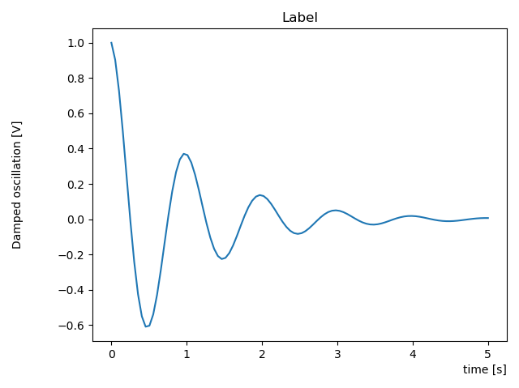


**2. Title**

```
plt.title(label, fontdict=None, loc=None, pad=None, **kwargs)				# kwargs는 text properties
ax.set_title(self, label, fontdict=None, loc=None, pad=None, **kwargs)
```


```python
x1 = np.linspace(0.0, 5.0, 100)
y1 = np.cos(2 * np.pi * x1) * np.exp(-x1)

fig, ax = plt.subplots(tight_layout=True)
ax.plot(x1, y1)
ax.set_title('Title',
             loc='left',		# 위치
             pad=30,			# 간격
             fontsize=20)
plt.show()
```

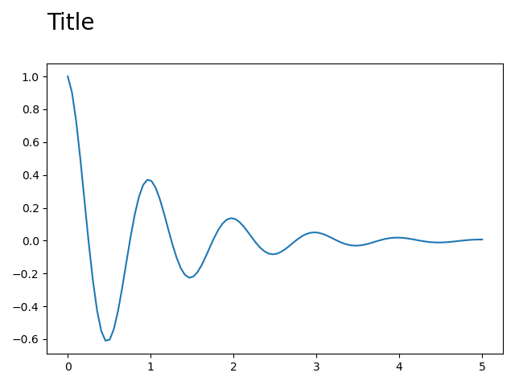


### Legends


**1. legend entries**

```python
legend(handles, labels)
```

**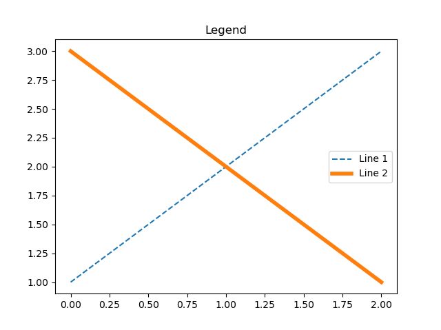**

```python
plt.title("Legend")

#1
line1, = plt.plot([1, 2, 3], linestyle='--', label="Line 1")
line2, = plt.plot([3, 2, 1], linewidth=4, label="Line 2")
plt.legend()

#2
line1, = plt.plot([1, 2, 3], linestyle='--')
line2, = plt.plot([3, 2, 1], linewidth=4)
plt.legend(["Line 1","Line 2"])

#3
line1, = plt.plot([1, 2, 3], linestyle='--')
line2, = plt.plot([3, 2, 1], linewidth=4)
plt.legend([line2,line1],["Line 1","Line 2"])

plt.show()
```


**2. location**

```
legend(loc)
```

| Location String | Location Code | Location String | Location Code |
| --------------- | ------------- | --------------- | ------------- |
| 'best'          | 0             | 'right'         | 5             |
| 'upper right'   | 1             | 'center right'  | 7             |
| 'upper left'    | 2             | 'lower center'  | 8             |
| 'lower left'    | 3             | 'upper center'  | 9             |
| 'lower right'   | 4             | 'center'        | 10            |

```python
plt.title("Legend")

line1, = plt.plot([1, 2, 3], linestyle='--', label="Line 1")
line2, = plt.plot([3, 2, 1], linewidth=4, label="Line 2")
plt.legend(loc=9)

plt.show()
```


### Grid


```
grid(b=None, which='major', axis='both', **kwargs)	# kwargs는 line2D properties
```

```python
X = np.linspace(-np.pi, np.pi, 256)
C = np.cos(X)
plt.title("Grid")
plt.plot(X, C)
plt.xticks([-np.pi, -np.pi / 2, 0, np.pi / 2, np.pi],
           [r'$-\pi$', r'$-\pi/2$', r'$0$', r'$+\pi/2$', r'$+\pi$'])
plt.yticks([-1, 0, 1], ["Low", "Zero", "High"])

plt.grid(True,				# 보이게 하려면 True
         which='major',		# 'major', 'minor', 'both'
         axis='both')		# 'both', 'x', 'y'

plt.show()
```

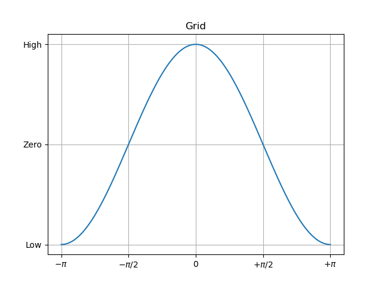

### Style

* available styles

```python
plt.style.available
```

> ['Solarize_Light2', '_classic_test_patch', 'bmh', ...,  'seaborn-white', 'seaborn-whitegrid', 'tableau-colorblind10']


* set style

```python
plt.style.use('fivethirtyeight')
```

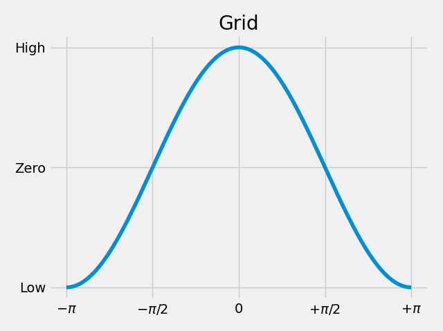


* comic style

```
plt.xkcd()
```

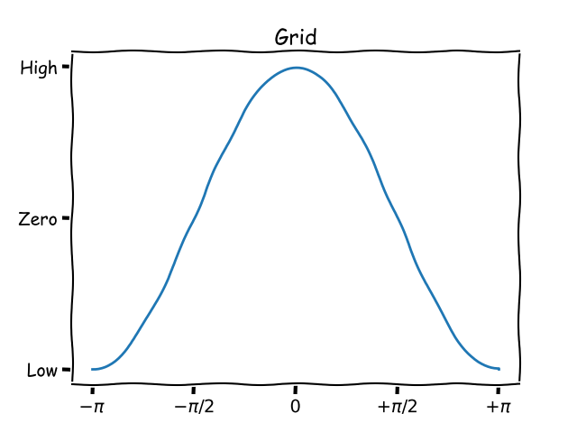


### Format strings


```python
fmt = '[marker][line][color]'

'b'    # blue markers with default shape
'or'   # red circles
'-g'   # green solid line
'--'   # dashed line with default color
'^k:'  # black triangle_up markers connected by a dotted line
```


**1. markers**

| character | description           |
| --------- | --------------------- |
| `'.'`     | point marker          |
| `','`     | pixel marker          |
| `'o'`     | circle marker         |
| `'v'`     | triangle_down marker  |
| `'^'`     | triangle_up marker    |
| `'<'`     | triangle_left marker  |
| `'>'`     | triangle_right marker |
| `'1'`     | tri_down marker       |
| `'2'`     | tri_up marker         |
| `'3'`     | tri_left marker       |
| `'4'`     | tri_right marker      |
| `'s'`     | square marker         |
| `'p'`     | pentagon marker       |
| `'*'`     | star marker           |
| `'h'`     | hexagon1 marker       |
| `'H'`     | hexagon2 marker       |
| `'+'`     | plus marker           |
| `'x'`     | x marker              |
| `'D'`     | diamond marker        |
| `'d'`     | thin_diamond marker   |
| `'|'`     | vline marker          |
| `'_'`     | hline marker          |


**2. line style**

| character | description         |
| --------- | ------------------- |
| `'-'`     | solid line style    |
| `'--'`    | dashed line style   |
| `'-.'`    | dash-dot line style |
| `':'`     | dotted line style   |


**3. colors**

| character | color   |
| --------- | ------- |
| `'b'`     | blue    |
| `'g'`     | green   |
| `'r'`     | red     |
| `'c'`     | cyan    |
| `'m'`     | magenta |
| `'y'`     | yellow  |
| `'k'`     | black   |
| `'w'`     | white   |


### Colors


- an RGB or RGBA (red, green, blue, alpha) tuple of float values in closed interval `[0, 1]` (e.g., `(0.1, 0.2, 0.5)` or `(0.1, 0.2, 0.5, 0.3)`);
- a hex RGB or RGBA string (e.g., `'#0f0f0f'` or `'#0f0f0f80'`; case-insensitive);
- a shorthand hex RGB or RGBA string, equivalent to the hex RGB or RGBA string obtained by duplicating each character, (e.g., `'#abc'`, equivalent to `'#aabbcc'`, or `'#abcd'`, equivalent to `'#aabbccdd'`; case-insensitive);
- a string representation of a float value in `[0, 1]` inclusive for gray level (e.g., `'0.5'`);
- one of the characters `{'b', 'g', 'r', 'c', 'm', 'y', 'k', 'w'}`, which are short-hand notations for shades of blue, green, red, cyan, magenta, yellow, black, and white. Note that the colors `'g', 'c', 'm', 'y'` do not coincide with the X11/CSS4 colors. Their particular shades were chosen for better visibility of colored lines against typical backgrounds.
- a X11/CSS4 color name (case-insensitive);
- a name from the [xkcd color survey](https://xkcd.com/color/rgb/), prefixed with `'xkcd:'` (e.g., `'xkcd:sky blue'`; case insensitive);
- one of the Tableau Colors from the 'T10' categorical palette (the default color cycle): `{'tab:blue', 'tab:orange', 'tab:green', 'tab:red', 'tab:purple', 'tab:brown', 'tab:pink', 'tab:gray', 'tab:olive', 'tab:cyan'}` (case-insensitive);
- a "CN" color spec, i.e. 'C' followed by a number, which is an index into the default property cycle (`rcParams["axes.prop_cycle"]` (default: `cycler('color', ['#1f77b4', '#ff7f0e', '#2ca02c', '#d62728', '#9467bd', '#8c564b', '#e377c2', '#7f7f7f', '#bcbd22', '#17becf'])`)); the indexing is intended to occur at rendering time, and defaults to black if the cycle does not include color.


**2. named colors**

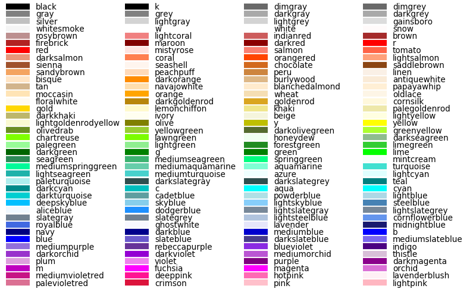


The supported color abbreviations are the single letter codes

| character | color   |
| --------- | ------- |
| `'b'`     | blue    |
| `'g'`     | green   |
| `'r'`     | red     |
| `'c'`     | cyan    |
| `'m'`     | magenta |
| `'y'`     | yellow  |
| `'k'`     | black   |
| `'w'`     | white   |

and the `'CN'` colors that index into the default property cycle.

If the color is the only part of the format string, you can additionally use any [`matplotlib.colors`](https://matplotlib.org/api/colors_api.html#module-matplotlib.colors) spec, e.g. full names (`'green'`) or hex strings (`'#008000'`).


**2. colormap**

print(plt.colormaps())

\# cmap = plt.get_cmap("tab20c")

\# outer_colors = cmap(np.arange(3)*4)

\# inner_colors = cmap(np.array([1, 2, 5, 6, 9, 10]))

### Save figure

* at current dir

```
plt.savefig('figure.png')
```

* with path

```
plt.savefig('C:\\Users\\정승균\\Desktop\\Python_Workspace\\요약\\Matplotlib\\img\\figure.jpeg')
```


**3. colorbar**

```
colorbar(mappable=None, cax=None, ax=None, **kw)
```

```python
ax = plt.subplot(111)
im = ax.imshow(np.linspace(0,1,100).reshape((10, 10)))

plt.colorbar(im,						# colormap된 data
             ax=ax,						# 속하게 될 axes
             pad=0.05,					# 거리
             label='color',				# label
             orientation='vertical')	# 방향

plt.show()
```

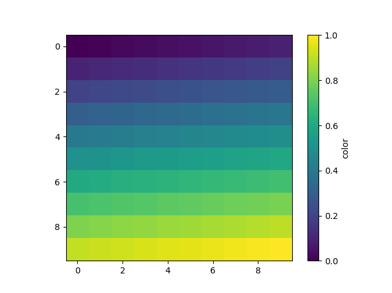


# Plotting


## Span


```python
#lines
axvline(x=0, ymin=0, ymax=1, **kwargs)
axhline(x=0, ymin=0, ymax=1, **kwargs)			# kwargs : Line2D property

#rectangles
axvspan(xmin, xmax, ymin=0, ymax=1, **kwargs)
axhspan(ymin, ymax, xmin=0, xmax=1, **kwargs)	# kwargs : Polygon properties
```


```python
plt.axis([0,2,0,2])

plt.axhline(0.5,                                # y=0.5
            xmin=0, xmax=0.4)                   # 0에서 1사이 값
plt.axvline(1.5, linewidth=4, color='g')        # line2D properties

plt.axhspan(1.25, 1.75)                         # 1.25 < y < 1.75
plt.axvspan(1, 1.55,
            ymin= 0.1, ymax=0.75,               # 0에서 1사이 값
            facecolor='r', alpha=0.5)           # polygon properties

plt.show()
```

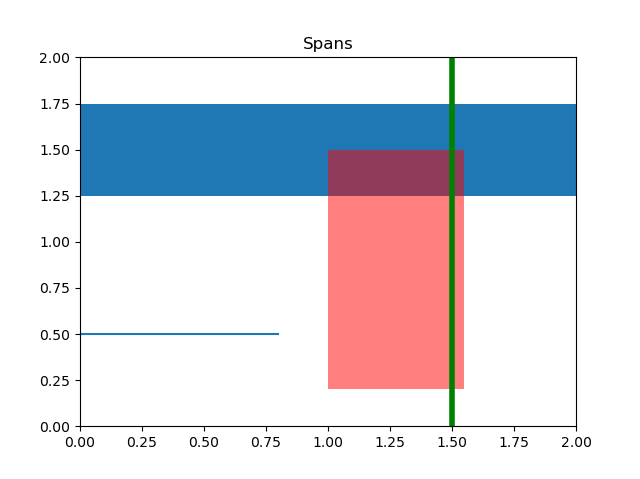


## Line Plot


**1. Call signature**

```
plot([x], y, [fmt], [x2], y2, [fmt2], ..., **kwargs)
```


frequently used kwargs:

| Properties        | alias | Description    |
| ----------------- | ----- | -------------- |
| `color`           | `c`   | 선 색깔        |
| `linewidth`       | `lw`  | 선 굵기        |
| `linestyle`       | `ls`  | 선 스타일      |
| `marker`          |       | 마커 종류      |
| `markersize`      | `ms`  | 마커 크기      |
| `markeredgecolor` | `mec` | 마커 선 색깔   |
| `markeredgewidth` | `mew` | 마커 선 굵기   |
| `markerfacecolor` | `mfc` | 마커 내부 색깔 |


**2. basic**

```python
y=[1, 4, 9, 16]

plt.xlabel("x")
plt.ylabel("y")
plt.title("Line Plot")

plt.plot(y)		# x value 자동으로 [0, 1, 2, 3]
plt.show()
```

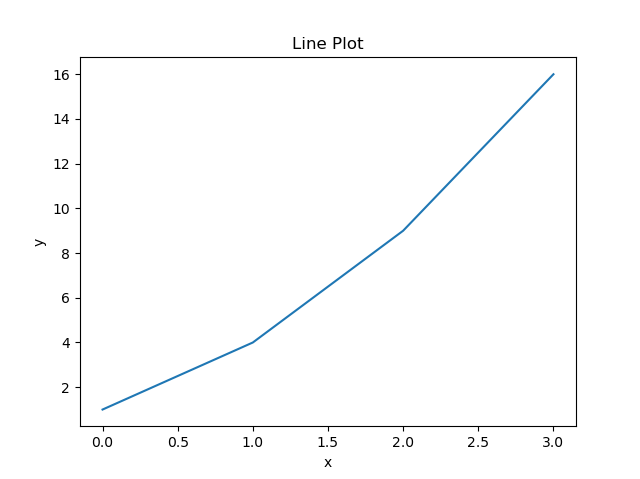


**3. using format strings**

```python
plt.title("Format String")
x= [10, 20, 30, 40]
y= [1, 4, 9, 16]

plt.plot(x, y, 'rs--')
plt.show()
```

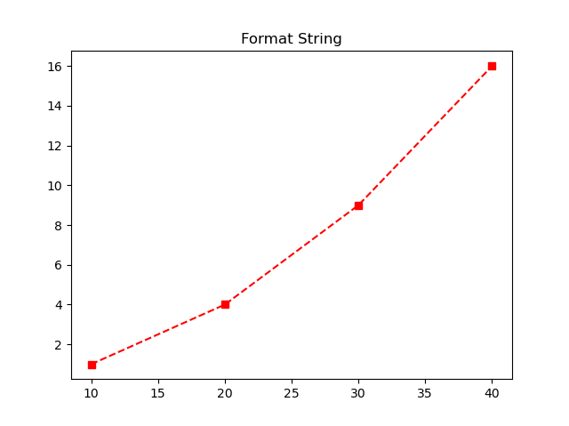


**4. with some kwargs**

```python
x = [10, 20, 30, 40]
y = [1, 4, 9, 16]

plt.title("Line Plot with kargs")
plt.xlabel("x")
plt.ylabel("y")

plt.plot(x, y,
         color="b",					# c='b'
         linewidth=5,				# lw=5
         linestyle="--",			# ls='--'
         marker="o",
         markersize=15,				# ms=15
         markeredgecolor="g",		# mec='g'
         markeredgewidth=5,			# mew=5
         markerfacecolor="r")		# mfc='r'
plt.show()
```


**5. multiple lines**

* plot multiple times

```python
x1 = [10, 20, 30, 40]
y1 = [1, 4, 9, 16]
x2 = [10, 20, 30, 40]
y2 = [9, 16, 4, 1]

plt.title("Multiple lines")
plt.xlabel("x")
plt.ylabel("y")

plt.plot(x1, y1, c="b", lw=5, ls="--", marker="o", ms=15, mec="g", mew=5, mfc="r")
plt.plot(x2, y2, c="k", lw=3, ls=":", marker="s", ms=10, mec="m", mew=5, mfc="c")
plt.show()
```

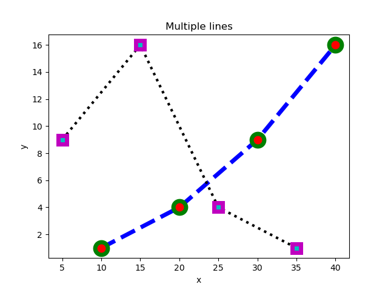


* with one plot call

```python
plt.title("Multiple line 2")
plt.xlabel("x")
plt.ylabel("y")

t = np.arange(0., 5., 0.2)

plt.plot(t, t, 'r--', t, 0.5 * t**2, 'bs:', t, 0.2 * t**3, 'g^-')
plt.show()
```

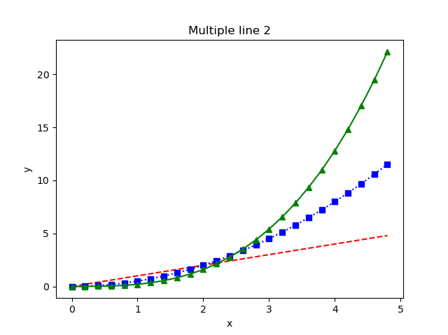

* with 2-D array

```python
df = pd.DataFrame({'a':[1,2,3,4,5],
                   'b':[1,4,9,16,25],
                   'c':[20,10,5,2,1]}, index=[-2, -1, 0, 1, 2])

plt.title('Multiple lines 3')
plt.plot(df.index, df)
plt.legend(df.columns)
plt.show()
```

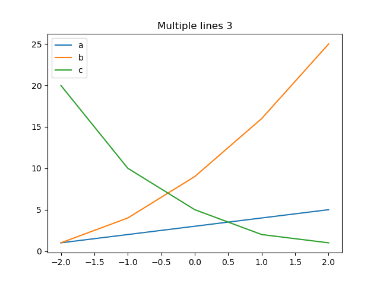


**6. example**

```python
plt.xkcd()

ages_x = [18, 19, 20, 21, 22, 23, 24, 25, 26, 27, 28, 29, 30, 31, 32, 33, 34, 35,
          36, 37, 38, 39, 40, 41, 42, 43, 44, 45, 46, 47, 48, 49, 50, 51, 52, 53, 54, 55]
py_dev_y = [20046, 17100, 20000, 24744, 30500, 37732, 41247, 45372, 48876, 53850, 57287,
            63016, 65998, 70003, 70000, 71496, 75370, 83640, 84666, 84392, 78254, 85000, 
            87038, 91991, 100000, 94796, 97962, 93302, 99240, 102736, 112285, 100771, 
            104708, 108423, 101407, 112542, 122870, 120000]
plt.plot(ages_x, py_dev_y, label='Python')

js_dev_y = [16446, 16791, 18942, 21780, 25704, 29000, 34372, 37810, 43515, 46823, 49293, 53437, 
            56373, 62375, 66674, 68745, 68746, 74583, 79000, 78508, 79996, 80403, 83820, 88833, 
            91660, 87892, 96243, 90000, 99313, 91660, 102264, 100000, 100000, 91660, 99240, 108000, 105000, 104000]
plt.plot(ages_x, js_dev_y, label='JavaScript')

dev_y = [17784, 16500, 18012, 20628, 25206, 30252, 34368, 38496, 42000, 46752, 49320, 53200, 
         56000, 62316, 64928, 67317, 68748, 73752, 77232, 78000, 78508, 79536, 82488, 88935, 
         90000, 90056, 95000, 90000, 91633, 91660, 98150, 98964, 100000, 98988, 100000, 108923, 105000, 103117]
plt.plot(ages_x, dev_y, color='#444444', linestyle='--', label='All Devs')

plt.xlabel('Ages')
plt.ylabel('Median Salary (USD)')
plt.title('Median Salary (USD) by Age')

plt.legend()

plt.tight_layout()
plt.show()
```

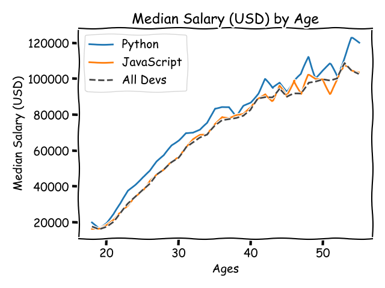


## Date plot

```python
dates = pd.date_range('2000-3-2','2000-3-6', freq='6H')
y     = np.arange(len(dates))

fig, ax = plt.subplots()
ax.plot_date(dates, y**2, 'o-', xdate=True, ydate=False)				# x축 data가 date형식, y는 아님
fig.autofmt_xdate()														# 보기좋게 tick 돌려줌

ax.xaxis.set_major_locator(mpl.dates.DayLocator())						# major tick 위치를 Day로
ax.xaxis.set_minor_locator(mpl.dates.HourLocator(range(0, 25, 6)))		# minor tick 위치를 6시간 단위로
ax.xaxis.set_major_formatter(mpl.dates.DateFormatter('%Y-%m-%d'))		# major tick label 형식

ax.fmt_xdata = mpl.dates.DateFormatter('%Y-%m-%d %H:%M:%S')				# 그래프 위로 마우스 올리면 나오는 값 형식

ax.set_title('Plot dates')
plt.show()
```

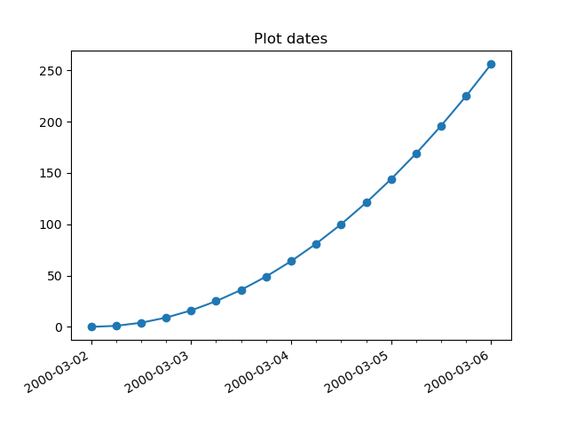


## Bar chart


```
bar(x, height, width=0.8, bottom=None, *, align='center', data=None, **kwargs)
```

**1. basic**

```python
labels = ['G1', 'G2', 'G3', 'G4', 'G5']
men_means = [20, 34, 30, 35, 27]
women_means = [25, 32, 34, 20, 25]

x = np.arange(len(labels))
fig, ax = plt.subplots()

rects1 = ax.bar(x, men_means,
                width= 0.35,		# bar의 너비
                bottom= 0,			# bar시작 높이
                align= 'edge',		# 왼쪽 정렬
                label= 'Men')
rects1 = ax.bar(x, women_means,
                width= -0.35,
                align= 'edge',		# width가 음수면 오르쪽 정렬
                label= 'Women')


ax.set_ylabel('Scores')
ax.set_title('Scores by group and gender')
ax.set_xticks(x)
ax.set_xticklabels(labels)
ax.legend()

fig.tight_layout()
plt.show()
```

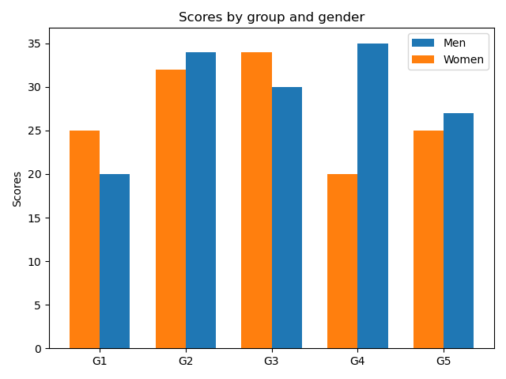


**2. error**

```python
people = ['A', 'B', 'C', 'D']
x_pos = np.arange(len(people))
performance = 3 + 10 * np.random.rand(len(people))
error = np.random.rand(len(people))

plt.title("Barh Chart")
plt.bar(x_pos, performance,
        yerr=error, 			# y축방향 error
        alpha=0.4)				# 투명도
plt.xticks(x_pos, people)
plt.show()
```

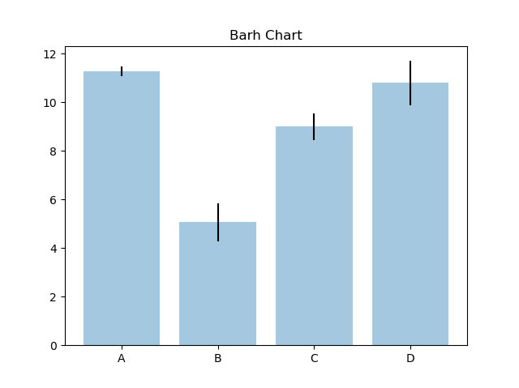

**3. horizontal bar**


```python
people = ['A', 'B', 'C', 'D']
y_pos = np.arange(len(people))
performance = 3 + 10 * np.random.rand(len(people))
error = np.random.rand(len(people))

plt.title("Barh Chart")
plt.barh(y_pos, performance,
         height= 0.8,			# width 대신 height
         xerr=error,			# yerr 대신 xerr
         alpha=0.4)
plt.yticks(y_pos, people)
plt.show()
```

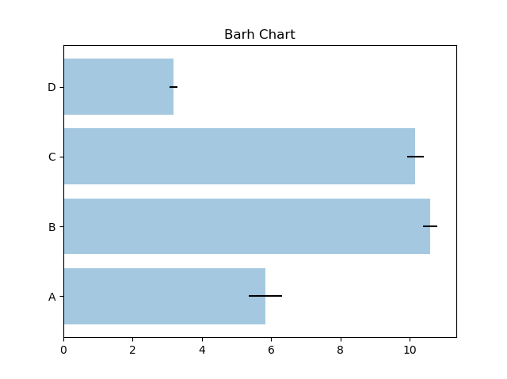

**4. example**

```python
from collections import Counter

data= pd.read_csv('data.csv').LanguagesWorkedWith

language_counter = Counter()
for i in data: language_counter.update(i.split(';'))
languages, popularity = zip(*language_counter.most_common(15))
languages = list(reversed(languages))
popularity= list(reversed(popularity))

plt.style.use("fivethirtyeight")
plt.barh(languages, popularity)
plt.title("Most Popular Languages")
plt.xlabel("Number of People Who Use")

plt.tight_layout()
plt.show()
```

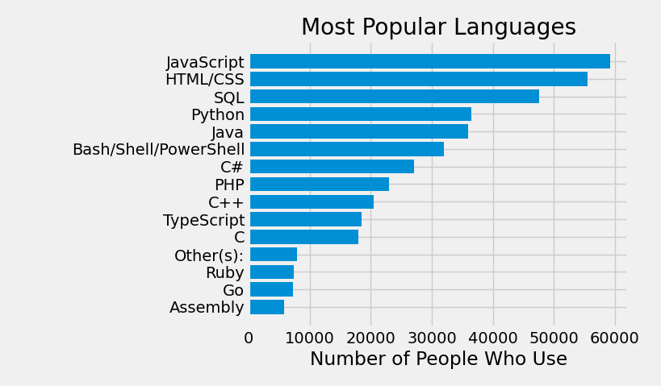


## Pie chart


```python
sizes = [1500, 3000, 4005, 1000]
labels = ['A', 'B', 'C', 'D']
explode = (0, 0.1, 0, 0)
colors = ['yellowgreen', 'gold', 'lightskyblue', 'lightcoral']

plt.title("Pie Chart")
plt.pie(sizes,
        labels=labels,                  # 이름
        explode=explode,                # 튀어나옴
        colors=colors,                  # 색
        autopct= '{:.1f}%'.format,      # 조각 안에 나타날 글씨, function도 가능, input은 percentage 
        shadow=True,                    # 그림자
        startangle=90,                  # 시작 각도
        wedgeprops={'edgecolor':'w'})   # wedge properties                  
plt.axis('equal')                       # 원 형태 유지
plt.show()
```

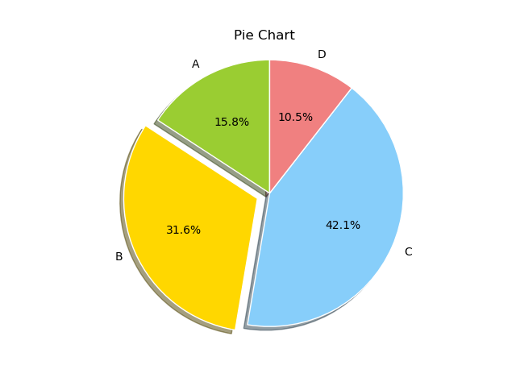

**2. example**

```python
fig, ax = plt.subplots()

size = 0.3
vals = np.array([[60., 32.], [37., 40.], [29., 10.]])

cmap = plt.get_cmap("tab20c")
outer_colors = cmap(np.arange(3)*4)
inner_colors = cmap(np.array([1, 2, 5, 6, 9, 10]))

ax.pie(vals.sum(axis=1), radius=1, colors=outer_colors,
       wedgeprops=dict(width=size, edgecolor='w'))

ax.pie(vals.flatten(), radius=1-size, colors=inner_colors,
       wedgeprops=dict(width=size, edgecolor='w'))

ax.set(aspect="equal", title='Doughnut Pie')
plt.show()
```

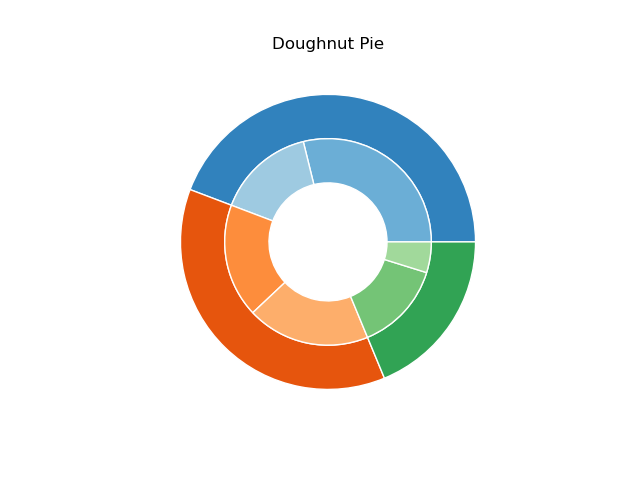


## Stack plot


```python
x = [1, 2, 3, 4, 5]
y1 = [1, 1, 2, 3, 5]
y2 = [0, 4, 2, 6, 8]
y3 = [1, 3, 5, 7, 9]
y = np.vstack([y1, y2, y3])

labels = ["Fibonacci ", "Evens", "Odds"]
colors = plt.get_cmap('Blues_r')([0.2, 0.4, 0.6])

fig, ax = plt.subplots()

ax.stackplot(x, y1, y2, y3,     # ax.stackplot(x, y, labels=labels)
             labels=labels,
             colors= colors) 

ax.legend(loc=('upper left'))
plt.show()
```

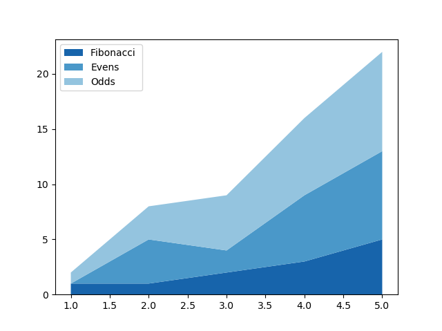

## Fill between


**1. basic**

```python
x = np.arange(0.0, 2, 0.01)
y1 = np.sin(2 * np.pi * x)
y2 = 0.8 * np.sin(4 * np.pi * x)

fig, (ax1, ax2) = plt.subplots(2, 1, sharex=True, figsize=(6, 4))

ax1.fill_between(x, y1)						# y2 = 0 by default
ax2.fill_between(x, y1, y2)

fig.suptitle('Fill-between')
plt.show()
```

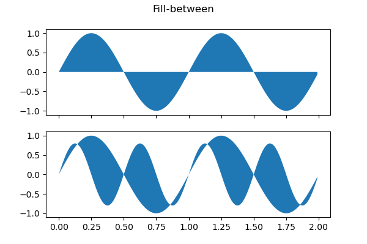

**2. kwargs**

```python
x = np.array([0, 1, 2, 3, 4, 5, 6, 7])
y1 = np.array([1, 1, 0.9, 0.8, 0.2, 0.2, 0.1, 0])
y2 = np.array([0.2, 0.2, 0.1, 0, 1, 1, 0.9, 0.8])

fig, ax = plt.subplots()

ax.plot(x, y1, 'o--')
ax.plot(x, y2, 'o--')
ax.fill_between(x, y1, y2,
                where=(y1 > y2),                # 구간 설정 
                color='C0',                     # 색
                alpha=0.3,                      # 투명도
                interpolate=True)               # 교점도 추가

ax.fill_between(x, y1, y2, where=(y1 <= y2),
                color='C1', alpha=0.3,
                interpolate=False,              # 교점 추가 X
                step='pre' )                    # bar같이 됨

ax.set_title('Fill between')
plt.show()
```

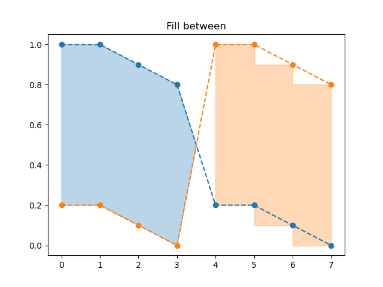


## Histrogram


```python
np.random.seed(19680801)
x = np.random.randn(1000, 3)

fig, (ax0, ax1, ax2) = plt.subplots(figsize=(10,4), nrows=1, ncols=3)

ax0.hist(x, 
         bins=10,               # integer or list of breakpoints
         density=True,          # normalize
         histtype='bar',        # type of graph. default: bar
         label=['A','B','C'])

ax1.hist(x, 10, density=True, 
         stacked=True)          # muli data가 쌓인 꼴

ax2.hist(x, 10,
         histtype='step',       # linegraph 같이 나옴
         stacked=True)

ax0.legend()
fig.tight_layout()
plt.show()
```

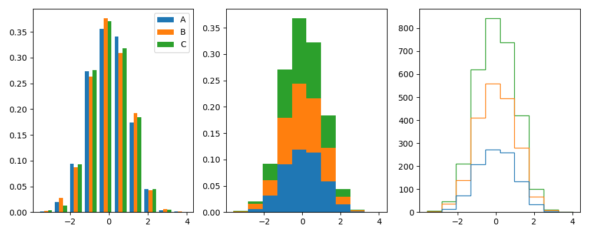


## Scatter plots


**1. basic**

```python
N = 50
x = np.random.rand(N)
y = np.random.rand(N)

colors = np.random.rand(N)
area = (30 * np.random.rand(N))**2

plt.scatter(x, y,
            s=area,
            c=colors,
            cmap = 'summer',
            alpha=0.5)

plt.title('Scatter plot')
plt.show()
```

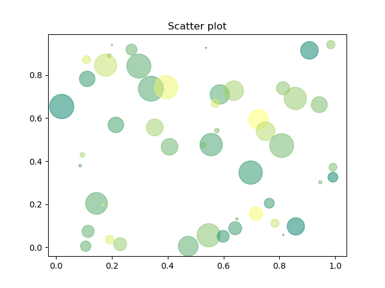

**2. add legends**


* one at a time

```python
fig, ax = plt.subplots()
for color in ['blue', 'orange', 'green']:
    n = 100
    x, y = np.random.rand(2, n)
    scale = 200.0 * np.random.rand(n)
    ax.scatter(x, y, c=color, s=scale, label=color,
               alpha=0.3, edgecolors='none')

ax.legend(loc= 'upper right')

plt.title("Scatter with legend")
plt.show()
```

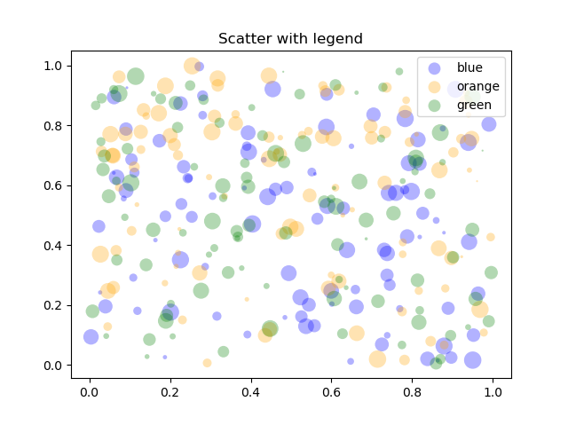

* at once

```python
N = 45
x, y = np.random.rand(2, N)
c = np.random.randint(1, 5, size=N)
s = np.random.randint(10, 220, size=N)

fig, ax = plt.subplots()

scatter = ax.scatter(x, y, c=c, s=s)

legend1 = ax.legend(*scatter.legend_elements(prop='colors'), loc="lower left", title="Classes")
legend2 = ax.legend(*scatter.legend_elements(prop="sizes", alpha=0.6, num=3), loc="upper right", title="Sizes")
ax.add_artist(legend1)

plt.show()
```

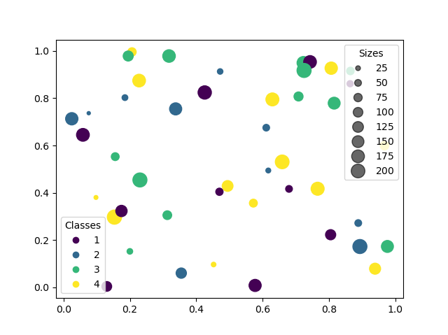

```python
volume = np.random.rayleigh(27, size=40)
amount = np.random.poisson(10, size=40)
ranking = np.random.normal(size=40)
price = np.random.uniform(1, 10, size=40)

fig, ax = plt.subplots()

scatter = ax.scatter(volume, amount, c=ranking, s=0.3*(price*3)**2, cmap="Spectral")

legend1 = ax.legend(*scatter.legend_elements(prop='colors', num=5),      # color에서 5개
                    loc="upper left", title="Ranking")
ax.add_artist(legend1)

kw = dict(prop="sizes", num=5, color=scatter.cmap(0.7),
          fmt="$ {x:.2f}",                                               # 포매팅
          func=lambda s: np.sqrt(s/.3)/3)                                # tranform 함수
legend2 = ax.legend(*scatter.legend_elements(**kw),
                    loc="lower right", title="Price")

plt.show()
```

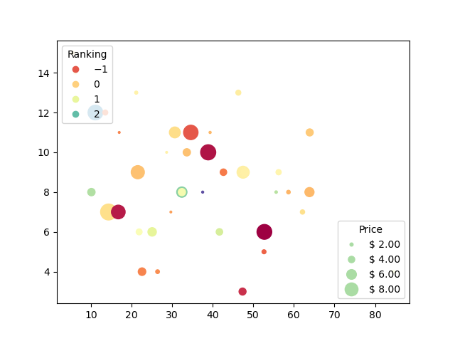


# Animation


## FuncAnimation

```python
fig, ax = plt.subplots()

x = np.arange(0, 2*np.pi, 0.01)
line, = ax.plot(x, np.sin(x))


def init():                                 # 초기화 함수
    line.set_ydata([np.nan] * len(x))
    return line,


def animate(i):
    line.set_ydata(np.sin(x + i / 100))     # 매 프레임마다 호출하는 함수
    return line,


ani = animation.FuncAnimation(
                    fig,                        # parent가 되는 figure                               
                    animate,                    # 업데이트 함수
                    init_func=init,             # 초기화 함수
                    frames = int(200*np.pi),    # 업데이트 함수에 들어가는 변수, frame의 갯수, default: count        
                    interval=2,                 # 2ms sec로 갱신
                    blit=True,                  # 속도향상, 앵간하면 키는게 좋대여
                    save_count=50)              # cache할 frame 수

plt.show()
```

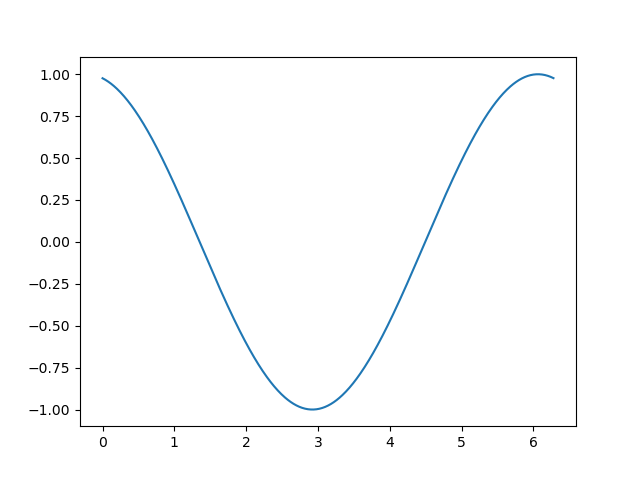


