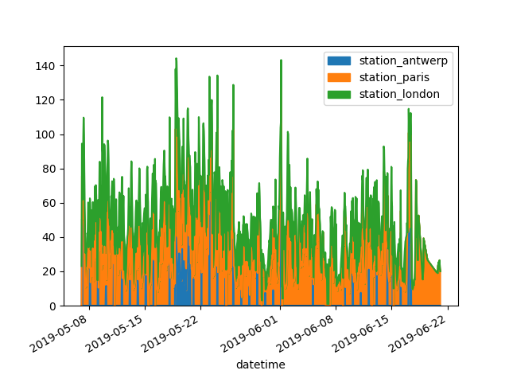

# Creating DataFrame


**1. From Python dictionary**

```python
df = pd.DataFrame({
     "Name": ["Braund, Mr. Owen Harris",
              "Allen, Mr. William Henry",
              "Bonnell, Miss. Elizabeth"],
     "Age": [22, 35, 58],
     "Sex": ["male", "male", "female"]}) 

print(df)
```

> ```
>                        Name  Age     Sex
> 0   Braund, Mr. Owen Harris   22    male
> 1  Allen, Mr. William Henry   35    male
> 2  Bonnell, Miss. Elizabeth   58  female
> ```


**2. Only Series**

```python
ages = pd.Series([22, 35, 58], name="Age")
print(ages)
```

> ```
> 0    22
> 1    35
> 2    58
> Name: Age, dtype: int64
> ```


**3. From file**

```python
titanic = pd.read_csv("titanic.csv")
titanic = pd.read_excel('titanic.xlsx', sheet_name='passengers')
air_quality = pd.read_csv("air_quality_no2.csv", index_col=0, parse_dates=True)
```


# Summary of Dataframe


**1. Technical summary**

```python
titanic.info()
```

>  ```
>  RangeIndex: 891 entries, 0 to 890
>  Data columns (total 12 columns):
>   #   Column       Non-Null Count  Dtype
>  ---  ------       --------------  -----
>   0   PassengerId  891 non-null    int64
>   1   Survived     891 non-null    int64
>   2   Pclass       891 non-null    int64
>   3   Name         891 non-null    object
>   4   Sex          891 non-null    object
>   5   Age          714 non-null    float64
>   6   SibSp        891 non-null    int64
>   7   Parch        891 non-null    int64
>   8   Ticket       891 non-null    object
>   9   Fare         891 non-null    float64
>   10  Cabin        204 non-null    object
>   11  Embarked     889 non-null    object
>  dtypes: float64(2), int64(5), object(5)
>  memory usage: 66.2+ KB
>  ```


**2. Overall statistics**

```python
titanic.describe()
```

> ```
>        PassengerId    Survived      Pclass         Age       SibSp       Parch        Fare
> count   891.000000  891.000000  891.000000  714.000000  891.000000  891.000000  891.000000
> mean    446.000000    0.383838    2.308642   29.699118    0.523008    0.381594   32.204208
> std     257.353842    0.486592    0.836071   14.526497    1.102743    0.806057   49.693429
> min       1.000000    0.000000    1.000000    0.420000    0.000000    0.000000    0.000000
> 25%     223.500000    0.000000    2.000000   20.125000    0.000000    0.000000    7.910400
> 50%     446.000000    0.000000    3.000000   28.000000    0.000000    0.000000   14.454200
> 75%     668.500000    1.000000    3.000000   38.000000    1.000000    0.000000   31.000000
> max     891.000000    1.000000    3.000000   80.000000    8.000000    6.000000  512.329200
> ```


**3. Datatypes of series**

```python
titanic.dtypes
```

> ```
> PassengerId      int64
> Survived         int64
> Pclass           int64
> Name            object
> Sex             object
> Age            float64
> SibSp            int64
> Parch            int64
> Ticket          object
> Fare           float64
> Cabin           object
> Embarked        object
> dtype: object
> ```


**4. shape**

```python
titanic.shape
```

> (891, 12)


**4. head/tail**

```python
titanic.head(3)
```

> ```
>    PassengerId  Survived  Pclass                                               Name     Sex   Age  SibSp  Parch            Ticket     Fare Cabin Embarked
> 0            1         0       3                            Braund, Mr. Owen Harris    male  22.0      1      0         A/5 21171   7.2500   NaN        S
> 1            2         1       1  Cumings, Mrs. John Bradley (Florence Briggs Th...  female  38.0      1      0          PC 17599  71.2833   C85        C
> 2            3         1       3                             Heikkinen, Miss. Laina  female  26.0      0      0  STON/O2. 3101282   7.9250   NaN        S
> ```


# Indexing


**1. column**

```
titanic["Age"]  #Series 반환
```

> ```
> 0      22.0
> 1      38.0
> 2      26.0
> 3      35.0
> 4      35.0
>     ...
> 886    27.0
> 887    19.0
> 888     NaN
> 889    26.0
> 890    32.0
> Name: Age, Length: 891, dtype: float64
> ```


```python
titanic[["Age", "Sex"]]
```

> ```
>    Age     Sex
> 0    22.0    male
> 1    38.0  female
> 2    26.0  female
> 3    35.0  female
> 4    35.0    male
> ..    ...     ...
> 886  27.0    male
> 887  19.0  female
> 888   NaN  female
> 889  26.0    male
> 890  32.0    male
> ```


**2. row**


- By index

```python
titanic[9:16]		# 9에서 15 row
```

> ```
>  PassengerId  Survived  Pclass                                  Name     Sex   Age  SibSp  Parch     Ticket     Fare Cabin Embarked
> 9            10         1       2   Nasser, Mrs. Nicholas (Adele Achem)  female  14.0      1      0     237736  30.0708   NaN        C
> 10           11         1       3       Sandstrom, Miss. Marguerite Rut  female   4.0      1      1    PP 9549  16.7000    G6        S
> 11           12         1       1              Bonnell, Miss. Elizabeth  female  58.0      0      0     113783  26.5500  C103        S
> 12           13         0       3        Saundercock, Mr. William Henry    male  20.0      0      0  A/5. 2151   8.0500   NaN        S
> 13           14         0       3           Andersson, Mr. Anders Johan    male  39.0      1      5     347082  31.2750   NaN        S
> 14           15         0       3  Vestrom, Miss. Hulda Amanda Adolfina  female  14.0      0      0     350406   7.8542   NaN        S
> 15           16         1       2      Hewlett, Mrs. (Mary D Kingcome)   female  55.0      0      0     248706  16.0000   NaN        S
> ```


* By condition

```python
titanic[titanic["Age"] > 35]  #Age가 35 이상인 row만
```

> ```
>   PassengerId  Survived  Pclass                                               Name     Sex   Age  SibSp  Parch    Ticket     Fare Cabin Embarked
> 1              2         1       1  Cumings, Mrs. John Bradley (Florence Briggs Th...  female  38.0      1      0  PC 17599  71.2833   C85        C
> 6              7         0       1                            McCarthy, Mr. Timothy J    male  54.0      0      0     17463  51.8625   E46        S
> 11            12         1       1                           Bonnell, Miss. Elizabeth  female  58.0      0      0    113783  26.5500  C103        S
> 13            14         0       3                        Andersson, Mr. Anders Johan    male  39.0      1      5    347082  31.2750   NaN        S
> 15            16         1       2                   Hewlett, Mrs. (Mary D Kingcome)   female  55.0      0      0    248706  16.0000   NaN        S
> ..           ...       ...     ...                                                ...     ...   ...    ...    ...       ...      ...   ...      ...
> 865          866         1       2                           Bystrom, Mrs. (Karolina)  female  42.0      0      0    236852  13.0000   NaN        S
> 871          872         1       1   Beckwith, Mrs. Richard Leonard (Sallie Monypeny)  female  47.0      1      1     11751  52.5542   D35        S
> 873          874         0       3                        Vander Cruyssen, Mr. Victor    male  47.0      0      0    345765   9.0000   NaN        S
> 879          880         1       1      Potter, Mrs. Thomas Jr (Lily Alexenia Wilson)  female  56.0      0      1     11767  83.1583   C50        C
> 885          886         0       3               Rice, Mrs. William (Margaret Norton)  female  39.0      0      5    382652  29.1250   NaN        Q
> ```


```python
titanic[(titanic["Pclass"] == 2) | (titanic["Pclass"] == 3)]	# Pclass가 [2,3]에 속해있는 row만
titanic[titanic["Pclass"].isin([2, 3])] 						# 동치
```

> ```
> PassengerId  Survived  Pclass                                      Name     Sex   Age  SibSp  Parch            Ticket     Fare Cabin Embarked
> 0              1         0       3                   Braund, Mr. Owen Harris    male  22.0      1      0         A/5 21171   7.2500   NaN        S
> 2              3         1       3                    Heikkinen, Miss. Laina  female  26.0      0      0  STON/O2. 3101282   7.9250   NaN        S
> 4              5         0       3                  Allen, Mr. William Henry    male  35.0      0      0            373450   8.0500   NaN        S
> 5              6         0       3                          Moran, Mr. James    male   NaN      0      0            330877   8.4583   NaN        Q
> 7              8         0       3            Palsson, Master. Gosta Leonard    male   2.0      3      1            349909  21.0750   NaN        S
> ..           ...       ...     ...                                       ...     ...   ...    ...    ...               ...      ...   ...      ...
> 884          885         0       3                    Sutehall, Mr. Henry Jr    male  25.0      0      0   SOTON/OQ 392076   7.0500   NaN        S
> 885          886         0       3      Rice, Mrs. William (Margaret Norton)  female  39.0      0      5            382652  29.1250   NaN        Q
> 886          887         0       2                     Montvila, Rev. Juozas    male  27.0      0      0            211536  13.0000   NaN        S
> 888          889         0       3  Johnston, Miss. Catherine Helen "Carrie"  female   NaN      1      2        W./C. 6607  23.4500   NaN        S
> 890          891         0       3                       Dooley, Mr. Patrick    male  32.0      0      0            370376   7.7500   NaN        Q
> ```


```python
titanic[titanic["Age"].notna()]		# Age가 정의되어있는 row만
```

> ```
>   PassengerId  Survived  Pclass                                               Name     Sex   Age  SibSp  Parch            Ticket     Fare Cabin Embarked
> 0              1         0       3                            Braund, Mr. Owen Harris    male  22.0      1      0         A/5 21171   7.2500   NaN        S
> 1              2         1       1  Cumings, Mrs. John Bradley (Florence Briggs Th...  female  38.0      1      0          PC 17599  71.2833   C85        C
> 2              3         1       3                             Heikkinen, Miss. Laina  female  26.0      0      0  STON/O2. 3101282   7.9250   NaN        S
> 3              4         1       1       Futrelle, Mrs. Jacques Heath (Lily May Peel)  female  35.0      1      0            113803  53.1000  C123        S
> 4              5         0       3                           Allen, Mr. William Henry    male  35.0      0      0            373450   8.0500   NaN        S
> ..           ...       ...     ...                                                ...     ...   ...    ...    ...               ...      ...   ...      ...
> 885          886         0       3               Rice, Mrs. William (Margaret Norton)  female  39.0      0      5            382652  29.1250   NaN        Q
> 886          887         0       2                              Montvila, Rev. Juozas    male  27.0      0      0            211536  13.0000   NaN        S
> 887          888         1       1                       Graham, Miss. Margaret Edith  female  19.0      0      0            112053  30.0000   B42        S
> 889          890         1       1                              Behr, Mr. Karl Howell    male  26.0      0      0            111369  30.0000  C148        C
> 890          891         0       3                                Dooley, Mr. Patrick    male  32.0      0      0            370376   7.7500   NaN        Q
> ```


**3. row & column**


* loc : label based

```python
titanic.loc[titanic["Age"] > 35, ["Name","Age"]
```

> ```
>                                                Name   Age
> 1    Cumings, Mrs. John Bradley (Florence Briggs Th...  38.0
> 6                              McCarthy, Mr. Timothy J  54.0
> 11                            Bonnell, Miss. Elizabeth  58.0
> 13                         Andersson, Mr. Anders Johan  39.0
> 15                    Hewlett, Mrs. (Mary D Kingcome)   55.0
> ..                                                 ...   ...
> 865                           Bystrom, Mrs. (Karolina)  42.0
> 871   Beckwith, Mrs. Richard Leonard (Sallie Monypeny)  47.0
> 873                        Vander Cruyssen, Mr. Victor  47.0
> 879      Potter, Mrs. Thomas Jr (Lily Alexenia Wilson)  56.0
> 885               Rice, Mrs. William (Margaret Norton)  39.0
> ```


* iloc : index based

```python
titanic.iloc[9:16, 2:5]
```

> ```
>  Pclass                                  Name     Sex
> 9        2   Nasser, Mrs. Nicholas (Adele Achem)  female
> 10       3       Sandstrom, Miss. Marguerite Rut  female
> 11       1              Bonnell, Miss. Elizabeth  female
> 12       3        Saundercock, Mr. William Henry    male
> 13       3           Andersson, Mr. Anders Johan    male
> 14       3  Vestrom, Miss. Hulda Amanda Adolfina  female
> 15       2      Hewlett, Mrs. (Mary D Kingcome)   female
> ```


# Modifying dataframe


### Renaming column

**1. manually**

```pytho
renamed = air_quality.rename(columns={"station_antwerp": "BETR801","station_paris": "FR04014"})
print(renamed)
```

> ```
>                      BETR801  FR04014  station_london
> datetime
> 2019-05-07 02:00:00      NaN      NaN            23.0
> 2019-05-07 03:00:00     50.5     25.0            19.0
> 2019-05-07 04:00:00     45.0     27.7            19.0
> 2019-05-07 05:00:00      NaN     50.4            16.0
> 2019-05-07 06:00:00      NaN     61.9             NaN
> ...                      ...      ...             ...
> 2019-06-20 22:00:00      NaN     21.4             NaN
> 2019-06-20 23:00:00      NaN     24.9             NaN
> 2019-06-21 00:00:00      NaN     26.5             NaN
> 2019-06-21 01:00:00      NaN     21.8             NaN
> 2019-06-21 02:00:00      NaN     20.0             NaN
> ```


**2. by function**

```python
renamed = air_quality_renamed.rename(columns=str.upper)
print(renamed)
```

> ```
>                      STATION_ANTWERP  STATION_PARIS  STATION_LONDON
> datetime
> 2019-05-07 02:00:00              NaN            NaN            23.0
> 2019-05-07 03:00:00             50.5           25.0            19.0
> 2019-05-07 04:00:00             45.0           27.7            19.0
> 2019-05-07 05:00:00              NaN           50.4            16.0
> 2019-05-07 06:00:00              NaN           61.9             NaN
> ...                              ...            ...             ...
> 2019-06-20 22:00:00              NaN           21.4             NaN
> 2019-06-20 23:00:00              NaN           24.9             NaN
> 2019-06-21 00:00:00              NaN           26.5             NaN
> 2019-06-21 01:00:00              NaN           21.8             NaN
> 2019-06-21 02:00:00              NaN           20.0             NaN
> ```
>
> 


### Creating new column

```python
air_quality["london_mg_per_cubic"] = air_quality["station_london"] * 1.882
print(air_quality)
```

> ```
>                     station_antwerp  station_paris  station_london  london_mg_per_cubic
> datetime
> 2019-05-07 02:00:00              NaN            NaN            23.0               43.286
> 2019-05-07 03:00:00             50.5           25.0            19.0               35.758
> 2019-05-07 04:00:00             45.0           27.7            19.0               35.758
> 2019-05-07 05:00:00              NaN           50.4            16.0               30.112
> 2019-05-07 06:00:00              NaN           61.9             NaN                  NaN
> ...                              ...            ...             ...                  ...
> 2019-06-20 22:00:00              NaN           21.4             NaN                  NaN
> 2019-06-20 23:00:00              NaN           24.9             NaN                  NaN
> 2019-06-21 00:00:00              NaN           26.5             NaN                  NaN
> 2019-06-21 01:00:00              NaN           21.8             NaN                  NaN
> 2019-06-21 02:00:00              NaN           20.0             NaN                  NaN
> ```


### Sort

```python
titanic.sort_values(by=['Pclass', 'Age'], ascending=False).head() # Pclass, Age 순으로 내림차순 정렬
```

> ```
>      PassengerId  Survived  Pclass                       Name     Sex   Age  SibSp  Parch  Ticket    Fare Cabin Embarked
> 851          852         0       3        Svensson, Mr. Johan    male  74.0      0      0  347060  7.7750   NaN        S
> 116          117         0       3       Connors, Mr. Patrick    male  70.5      0      0  370369  7.7500   NaN        Q
> 280          281         0       3           Duane, Mr. Frank    male  65.0      0      0  336439  7.7500   NaN        Q
> 483          484         1       3     Turkula, Mrs. (Hedwig)  female  63.0      0      0    4134  9.5875   NaN        S
> 326          327         0       3  Nysveen, Mr. Johan Hansen    male  61.0      0      0  345364  6.2375   NaN        S
> ```


### Pivot

**1. 중복 없을시**

```python
no2 = air_quality[air_quality["parameter"] == "no2"]
pivoted = no2.pivot(columns="location", values="value")
print(pivoted)
```

>```
>location                   BETR801  FR04014  London Westminster
>date.utc
>2019-04-09 01:00:00+00:00     22.5     24.4                 NaN
>2019-04-09 02:00:00+00:00     53.5     27.4                67.0
>2019-04-09 03:00:00+00:00     54.5     34.2                67.0
>2019-04-09 04:00:00+00:00     34.5     48.5                41.0
>2019-04-09 05:00:00+00:00     46.5     59.5                41.0
>...                            ...      ...                 ...
>2019-06-20 20:00:00+00:00      NaN     21.4                 NaN
>2019-06-20 21:00:00+00:00      NaN     24.9                 NaN
>2019-06-20 22:00:00+00:00      NaN     26.5                 NaN
>2019-06-20 23:00:00+00:00      NaN     21.8                 NaN
>2019-06-21 00:00:00+00:00      NaN     20.0                 NaN
>```


**2. 중복시**

```python
pivoted = air_quality.pivot_table(values="value", index="location", columns="parameter", aggfunc="mean", margins=True)
print(pivoted)
```

> ```
> parameter                 no2       pm25        All
> location
> BETR801             26.950920  23.169492  24.982353
> FR04014             29.374284        NaN  29.374284
> London Westminster  29.740050  13.443568  21.491708
> All                 29.430316  14.386849  24.222743
> ```


# Combining Data


**1. Concatenating**

```python
air_quality_no2 = air_quality_no2[["date.utc", "location", "parameter", "value"]]
air_quality_pm25 = air_quality_pm25[["date.utc", "location", "parameter", "value"]]

'''
                       date.utc            location parameter  value
0     2019-06-21 00:00:00+00:00             FR04014       no2   20.0
1     2019-06-20 23:00:00+00:00             FR04014       no2   21.8
2     2019-06-20 22:00:00+00:00             FR04014       no2   26.5
3     2019-06-20 21:00:00+00:00             FR04014       no2   24.9

                       date.utc            location parameter  value
0     2019-06-18 06:00:00+00:00             BETR801      pm25   18.0
1     2019-06-17 08:00:00+00:00             BETR801      pm25    6.5
2     2019-06-17 07:00:00+00:00             BETR801      pm25   18.5
3     2019-06-17 06:00:00+00:00             BETR801      pm25   16.0
'''

air_quality = pd.concat([air_quality_pm25, air_quality_no2], axis=0)
print(air_quality)
```

> ```
>                        date.utc            location parameter  value
> 0     2019-06-18 06:00:00+00:00             BETR801      pm25   18.0
> 1     2019-06-17 08:00:00+00:00             BETR801      pm25    6.5
> 2     2019-06-17 07:00:00+00:00             BETR801      pm25   18.5
> 3     2019-06-17 06:00:00+00:00             BETR801      pm25   16.0
> 4     2019-06-17 05:00:00+00:00             BETR801      pm25    7.5
> ...                         ...                 ...       ...    ...
> 2063  2019-05-07 06:00:00+00:00  London Westminster       no2   26.0
> 2064  2019-05-07 04:00:00+00:00  London Westminster       no2   16.0
> 2065  2019-05-07 03:00:00+00:00  London Westminster       no2   19.0
> 2066  2019-05-07 02:00:00+00:00  London Westminster       no2   19.0
> 2067  2019-05-07 01:00:00+00:00  London Westminster       no2   23.0
> ```


**2. Merging**


* Have common column

```python
stations_coord.head()
air_quality.head()

'''
  location  coordinates.latitude  coordinates.longitude
0  BELAL01              51.23619                4.38522
1  BELHB23              51.17030                4.34100
2  BELLD01              51.10998                5.00486
3  BELLD02              51.12038                5.02155
4  BELR833              51.32766                4.36226

                       date.utc            location parameter  value
2067  2019-05-07 01:00:00+00:00  London Westminster       no2   23.0
1003  2019-05-07 01:00:00+00:00             FR04014       no2   25.0
100   2019-05-07 01:00:00+00:00             BETR801      pm25   12.5
1098  2019-05-07 01:00:00+00:00             BETR801       no2   50.5
1109  2019-05-07 01:00:00+00:00  London Westminster      pm25    8.0
'''

air_quality = pd.merge(air_quality, stations_coord, how='left', on='location')
print(air_quality.head())
```

> ```
>  
>                     date.utc            location parameter  value  coordinates.latitude  coordinates.longitude
> 0  2019-05-07 01:00:00+00:00  London Westminster       no2   23.0              51.49467               -0.13193
> 1  2019-05-07 01:00:00+00:00             FR04014       no2   25.0              48.83724                2.39390
> 2  2019-05-07 01:00:00+00:00             FR04014       no2   25.0              48.83722                2.39390
> 3  2019-05-07 01:00:00+00:00             BETR801      pm25   12.5              51.20966                4.43182
> 4  2019-05-07 01:00:00+00:00             BETR801       no2   50.5              51.20966                4.43182
> ```


* No common column

```python
air_quality.head()
air_quality_parameters.head()

'''
                       date.utc            location parameter  value
2067  2019-05-07 01:00:00+00:00  London Westminster       no2   23.0
1003  2019-05-07 01:00:00+00:00             FR04014       no2   25.0
100   2019-05-07 01:00:00+00:00             BETR801      pm25   12.5
1098  2019-05-07 01:00:00+00:00             BETR801       no2   50.5
1109  2019-05-07 01:00:00+00:00  London Westminster      pm25    8.0

     id                                        description  name
0    bc                                       Black Carbon    BC
1    co                                    Carbon Monoxide    CO
2   no2                                   Nitrogen Dioxide   NO2
3    o3                                              Ozone    O3
4  pm10  Particulate matter less than 10 micrometers in...  PM10
'''

air_quality = pd.merge(air_quality, stations_coord, how='left', on='location')
print(air_quality)
```

> ```
>                     date.utc            location parameter  ...    id                                        description   name
> 0  2019-05-07 01:00:00+00:00  London Westminster       no2  ...   no2                                   Nitrogen Dioxide    NO2
> 1  2019-05-07 01:00:00+00:00             FR04014       no2  ...   no2                                   Nitrogen Dioxide    NO2
> 2  2019-05-07 01:00:00+00:00             FR04014       no2  ...   no2                                   Nitrogen Dioxide    NO2
> 3  2019-05-07 01:00:00+00:00             BETR801      pm25  ...  pm25  Particulate matter less than 2.5 micrometers i...  PM2.5
> 4  2019-05-07 01:00:00+00:00             BETR801       no2  ...   no2                                   Nitrogen Dioxide    NO2
> ```


# Statistics


**1. min/ max/ mean/ median/ ...**

```python
titanic["Age","Fare"].mean()
```

> Age     29.699118
> Fare    32.204208


**2. agg**

```python
titanic.agg({'Age': ['min', 'max', 'median', 'skew'],
             'Fare': ['min', 'max', 'median', 'mean']})
```

>  ```
>               Age        Fare
> max     80.000000  512.329200
> mean          NaN   32.204208
> median  28.000000   14.454200
> min      0.420000    0.000000
> skew     0.389108         NaN
>  ```


**3. groupby**

```python
titanic[["Sex", "Age"]].groupby("Sex").mean()
```

> ```              
>               Age
> Sex
> female  27.915709
> male    30.726645
> ```


```python
titanic.groupby(["Sex", "Pclass"])["Fare"].mean()
```

> ```
> Sex     Pclass
> female  1         106.125798
>         2          21.970121
>         3          16.118810
> male    1          67.226127
>         2          19.741782
>         3          12.661633
> ```


**4. count**

```python
titanic[["Pclass","Sex"]].value_counts()  # titanic.groupby(["Pclass","Sex"])["Pclass"].count()의 shortcut
```

> ```
> Pclass  Sex
> 3       male      347
>         female    144
> 1       male      122
> 2       male      108
> 1       female     94
> 2       female     76
> ```


# Plotting with mathplotlib


### Styles


**1. line**

- plot dataframe

```python
import matplotlib.pyplot as plt
air_quality.plot()
plt.show()
```


- plot series

```python
air_quality["station_paris"].plot()
plt.show()
```


**2. scatter**

```python
air_quality.plot.scatter(x="station_london", y="station_paris", alpha=0.5)
plt.show()
```


**3. box**

```python
air_quality.plot.box()
plt.show()
```


**4. area**

```python
air_quality.plot.area()
plt.show()
```




### Subplots

```python
air_quality.plot.area(figsize=(12, 4), subplots=True)
plt.show()
```

