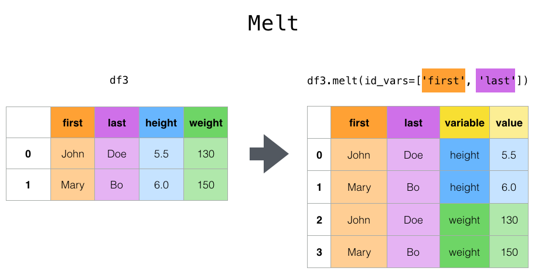
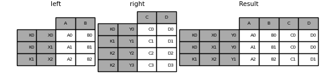

# Creating Dataframe


### Creating Series

> s = pd.Series(data, index=index), index is defaulted as 0,1,2,...


* from list

```
s = pd.Series(np.random.randn(5), index=['a', 'b', 'c', 'd', 'e'], dtype=np.float32, name='A')
```

> ```
> a   -0.048518
> b   -0.472143
> c    0.240204
> d    2.393079
> e   -0.891866
> Name: A, dtype: float32
> ```


* from dict

```
 d = {'b': 1, 'a': 0, 'c': 2}
 pd.Series(d, index=['b', 'c', 'd', 'a'])
```

> ```
> b    1.0
> c    2.0
> d    NaN
> a    0.0
> dtype: float64
> ```


### Creating DataFrame

**1. Basic**

* from array

```python
dates = pd.date_range('20130101', periods=6) # DatatimeIndex 생성
df = pd.DataFrame(np.random.randn(6, 4), index=dates, columns=list('ABCD'))
```
> ```
>                    A         B         C         D
> 2013-01-01  0.469112 -0.282863 -1.509059 -1.135632
> 2013-01-02  1.212112 -0.173215  0.119209 -1.044236
> 2013-01-03 -0.861849 -2.104569 -0.494929  1.071804
> 2013-01-04  0.721555 -0.706771 -1.039575  0.271860
> 2013-01-05 -0.424972  0.567020  0.276232 -1.087401
> 2013-01-06 -0.673690  0.113648 -1.478427  0.524988
> ```


* from dict

```
d = {'one': pd.Series([1., 2., 3.], index=['a', 'b', 'c']),
	 'two': pd.Series([1., 2., 3., 4.], index=['a', 'b', 'c', 'd'])}
pd.DataFrame(d, index=['d', 'b', 'a'], columns=['two', 'three'])
```

> ```
>       two three
> d  4.0   NaN
> b  2.0   NaN
> a  1.0   NaN
> ```


* from list of dicts

```
data2 = [{'a': 1, 'b': 2}, {'a': 5, 'b': 10, 'c': 20}]
pd.DataFrame(data2, index=['first', 'second'], columns=['a', 'b'])
```

> ```
>            a   b
> first   1   2
> second  5  10
> ```


* from structured array

```
data= np.array([(1, 2., 'Hello'), (2, 3., "World")], dtype=[('A', 'i4'), ('B', 'f4'), ('C', 'a10')])
pd.DataFrame(data)
```

> ```
>       A    B         C
> 0  1  2.0  b'Hello'
> 1  2  3.0  b'World'
> ```


* from tuple dict

```
pd.DataFrame({('a', 'b'): {('A', 'B'): 1, ('A', 'C'): 2},
              ('a', 'a'): {('A', 'C'): 3, ('A', 'B'): 4},
              ('a', 'c'): {('A', 'B'): 5, ('A', 'C'): 6},
              ('b', 'a'): {('A', 'C'): 7, ('A', 'B'): 8},
              ('b', 'b'): {('A', 'D'): 9, ('A', 'B'): 10}})
```

> ```
>        a              b      
>        b    a    c    a     b
> A B  1.0  4.0  5.0  8.0  10.0
>   C  2.0  3.0  6.0  7.0   NaN
>   D  NaN  NaN  NaN  NaN   9.0
> ```


**2. converting methods**


* from_dict

Operates like the DataFrame constructor except for the `orient` parameter:

 `'columns'` by default,  can be set to `'index'` in order to use the dict keys as row labels.

```python
d = dict([('A', [1, 2, 3]), ('B', [4, 5, 6])])
pd.DataFrame.from_dict(d)		# same as pd.DataFrame(d)
```

> ```
>    A  B
> 0  1  4
> 1  2  5
> 2  3  6
> ```


```
pd.DataFrame.from_dict(d, orient='index', columns=['one', 'two', 'three'])
```

> ```
> Out[61]: 
>    one  two  three
> A    1    2      3
> B    4    5      6
> ```


* from_records

Operates like normal DataFrame constructor, except that index may be a specificed

```
data= array([(1, 2., b'Hello'), (2, 3., b'World')],
      dtype=[('A', '<i4'), ('B', '<f4'), ('C', 'S10')])

pd.DataFrame.from_records(data, index='C')
```

> ```
>           A    B
> C               
> b'Hello'  1  2.0
> b'World'  2  3.0
> ```


**3. From file**

* csv

```
pd.read_csv('foo.csv')
df.to_csv('foo.csv')
```


* excel

```
df.to_excel('foo.xlsx', sheet_name='Sheet1')
pd.read_excel('foo.xlsx', 'Sheet1', index_col=None, na_values=['NA'])
```


### Attributes

Display the index, columns:

```
In [15]: df.index
Out[15]: 
DatetimeIndex(['2013-01-01', '2013-01-02', '2013-01-03', '2013-01-04',
               '2013-01-05', '2013-01-06'],
              dtype='datetime64[ns]', freq='D')

In [16]: df.columns
Out[16]: Index(['A', 'B', 'C', 'D'], dtype='object')
```

```
s.index
Out[5]: Index(['a', 'b', 'c', 'd', 'e'], dtype='object')
```

```
In [18]: s.dtype
Out[18]: dtype('float64')
```

```
s = pd.Series(np.random.randn(5), name='something')
In [34]: s.name
Out[34]: 'something'
```

```
In [8]: df.columns = [x.lower() for x in df.columns]

In [9]: df
Out[9]: 
                   a         b         c
2000-01-01 -0.173215  0.119209 -1.044236
2000-01-02 -0.861849 -2.104569 -0.494929
2000-01-03  1.071804  0.721555 -0.706771
2000-01-04 -1.039575  0.271860 -0.424972
2000-01-05  0.567020  0.276232 -1.087401
2000-01-06 -0.673690  0.113648 -1.478427
2000-01-07  0.524988  0.404705  0.577046
2000-01-08 -1.715002 -1.039268 -0.370647
```


# Special Objects


## Index


###  Creating Index object


```
index = pd.Index(['e', 'd', 'a', 'b'])
```

> Index(['e', 'd', 'a', 'b'], dtype='object')


```
index = pd.Index(['e', 'd', 'a', 'b'], name='something')
```

> Index(['e', 'd', 'a', 'b'], dtype='object', name='something')


```
index = pd.Index(list(range(5)), name='rows')
columns = pd.Index(['A', 'B', 'C'], name='cols')

df = pd.DataFrame(np.random.randn(5, 3), index=index, columns=columns)
```

> ```
> cols         A         B         C
> rows                              
> 0     1.295989  0.185778  0.436259
> 1     0.678101  0.311369 -0.528378
> 2    -0.674808 -1.103529 -0.656157
> 3     1.889957  2.076651 -1.102192
> 4    -1.211795 -0.791746  0.634724
> ```


### Changing name

```
ind = pd.Index([1, 2, 3])
ind.rename("apple")			# returns copy
```

```
ind.set_names(["apple"], inplace=True)
```

```
ind.name = "bob"
```


### Set operations on Index objects

```
a = pd.Index(['c', 'b', 'a'])
b = pd.Index(['c', 'e', 'd'])

a | b
```

> Index(['a', 'b', 'c', 'd', 'e'], dtype='object')


```
a & b

```

>  Index(['c'], dtype='object')


```
a.difference(b)
```

> Index(['a', 'b'], dtype='object')


```
a^b
```

> Index(['a', 'b', 'd', 'e'], dtype='object')


### Fill missing values

```python
idx1 = pd.Index([1, np.nan, 3, 4])
'└> Float64Index([1.0, nan, 3.0, 4.0], dtype='float64')'

idx1.fillna(2)
```

> Float64Index([1.0, 2.0, 3.0, 4.0], dtype='float64')


### Set / reset index


**1. set_index**

```python
data
'''
     a    b  c    d
0  bar  one  z  1.0
1  bar  two  y  2.0
2  foo  one  x  3.0
3  foo  two  w  4.0
'''

indexed1 = data.set_index('c')
```

> ```
>      a    b    d
> c               
> z  bar  one  1.0
> y  bar  two  2.0
> x  foo  one  3.0
> w  foo  two  4.0
> ```


```python
indexed2 = data.set_index(['a', 'b'], inplace=True)
```

> ```
>          c    d
> a   b          
> bar one  z  1.0
>     two  y  2.0
> foo one  x  3.0
>     two  w  4.0
> ```


```python
frame = data.set_index('c', drop=False)				# c column 유지
frame = frame.set_index(['a', 'b'], append=True)	# index에 추가
```

```
           c    d
c a   b          
z bar one  z  1.0
y bar two  y  2.0
x foo one  x  3.0
w foo two  w  4.0
```


**2. reset_index**


```python
data
'''
         c    d
a   b          
bar one  z  1.0
    two  y  2.0
foo one  x  3.0
    two  w  4.0
'''

 data.reset_index()
```

> ```
>      a    b  c    d
> 0  bar  one  z  1.0
> 1  bar  two  y  2.0
> 2  foo  one  x  3.0
> 3  foo  two  w  4.0
> ```


```
frame
'''
           c    d
c a   b          
z bar one  z  1.0
y bar two  y  2.0
x foo one  x  3.0
w foo two  w  4.0
'''

frame.reset_index(level=1)
```

> ```
>          a  c    d
> c b               
> z one  bar  z  1.0
> y two  bar  y  2.0
> x one  foo  x  3.0
> w two  foo  w  4.0
> ```


## MultiIndex


See [Advanced Indexing](https://pandas.pydata.org/pandas-docs/stable/user_guide/advanced.html#advanced) for usage of MultiIndexes.

```
In [295]: ind = pd.Index([1, 2, 3])

In [296]: ind.rename("apple")
Out[296]: Int64Index([1, 2, 3], dtype='int64', name='apple')

In [297]: ind
Out[297]: Int64Index([1, 2, 3], dtype='int64')

In [298]: ind.set_names(["apple"], inplace=True)

In [299]: ind.name = "bob"

In [300]: ind
Out[300]: Int64Index([1, 2, 3], dtype='int64', name='bob')
```

`set_names`, `set_levels`, and `set_codes` also take an optional `level` argument

```
In [301]: index = pd.MultiIndex.from_product([range(3), ['one', 'two']], names=['first', 'second'])

In [302]: index
Out[302]: 
MultiIndex([(0, 'one'),
            (0, 'two'),
            (1, 'one'),
            (1, 'two'),
            (2, 'one'),
            (2, 'two')],
           names=['first', 'second'])

In [303]: index.levels[1]
Out[303]: Index(['one', 'two'], dtype='object', name='second')

In [304]: index.set_levels(["a", "b"], level=1)
Out[304]: 
MultiIndex([(0, 'a'),
            (0, 'b'),
            (1, 'a'),
            (1, 'b'),
            (2, 'a'),
            (2, 'b')],
           names=['first', 'second'])
```


## Time series


**1. resample**

```
rng = pd.date_range('1/1/2012', periods=150, freq='S')
ts = pd.Series(np.random.randint(0, 500, len(rng)), index=rng)

ts.resample('1Min').sum()
```

> ```
> 2012-01-01 00:00:00    15676
> 2012-01-01 00:01:00    16864
> 2012-01-01 00:02:00     8102
> Freq: T, dtype: int32
> ```


**2. Time zone**

* converting to tz

```python
pd.date_range('3/6/2012 00:00', periods=5, freq='D')
ts = pd.Series(np.random.randn(len(rng)), rng)

'''
2012-03-06    1.857704
2012-03-07   -1.193545
2012-03-08    0.677510
2012-03-09   -0.153931
2012-03-10    0.520091
Freq: D, dtype: float64
'''

ts_utc = ts.tz_localize('UTC')
```

> ```
> 2012-03-06 00:00:00+00:00    1.857704
> 2012-03-07 00:00:00+00:00   -1.193545
> 2012-03-08 00:00:00+00:00    0.677510
> 2012-03-09 00:00:00+00:00   -0.153931
> 2012-03-10 00:00:00+00:00    0.520091
> Freq: D, dtype: float64
> ```


* Converting to another tz

```
ts_utc.tz_convert('US/Eastern')
```

> ```
> 2012-03-05 19:00:00-05:00    1.857704
> 2012-03-06 19:00:00-05:00   -1.193545
> 2012-03-07 19:00:00-05:00    0.677510
> 2012-03-08 19:00:00-05:00   -0.153931
> 2012-03-09 19:00:00-05:00    0.520091
> Freq: D, dtype: float64
> ```


* Converting between time span representations:

```python
rng = pd.date_range('1/1/2012', periods=5, freq='M')
ts = pd.Series(np.random.randn(len(rng)), index=rng)

'''
2012-01-31   -1.475051
2012-02-29    0.722570
2012-03-31   -0.322646
2012-04-30   -1.601631
2012-05-31    0.778033
Freq: M, dtype: float64
'''

ps = ts.to_period()
ps.to_timestamp()
```

> ```
> 2012-01   -1.475051
> 2012-02    0.722570
> 2012-03   -0.322646
> 2012-04   -1.601631
> 2012-05    0.778033
> Freq: M, dtype: float64
> 
> 2012-01-01   -1.475051
> 2012-02-01    0.722570
> 2012-03-01   -0.322646
> 2012-04-01   -1.601631
> 2012-05-01    0.778033
> Freq: MS, dtype: float64
> ```


we convert a quarterly frequency with year ending in November to 9am of the end of the month following the quarter end:

```
prng = pd.period_range('1990Q1', '2000Q4', freq='Q-NOV')
 ts = pd.Series(np.random.randn(len(prng)), prng)
ts.index = (prng.asfreq('M', 'e') + 1).asfreq('H', 's') + 9
ts.head()
```

> ```
> 1990-03-01 09:00   -0.289342
> 1990-06-01 09:00    0.233141
> 1990-09-01 09:00   -0.223540
> 1990-12-01 09:00    0.542054
> 1991-03-01 09:00   -0.688585
> Freq: H, dtype: float64
> ```


### .dt accessor

`Series` has an accessor to succinctly return datetime like properties for the *values* of the Series, if it is a datetime/period like Series. This will return a Series, indexed like the existing Series.

```
# datetime
In [272]: s = pd.Series(pd.date_range('20130101 09:10:12', periods=4))

In [273]: s
Out[273]: 
0   2013-01-01 09:10:12
1   2013-01-02 09:10:12
2   2013-01-03 09:10:12
3   2013-01-04 09:10:12
dtype: datetime64[ns]

In [274]: s.dt.hour
Out[274]: 
0    9
1    9
2    9
3    9
dtype: int64

In [275]: s.dt.second
Out[275]: 
0    12
1    12
2    12
3    12
dtype: int64

In [276]: s.dt.day
Out[276]: 
0    1
1    2
2    3
3    4
dtype: int64
```

This enables nice expressions like this:

```
In [277]: s[s.dt.day == 2]
Out[277]: 
1   2013-01-02 09:10:12
dtype: datetime64[ns]
```

You can easily produces tz aware transformations:

```
In [278]: stz = s.dt.tz_localize('US/Eastern')

In [279]: stz
Out[279]: 
0   2013-01-01 09:10:12-05:00
1   2013-01-02 09:10:12-05:00
2   2013-01-03 09:10:12-05:00
3   2013-01-04 09:10:12-05:00
dtype: datetime64[ns, US/Eastern]

In [280]: stz.dt.tz
Out[280]: <DstTzInfo 'US/Eastern' LMT-1 day, 19:04:00 STD>
```

You can also chain these types of operations:

```
In [281]: s.dt.tz_localize('UTC').dt.tz_convert('US/Eastern')
Out[281]: 
0   2013-01-01 04:10:12-05:00
1   2013-01-02 04:10:12-05:00
2   2013-01-03 04:10:12-05:00
3   2013-01-04 04:10:12-05:00
dtype: datetime64[ns, US/Eastern]
```

You can also format datetime values as strings with [`Series.dt.strftime()`](https://pandas.pydata.org/pandas-docs/stable/reference/api/pandas.Series.dt.strftime.html#pandas.Series.dt.strftime) which supports the same format as the standard [`strftime()`](https://docs.python.org/3/library/datetime.html#datetime.datetime.strftime).

```
# DatetimeIndex
In [282]: s = pd.Series(pd.date_range('20130101', periods=4))

In [283]: s
Out[283]: 
0   2013-01-01
1   2013-01-02
2   2013-01-03
3   2013-01-04
dtype: datetime64[ns]

In [284]: s.dt.strftime('%Y/%m/%d')
Out[284]: 
0    2013/01/01
1    2013/01/02
2    2013/01/03
3    2013/01/04
dtype: object
# PeriodIndex
In [285]: s = pd.Series(pd.period_range('20130101', periods=4))

In [286]: s
Out[286]: 
0    2013-01-01
1    2013-01-02
2    2013-01-03
3    2013-01-04
dtype: period[D]

In [287]: s.dt.strftime('%Y/%m/%d')
Out[287]: 
0    2013/01/01
1    2013/01/02
2    2013/01/03
3    2013/01/04
dtype: object
```

The `.dt` accessor works for period and timedelta dtypes.

```
# period
In [288]: s = pd.Series(pd.period_range('20130101', periods=4, freq='D'))

In [289]: s
Out[289]: 
0    2013-01-01
1    2013-01-02
2    2013-01-03
3    2013-01-04
dtype: period[D]

In [290]: s.dt.year
Out[290]: 
0    2013
1    2013
2    2013
3    2013
dtype: int64

In [291]: s.dt.day
Out[291]: 
0    1
1    2
2    3
3    4
dtype: int64
# timedelta
In [292]: s = pd.Series(pd.timedelta_range('1 day 00:00:05', periods=4, freq='s'))

In [293]: s
Out[293]: 
0   1 days 00:00:05
1   1 days 00:00:06
2   1 days 00:00:07
3   1 days 00:00:08
dtype: timedelta64[ns]

In [294]: s.dt.days
Out[294]: 
0    1
1    1
2    1
3    1
dtype: int64

In [295]: s.dt.seconds
Out[295]: 
0    5
1    6
2    7
3    8
dtype: int64

In [296]: s.dt.components
Out[296]: 
   days  hours  minutes  seconds  milliseconds  microseconds  nanoseconds
0     1      0        0        5             0             0            0
1     1      0        0        6             0             0            0
2     1      0        0        7             0             0            0
3     1      0        0        8             0             0            0
```

Note

`Series.dt` will raise a `TypeError` if you access with a non-datetime-like values.


## String Methods

Series is equipped with a set of string processing methods in the str attribute that make it easy to operate on each element of the array, as in the code snippet below. Note that pattern-matching in str generally uses [regular expressions](https://docs.python.org/3/library/re.html) by default (and in some cases always uses them). See more at [Vectorized String Methods](https://pandas.pydata.org/pandas-docs/stable/user_guide/text.html#text-string-methods).

```
In [71]: s = pd.Series(['A', 'B', 'C', 'Aaba', 'Baca', np.nan, 'CABA', 'dog', 'cat'])

In [72]: s.str.lower()
Out[72]: 
0       a
1       b
2       c
3    aaba
4    baca
5     NaN
6    caba
7     dog
8     cat
dtype: object
```


## Categoricals


```python
df = pd.DataFrame({"id": [1, 2, 3, 4, 5, 6],
                   "raw_grade": ['a', 'b', 'b', 'a', 'a', 'e']})
print(df['raw_grade'].dtype)

df["grade"] = df["raw_grade"].astype("category")
print(df['grade'].dtype)
```

> object
> category


Rename the categories

```
In [126]: df["grade"].cat.categories = ["very good", "good", "very bad"]
```


Reorder the categories : so you can sort

```
df["grade"] = df["grade"].cat.set_categories(["very bad", "bad", "medium", "good", "very good"])
df["grade"]
```

> ```
> 0    very good
> 1         good
> 2         good
> 3    very good
> 4    very good
> 5     very bad
> Name: grade, dtype: category
> Categories (5, object): ['very bad', 'bad', 'medium', 'good', 'very good']
> ```


```
df.sort_values(by="grade")
```

> ```
> id raw_grade      grade
> 5   6         e   very bad
> 1   2         b       good
> 2   3         b       good
> 0   1         a  very good
> 3   4         a  very good
> 4   5         a  very good
> ```


# Converting Objects


**1. Series to Extended Array**

```
s.array
s.index.array
```

> ```
> <PandasArray>
> [ 0.4691122999071863, -0.2828633443286633, -1.5090585031735124,
>  -1.1356323710171934,  1.2121120250208506]
> Length: 5, dtype: float64
> 
> <PandasArray>
> ['a', 'b', 'c', 'd', 'e']
> Length: 5, dtype: object
> ```


**2. Dataframe to numpy array**

```
df.to_numpy()
```

> ```
> array([[-0.1732,  0.1192, -1.0442],
>        [-0.8618, -2.1046, -0.4949],
>        [ 1.0718,  0.7216, -0.7068],
>        [-1.0396,  0.2719, -0.425 ],
>        [ 0.567 ,  0.2762, -1.0874],
>        [-0.6737,  0.1136, -1.4784],
>        [ 0.525 ,  0.4047,  0.577 ],
>        [-1.715 , -1.0393, -0.3706]])
> ```


### astype


```python
df3.dtypes
''' 
A    float32
B    float64
C    float64
dtype: object
'''

df3.astype('float32').dtypes
```

> ```
> A    float32
> B    float32
> C    float32
> dtype: object
> ```


* using list

```
dft = pd.DataFrame({'a': [1, 2, 3], 'b': [4, 5, 6], 'c': [7, 8, 9]})
dft[['a', 'b']] = dft[['a', 'b']].astype(np.uint8)

dft.dtypes
```

> ```
> a    uint8
> b    uint8
> c    int64
> dtype: object
> ```


* using dict

```
dft1 = pd.DataFrame({'a': [1, 0, 1], 'b': [4, 5, 6], 'c': [7, 8, 9]})
dft1 = dft1.astype({'a': np.bool, 'c': np.float64})

dft1.dtypes
```

> ```
> a       bool
> b      int64
> c    float64
> dtype: object
> ```


###  Infer_objects


* `infer_objects()`:  soft convert to the correct type

```
import datetime
df = pd.DataFrame([[1, 2],
                   ['a', 'b'],
                   [datetime.datetime(2016, 3, 2),
                    datetime.datetime(2016, 3, 2)]])
df = df.T
'''
   0  1          2
0  1  a 2016-03-02
1  2  b 2016-03-02
'''
df.dtypes
'''
0            object
1            object
2    datetime64[ns]
'''

df.infer_objects().dtypes
```

> ```
> 0             int64
> 1            object
> 2    datetime64[ns]
> dtype: object
> ```


### to_ : For 1D array or scalar


**1. to_numeric(): conversion to numeric dtypes**

```
 m = ['1.1', 2, 3]
pd.to_numeric(m)
```

> ```
> array([1.1, 2. , 3. ])
> ```

 

* `downcast` :  downcasting the data to a smaller dtype, which can conserve memory

```python
m = ['1', 2, 3]

pd.to_numeric(m, downcast='integer')   # smallest signed int dtype
pd.to_numeric(m, downcast='signed')     # same as 'integer'
pd.to_numeric(m, downcast='unsigned')  # smallest unsigned int dtype
pd.to_numeric(m, downcast='float')     # smallest float dtype
```

> ```
> array([1, 2, 3], dtype=int8)
> array([1, 2, 3], dtype=int8)
> array([1, 2, 3], dtype=uint8)
> array([1., 2., 3.], dtype=float32)
> ```


**2. other to_s**


- `to_datetime()`: conversion to datetime objects

	```
	import datetime
	m = ['2016-07-09', datetime.datetime(2016, 3, 2)]
	pd.to_datetime(m)
	```

	> ```
	> DatetimeIndex(['2016-07-09', '2016-03-02'], dtype='datetime64[ns]', freq=None)
	> ```

	

- `to_timedelta()`: conversion to timedelta objects

	```
	m = ['5us', pd.Timedelta('1day')]
	pd.to_timedelta(m)
	```

	> ```
	> TimedeltaIndex(['0 days 00:00:00.000005', '1 days 00:00:00'], dtype='timedelta64[ns]', freq=None)
	> ```


**3. Error handling**

*  `errors='raise'`: default, errors  raised if conversion is not possible. 

```
import datetime
m = ['apple', datetime.datetime(2016, 3, 2)]

pd.to_datetime(m, errors='raise')

```

> ```
> ParserError: Unknown string format: apple
> ```


* `errors='coerce'`: Convert problematic elements to `pd.NaT` (for datetime and timedelta) or `np.nan` (for numeric). 

```
pd.to_datetime(m, errors='coerce')
```

> ```
> DatetimeIndex(['NaT', '2016-03-02'], dtype='datetime64[ns]', freq=None)
> ```


*  `errors='ignore'`, which will simply return the passed in data if it encounters any errors with the conversion to a desired data type

```
pd.to_datetime(m, errors='ignore')
```

> ```
> Index(['apple', 2016-03-02 00:00:00], dtype='object')
> ```


**4. Apply to dataframe**

With [`apply()`](https://pandas.pydata.org/pandas-docs/stable/reference/api/pandas.DataFrame.apply.html#pandas.DataFrame.apply), we can “apply” the function over each column efficiently:

```
import datetime

df = pd.DataFrame([['2016-07-09', datetime.datetime(2016, 3, 2)]] * 2, dtype='O')
'''
            0                    1
0  2016-07-09  2016-03-02 00:00:00
1  2016-07-09  2016-03-02 00:00:00
'''

df.apply(pd.to_datetime)
```

> ```
>            0          1
> 0 2016-07-09 2016-03-02
> 1 2016-07-09 2016-03-02
> ```


# Indexing


### Basics


**1. Column**

```python
df['A'] 	# df.A 와 같음
```

> ```
> 2013-01-01    0.469112
> 2013-01-02    1.212112
> 2013-01-03   -0.861849
> 2013-01-04    0.721555
> 2013-01-05   -0.424972
> 2013-01-06   -0.673690
> Freq: D, Name: A, dtype: float64
> ```


**2. Row**

```
df[0:3]
```

> ```
>                    A         B         C         D
> 2013-01-01  0.469112 -0.282863 -1.509059 -1.135632
> 2013-01-02  1.212112 -0.173215  0.119209 -1.044236
> 2013-01-03 -0.861849 -2.104569 -0.494929  1.071804
> ```


```
df['20130102':'20130104']
```

> ```
>                    A         B         C         D
> 2013-01-02  1.212112 -0.173215  0.119209 -1.044236
> 2013-01-03 -0.861849 -2.104569 -0.494929  1.071804
> 2013-01-04  0.721555 -0.706771 -1.039575  0.271860
> ```


**3. loc : Label based**

Allowed Inputs:

- A single label, e.g. `5` or `'a'` 

- A list or array of labels `['a', 'b', 'c']`.

- A slice object with labels `'a':'f'` (both the start and the stop are included)

- A boolean array (any `NA` values will be treated as `False`).

- A `callable` function with one argument that returns one of the above.

	

```
df.loc[dates[0:2]]
```

> ```
>                    A         B         C         D
> 2013-01-01 -1.153278 -0.457046  1.144594  0.267763
> 2013-01-02 -1.011228 -0.227582 -1.333836  0.884151
> ```


```
df.loc['20130102':'20130104', ['A', 'B']]
```

> ```
>                    A         B
> 2013-01-02  1.212112 -0.173215
> 2013-01-03 -0.861849 -2.104569
> 2013-01-04  0.721555 -0.706771
> ```


**4. iloc : Index based**

Allowed Inputs:

- An integer e.g. `5`.
- A list or array of integers `[4, 3, 0]`.
- A slice object with ints `1:7`.
- A boolean array (any `NA` values will be treated as `False`).
- A `callable` function with one argument that returnsone of the above.
- 

```
df.iloc[3]
```

> ```
> A    0.721555
> B   -0.706771
> C   -1.039575
> D    0.271860
> Name: 2013-01-04 00:00:00, dtype: float64
> ```


```
df.iloc[3:5, 0:2]
```

> ```
>                    A         B
> 2013-01-04  0.721555 -0.706771
> 2013-01-05 -0.424972  0.567020
> ```


```
df.iloc[[1, 2, 4], [0, 2]]
```

> ```
>                    A         C
> 2013-01-02  1.212112  0.119209
> 2013-01-03 -0.861849 -0.494929
> 2013-01-05 -0.424972  0.276232
> ```


**5. Single Value**

* label based

```python
df.at[dates[0], 'A'] 	# df.loc[dates[0], 'A'] 와 같지만 더 빠름
```

> 0.4691122999071863


* index based

```python
df.iat[1, 1] 			# df.iloc[1, 1] 와 같지만 더 빠름
```

>  -0.17321464905330858


**6. Using callable**


```python
df1 = pd.DataFrame(np.random.randn(6, 4), index=list('abcdef'), columns=list('ABCD'))
'''
          A         B         C         D
a -0.023688  2.410179  1.450520  0.206053
b -0.251905 -2.213588  1.063327  1.266143
c  0.299368 -0.863838  0.408204 -1.048089
d -0.025747 -0.988387  0.094055  1.262731
e  1.289997  0.082423 -0.055758  0.536580
f -0.489682  0.369374 -0.034571 -2.484478
'''

df1.loc[lambda df: df['A'] > 0, :]
```

> ```
>           A         B         C         D
> c  0.299368 -0.863838  0.408204 -1.048089
> e  1.289997  0.082423 -0.055758  0.536580
> ```


```
df1[lambda df: df.columns[0]]
```

> ```
> a   -0.023688
> b   -0.251905
> c    0.299368
> d   -0.025747
> e    1.289997
> f   -0.489682
> Name: A, dtype: float64
> ```


**7. Using Boolian**

* boolian operators are : `|` for `or`, `&` for `and`, and `~` for `not`

```
df[df['A'] > 0]
```

> ```
>                    A         B         C         D
> 2013-01-01  0.469112 -0.282863 -1.509059 -1.135632
> 2013-01-02  1.212112 -0.173215  0.119209 -1.044236
> 2013-01-04  0.721555 -0.706771 -1.039575  0.271860
> ```


```
df[df > 0]
```

> ```
>                    A         B         C         D
> 2013-01-01  0.469112       NaN       NaN       NaN
> 2013-01-02  1.212112       NaN  0.119209       NaN
> 2013-01-03       NaN       NaN       NaN  1.071804
> 2013-01-04  0.721555       NaN       NaN  0.271860
> 2013-01-05       NaN  0.567020  0.276232       NaN
> 2013-01-06       NaN  0.113648       NaN  0.524988
> ```


### Mask functions


**1. isin**

* using list

```python
s = pd.Series(np.arange(5), index=np.arange(5)[::-1], dtype='int64')
s[s.isin([2, 4, 6])]
```

> ```
> 2    2
> 0    4
> dtype: int64
> ```


```python
s[s.index.isin([2, 4, 6])]
```

> ```
> 4    0
> 2    2
> dtype: int64
> ```


```
df = pd.DataFrame({'vals': [1, 2, 3, 4], 'ids': ['a', 'b', 'f', 'n'],
                   'ids2': ['a', 'n', 'c', 'n']})

values = ['a', 'b', 1, 3]
df.isin(values)
```

> ```
>     vals    ids   ids2
> 0   True   True   True
> 1  False   True  False
> 2   True  False  False
> 3  False  False  False
> ```


* using dict

```
df = pd.DataFrame({'vals': [1, 2, 3, 4], 'ids': ['a', 'b', 'f', 'n'],
                   'ids2': ['a', 'n', 'c', 'n']})

values = {'ids': ['a', 'b'], 'vals': [1, 3]}
df.isin(values)
```

> ```
>     vals    ids   ids2
> 0   True   True  False
> 1  False   True  False
> 2   True  False  False
> 3  False  False  False
> ```


```
df = pd.DataFrame({'vals': [1, 2, 3, 4], 'ids': ['a', 'b', 'f', 'n'],
                   'ids2': ['a', 'n', 'c', 'n']})

values = {'ids': ['a', 'b'], 'ids2': ['a', 'c'], 'vals': [1, 3]}
row_mask = df.isin(values).all(1)
df[row_mask]
```

> ```
>    vals ids ids2
> 0     1   a    a
> ```


* Multiindex

```
s_mi = pd.Series(np.arange(6),index=pd.MultiIndex.from_product([[0, 1], ['a', 'b', 'c']]))
'''
0  a    0
   b    1
   c    2
1  a    3
   b    4
   c    5
dtype: int64
'''

s_mi.iloc[s_mi.index.isin([(1, 'a'), (2, 'b'), (0, 'c')])]
```

> ```
> 0  c    2
> 1  a    3
> dtype: int64
> ```


```
s_mi.iloc[s_mi.index.isin(['a', 'c', 'e'], level=1)]
```

> ```
> 0  a    0
>    c    2
> 1  a    3
>    c    5
> dtype: int64
> ```


**2. where**


```python
s = pd.Series(np.arange(5), index=np.arange(5)[::-1], dtype='int64')
s.where(s > 0)			# preserves original shape
```

> ```
> 4    NaN
> 3    1.0
> 2    2.0
> 1    3.0
> 0    4.0
> dtype: float64
> ```


```python
df.where(df < 0, -df, inplace='True')	# default는 copy함
```

> ```
>                    A         B         C         D
> 2000-01-01 -2.104139 -1.309525 -0.485855 -0.245166
> 2000-01-02 -0.352480 -0.390389 -1.192319 -1.655824
> 2000-01-03 -0.864883 -0.299674 -0.227870 -0.281059
> 2000-01-04 -0.846958 -1.222082 -0.600705 -1.233203
> 2000-01-05 -0.669692 -0.605656 -1.169184 -0.342416
> 2000-01-06 -0.868584 -0.948458 -2.297780 -0.684718
> 2000-01-07 -2.670153 -0.114722 -0.168904 -0.048048
> 2000-01-08 -0.801196 -1.392071 -0.048788 -0.808838
> ```


```python
df.where(df > 0, df['A'], axis='index')		# index로 allign
```

> ```
>                    A         B         C         D
> 2000-01-01 -2.104139 -2.104139  0.485855  0.245166
> 2000-01-02 -0.352480  0.390389 -0.352480  1.655824
> 2000-01-03 -0.864883  0.299674 -0.864883  0.281059
> 2000-01-04  0.846958  0.846958  0.600705  0.846958
> 2000-01-05  0.669692  0.669692  0.669692  0.342416
> 2000-01-06  0.868584  0.868584  2.297780  0.868584
> 2000-01-07 -2.670153 -2.670153  0.168904 -2.670153
> 2000-01-08  0.801196  1.392071  0.801196  0.801196
> ```


```
df3 = pd.DataFrame({'A': [1, 2, 3],
                    'B': [4, 5, 6],
                    'C': [7, 8, 9]})

df3.where(lambda x: x > 4, lambda x: x + 10)
```

> ```
>     A   B  C
> 0  11  14  7
> 1  12   5  8
> 2  13   6  9
> ```


**3. mask**

* inverse boolean operation of `where`.

```
df.mask(df >= 0) 
```

> ```
>                    A         B         C         D
> 2000-01-01 -2.104139 -1.309525       NaN       NaN
> 2000-01-02 -0.352480       NaN -1.192319       NaN
> 2000-01-03 -0.864883       NaN -0.227870       NaN
> 2000-01-04       NaN -1.222082       NaN -1.233203
> 2000-01-05       NaN -0.605656 -1.169184       NaN
> 2000-01-06       NaN -0.948458       NaN -0.684718
> 2000-01-07 -2.670153 -0.114722       NaN -0.048048
> 2000-01-08       NaN       NaN -0.048788 -0.808838
> ```


**4. isna**

```
pd.isna(df1)
```

> ```
>                 A      B      C      D      F      E
> 2013-01-01  False  False  False  False   True  False
> 2013-01-02  False  False  False  False  False  False
> 2013-01-03  False  False  False  False  False   True
> 2013-01-04  False  False  False  False  False   True
> ```


**5. query**

* 여러 dataframe이 같은 column name일때 유용함 : expression = 'a<b' 하고 재활용

```python
df = pd.DataFrame(np.random.rand(10, 3), columns=list('abc'))
'''
          a         b         c
0  0.438921  0.118680  0.863670
1  0.138138  0.577363  0.686602
2  0.595307  0.564592  0.520630
3  0.913052  0.926075  0.616184
4  0.078718  0.854477  0.898725
5  0.076404  0.523211  0.591538
6  0.792342  0.216974  0.564056
7  0.397890  0.454131  0.915716
8  0.074315  0.437913  0.019794
9  0.559209  0.502065  0.026437
'''

df.query('(a < b) & (b < c)')	# df[(df['a'] < df['b']) & (df['b'] < df['c'])] 와 같음
```

> ```
>           a         b         c
> 1  0.138138  0.577363  0.686602
> 4  0.078718  0.854477  0.898725
> 5  0.076404  0.523211  0.591538
> 7  0.397890  0.454131  0.915716
> ```


```python
df = pd.DataFrame(np.random.randint(5, size=(10, 2)), columns=list('bc'))
df.index.name = 'a'
'''
   b  c
a      
0  0  4
1  0  1
2  3  4
3  4  3
4  1  4
5  0  3
6  0  1
7  3  4
8  2  3
9  1  1
'''

df.query('a < b and b < c') # index name이 따로 없으면 df.query('index < b < c') 도 가능
```

> ```
>    b  c
> a      
> 2  3  4
> ```


* in/ not in, ==, != 도 가능

```python
df = pd.DataFrame({'a': list('aabbccddeeff'), 'b': list('aaaabbbbcccc'),
                   'c': np.random.randint(5, size=12),
                   'd': np.random.randint(9, size=12)})
'''
    a  b  c  d
0   a  a  2  6
1   a  a  4  7
2   b  a  1  6
3   b  a  2  1
4   c  b  3  6
5   c  b  0  2
6   d  b  3  3
7   d  b  2  1
8   e  c  4  3
9   e  c  2  0
10  f  c  0  6
11  f  c  1  2
'''

df.query('a in b')		# df.query('a == ["a", "b", "c"]'), df[df['a'].isin(df['b'])] 와 같음
df.query('a not in b')
```

> ```
>    a  b  c  d
> 0  a  a  2  6
> 1  a  a  4  7
> 2  b  a  1  6
> 3  b  a  2  1
> 4  c  b  3  6
> 5  c  b  0  2
> 
>     a  b  c  d
> 6   d  b  3  3
> 7   d  b  2  1
> 8   e  c  4  3
> 9   e  c  2  0
> 10  f  c  0  6
> 11  f  c  1  2
> ```


* multiindex

```python
 df
''' 
                   0         1
color food                    
red   ham   0.194889 -0.381994
      ham   0.318587  2.089075
      eggs -0.728293 -0.090255
green eggs -0.748199  1.318931
      eggs -2.029766  0.792652
      ham   0.461007 -0.542749
      ham  -0.305384 -0.479195
      eggs  0.095031 -0.270099
      eggs -0.707140 -0.773882
      eggs  0.229453  0.304418
'''

df.query('color == "red"')
```

> ```
>                    0         1
> color food                    
> red   ham   0.194889 -0.381994
>       ham   0.318587  2.089075
>       eggs -0.728293 -0.090255
> ```


If the levels of the MultiIndex are unnamed, you can refer to them using special names:

```python
df.index.names = [None, None]
df.query('ilevel_0 == "red"')	# ilevel_0 means “index level 0”
```

> ```
>                  0         1
> red ham   0.194889 -0.381994
>     ham   0.318587  2.089075
>     eggs -0.728293 -0.090255
> ```


### Random selection


```python
s = pd.Series([0, 1, 2, 3, 4, 5])
s.sample()
```

> ```
> 4    4
> dtype: int64
> ```


```python
s = pd.Series([0, 1, 2, 3, 4, 5])
s.sample(n=3, random_state=2)		#seed 설정
```

> ```
> 0    0
> 4    4
> 1    1
> dtype: int64
> ```


```python
s = pd.Series([0, 1, 2, 3, 4, 5])
s.sample(frac=0.5)
```

> ```
> 5    5
> 3    3
> 1    1
> dtype: int64
> ```


```python
s = pd.Series([0, 1, 2, 3, 4, 5])
s.sample(n=6, replace=True)
```

> ```
> 0    0
> 4    4
> 3    3
> 2    2
> 4    4
> 4    4
> dtype: int64
> ```


```python
s = pd.Series([0, 1, 2, 3, 4, 5])
example_weights = [0, 0, 0.2, 0.2, 0.2, 0.4]	#will be automatically normalized
s.sample(n=3, weights=example_weights)
```

> ```
> 5    5
> 4    4
> 3    3
> dtype: int64
> ```


```
df2 = pd.DataFrame({'col1': [9, 8, 7, 6],
                    'weight_column': [0.5, 0.4, 0.1, 0]})

df2.sample(n=3, weights='weight_column')
```

> ```
>       col1  weight_column
> 1     8            0.4
> 0     9            0.5
> 2     7            0.1
> ```


```python
df3 = pd.DataFrame({'col1': [1, 2, 3], 'col2': [2, 3, 4]})
df3.sample(n=1, axis=1)		# sample columns instead of rows
```

> ```
>       col1
> 0     1
> 1     2
> 2     3
> ```


### Selecting columns based on dtype


```python
df = pd.DataFrame({'string': list('abc'),
                   'int64': list(range(1, 4)),
                   'uint8': np.arange(3, 6).astype('u1'),
                   'float64': np.arange(4.0, 7.0),
                   'bool1': [True, False, True],
                   'bool2': [False, True, False],
                   'dates': pd.date_range('now', periods=3),
                   'category': pd.Series(list("ABC")).astype('category')})

df['tdeltas'] = df.dates.diff()
df['uint64'] = np.arange(3, 6).astype('u8')
df['other_dates'] = pd.date_range('20130101', periods=3)
df['tz_aware_dates'] = pd.date_range('20130101', periods=3, tz='US/Eastern')

df.dtypes
'''
string                                object
int64                                  int64
uint8                                  uint8
float64                              float64
bool1                                   bool
bool2                                   bool
dates                         datetime64[ns]
category                            category
tdeltas                      timedelta64[ns]
uint64                                uint64
other_dates                   datetime64[ns]
tz_aware_dates    datetime64[ns, US/Eastern]
dtype: object
'''
df.select_dtypes(include=[bool])
```

> ```
>    bool1  bool2
> 0   True  False
> 1  False   True
> 2   True  False
> ```


```
df.select_dtypes(include=['number', 'bool'], exclude=['unsignedinteger'])
```

> ```
>    int64  float64  bool1  bool2 tdeltas
> 0      1      4.0   True  False     NaT
> 1      2      5.0  False   True  1 days
> 2      3      6.0   True  False  1 days
> ```


### Other Methods


**1. get**

```python
 s = pd.Series([1, 2, 3], index=['a', 'b', 'c'])
 s.get('a')
```

> 1


```python
s.get('x', default=-1)
```

> -1


**2. lookup**

* returns a nparray

```
dflookup = pd.DataFrame(np.random.rand(20, 4), columns = ['A', 'B', 'C', 'D'])
dflookup.lookup(list(range(0, 10, 2)), ['B', 'C', 'A', 'B', 'D'])
```

> array([0.3506, 0.4779, 0.4825, 0.9197, 0.5019])


# Modifying dataframe


## Reindexing


**0. set_index**


```python
df = pd.DataFrame({'month': [1, 4, 7, 10],
                   'year': [2012, 2014, 2013, 2014],
                   'sale': [55, 40, 84, 31]})
'''
   month  year  sale
0      1  2012    55
1      4  2014    40
2      7  2013    84
3     10  2014    31
'''

df.set_index('month')
```

> ```
>           year  sale
> month
> 1      2012    55
> 4      2014    40
> 7      2013    84
> 10     2014    31
> ```


**1. reindex: change order**

```python
df
''' 
        one       two     three
a  1.394981  1.772517       NaN
b  0.343054  1.912123 -0.050390
c  0.695246  1.478369  1.227435
d       NaN  0.279344 -0.613172
'''

df2= df.reindex(index=['c', 'f', 'b'], columns=['three', 'two', 'one'])
```

> ```
>          three       two       one
> c  1.227435  1.478369  0.695246
> f       NaN       NaN       NaN
> b -0.050390  1.912123  0.343054
> ```


```
df.reindex(['c', 'f', 'b'], axis='index')
```

> ```
>            one       two     three
> c  0.695246  1.478369  1.227435
> f       NaN       NaN       NaN
> b  0.343054  1.912123 -0.050390
> ```


```python
df.reindex(index = df2.index, columns = df2.columns) # df2와 동일
```

> ```
>          three       two       one
> c  1.227435  1.478369  0.695246
> f       NaN       NaN       NaN
> b -0.050390  1.912123  0.343054
> ```


- `method='pad'/'ffill'`: Fill values forward
- `method='bfill/backfill'`: Fill values backward
- `method='nearest'`:   Fill from the nearest index value


```python
rng = pd.date_range('1/3/2000', periods=8)
ts = pd.Series(np.random.randn(8), index=rng)
ts2 = ts[[0, 3, 6]]
ts2.reindex(ts.index)
'''
2000-01-03    0.183051
2000-01-04         NaN
2000-01-05         NaN
2000-01-06    2.395489
2000-01-07         NaN
2000-01-08         NaN
2000-01-09    0.733639
2000-01-10         NaN
Freq: D, dtype: float64
'''

ts2.reindex(ts.index, method='ffill')
```

> ```
> 2000-01-03    0.183051
> 2000-01-04    0.183051
> 2000-01-05    0.183051
> 2000-01-06    2.395489
> 2000-01-07    2.395489
> 2000-01-08    2.395489
> 2000-01-09    0.733639
> 2000-01-10    0.733639
> Freq: D, dtype: float64
> ```


```python
ts2.reindex(ts.index, method='bfill')
```

> ```
> 2000-01-03    0.183051
> 2000-01-04    2.395489
> 2000-01-05    2.395489
> 2000-01-06    2.395489
> 2000-01-07    0.733639
> 2000-01-08    0.733639
> 2000-01-09    0.733639
> 2000-01-10         NaN
> Freq: D, dtype: float64
> ```


```python
ts2.reindex(ts.index, method='nearest')
```

> ```
> 2000-01-03    0.183051
> 2000-01-04    0.183051
> 2000-01-05    2.395489
> 2000-01-06    2.395489
> 2000-01-07    2.395489
> 2000-01-08    0.733639
> 2000-01-09    0.733639
> 2000-01-10    0.733639
> Freq: D, dtype: float64
> ```


* The `limit` and `tolerance` arguments provide additional control over filling while reindexing. 

```
ts2.reindex(ts.index, method='ffill', limit=1)
```

> ```
> 2000-01-03    0.183051
> 2000-01-04    0.183051
> 2000-01-05         NaN
> 2000-01-06    2.395489
> 2000-01-07    2.395489
> 2000-01-08         NaN
> 2000-01-09    0.733639
> 2000-01-10    0.733639
> Freq: D, dtype: float64
> ```


```
ts2.reindex(ts.index, method='ffill', tolerance='1 day')
```

> ```
> 2000-01-03    0.183051
> 2000-01-04    0.183051
> 2000-01-05         NaN
> 2000-01-06    2.395489
> 2000-01-07    2.395489
> 2000-01-08         NaN
> 2000-01-09    0.733639
> 2000-01-10    0.733639
> Freq: D, dtype: float64
> ```


**2. reindex_like**


```python
df.reindex_like(df2) # df2와 동일
```

> ```
>    three       two       one
> c  1.227435  1.478369  0.695246
> f       NaN       NaN       NaN
> b -0.050390  1.912123  0.343054
> ```


**3. align**


- `join='outer'`: take the union of the indexes (default)
- `join='left'`: use the calling object’s index
- `join='right'`: use the passed object’s index
- `join='inner'`: intersect the indexes


```
df.align(df2, join='inner')
```

> ```
> (        one       two
> a  1.394981  1.772517
> b  0.343054  1.912123
> c  0.695246  1.478369,
>       one       two
> a  1.394981  1.772517
> b  0.343054  1.912123
> c  0.695246  1.478369)
> ```


```python
df.align(df2, join='inner', axis=0)		#index 축으로만
```

> ```
> (        one       two     three
> a  1.394981  1.772517       NaN
> b  0.343054  1.912123 -0.050390
> c  0.695246  1.478369  1.227435,
>       one       two
> a  1.394981  1.772517
> b  0.343054  1.912123
> c  0.695246  1.478369)
> ```


**4. drop**

```python
df
'''
        one       two     three
a  1.394981  1.772517       NaN
b  0.343054  1.912123 -0.050390
c  0.695246  1.478369  1.227435
d       NaN  0.279344 -0.613172
'''

 df.drop(['a', 'd'], axis=0)
```

> ```
>      one       two     three
> b  0.343054  1.912123 -0.050390
> c  0.695246  1.478369  1.227435
> ```


```python
df.drop(['one'], axis=1)
```

> ```
>      two     three
> a  1.772517       NaN
> b  1.912123 -0.050390
> c  1.478369  1.227435
> d  0.279344 -0.613172
> ```


**5. rename: change label**

* by mapping

```python
 s
'''
a   -0.186646
b   -1.692424
c   -0.303893
d   -1.425662
e    1.114285
dtype: float64
'''

s.rename(str.upper)
```

> ```
> A   -0.186646
> B   -1.692424
> C   -0.303893
> D   -1.425662
> E    1.114285
> dtype: float64
> ```


* by dictionary

```
df.rename(columns={'one': 'foo', 'two': 'bar'},
          index={'a': 'apple', 'b': 'banana', 'd': 'durian'})
```

> ```
>           foo       bar     three
> apple   1.394981  1.772517       NaN
> banana  0.343054  1.912123 -0.050390
> c       0.695246  1.478369  1.227435
> durian       NaN  0.279344 -0.613172
> ```


* Can specify axis

```
df.rename({'one': 'foo', 'two': 'bar'}, axis='columns')
```

> ```
>         foo       bar     three
> a  1.394981  1.772517       NaN
> b  0.343054  1.912123 -0.050390
> c  0.695246  1.478369  1.227435
> d       NaN  0.279344 -0.613172
> ```


* for Series

```python
s.rename("scalar-name")	# s.name = "scalar-name"
```


* `inplace` named parameter that is by default `False` and copies the underlying data. Pass `inplace=True` to rename the data in place.


**6. rename_axis : change name of axis**


```python
df = pd.DataFrame({'x': [1, 2, 3, 4, 5, 6],
                   'y': [10, 20, 30, 40, 50, 60]},
                   index=pd.MultiIndex.from_product([['a', 'b', 'c'], [1, 2]],
                   names=['let', 'num']))
'''
         x   y
let num       
a   1    1  10
    2    2  20
b   1    3  30
    2    4  40
c   1    5  50
    2    6  60
'''

df.rename_axis(index={'let': 'abc'})
```

> ```
>          x   y
> abc num       
> a   1    1  10
>     2    2  20
> b   1    3  30
>     2    4  40
> c   1    5  50
>     2    6  60
> ```


```
df.rename_axis(index=str.upper)
```

> ```
>          x   y
> LET NUM       
> a   1    1  10
>     2    2  20
> b   1    3  30
>     2    4  40
> c   1    5  50
>     2    6  60
> ```


## Reshaping


### Pivot


```python
df
''' 
         date variable     value
0  2000-01-03        A  0.469112
1  2000-01-04        A -0.282863
2  2000-01-05        A -1.509059
3  2000-01-03        B -1.135632
4  2000-01-04        B  1.212112
5  2000-01-05        B -0.173215
6  2000-01-03        C  0.119209
7  2000-01-04        C -1.044236
8  2000-01-05        C -0.861849
9  2000-01-03        D -2.104569
10 2000-01-04        D -0.494929
11 2000-01-05        D  1.071804
'''
```


```
df.pivot(index='date', columns='variable', values='value')
```

> ```
> variable           A         B         C         D
> date                                              
> 2000-01-03  0.469112 -1.135632  0.119209 -2.104569
> 2000-01-04 -0.282863  1.212112 -1.044236 -0.494929
> 2000-01-05 -1.509059 -0.173215 -0.861849  1.071804
> ```


* If the `values` argument is omitted : Dataframe will have hiearchical columns. 

```
df['value2'] = df['value'] * 2
pivoted = df.pivot(index='date', columns='variable')
```

> ```
>                                                 value                                  value2                              
> variable           A         B         C         D         A         B         C         D
> date                                                                                      
> 2000-01-03  0.469112 -1.135632  0.119209 -2.104569  0.938225 -2.271265  0.238417 -4.209138
> 2000-01-04 -0.282863  1.212112 -1.044236 -0.494929 -0.565727  2.424224 -2.088472 -0.989859
> 2000-01-05 -1.509059 -0.173215 -0.861849  1.071804 -3.018117 -0.346429 -1.723698  2.143608
> ```


### Stack/ Unstack


```python
tuples = list(zip(*[['bar', 'bar', 'baz', 'baz',
                     'foo', 'foo', 'qux', 'qux'],
                    ['one', 'two', 'one', 'two',
                     'one', 'two', 'one', 'two']]))

index = pd.MultiIndex.from_tuples(tuples, names=['first', 'second'])
df = pd.DataFrame(np.random.randn(8, 2), index=index, columns=['A', 'B'])

df2 = df[:4]
'''
                     A         B
first second                    
bar   one     0.721555 -0.706771
      two    -1.039575  0.271860
baz   one    -0.424972  0.567020
      two     0.276232 -1.087401
'''
```


```
stacked = df2.stack()
```

> ```
> first  second   
> bar    one     A    0.721555
>                   B   -0.706771
>           two     A   -1.039575
>                   B    0.271860
> baz    one     A   -0.424972
>                   B    0.567020
>           two     A    0.276232
>                   B   -1.087401
> dtype: float64
> ```


* Inverse operation of `stack` is `unstack`, which by default unstacks the last level

```python
stacked.unstack()		# stacked.unstack(-1)
```

> ```
>                   A         B
> first second                    
> bar   one     0.721555 -0.706771
>    two    -1.039575  0.271860
> baz   one    -0.424972  0.567020
>    two     0.276232 -1.087401
> ```


```python
stacked.unstack(1)		# stacked.unstack('second')
```

> ```
> second        one       two
> first                      
> bar   A  0.721555 -1.039575
>    B -0.706771  0.271860
> baz   A -0.424972  0.276232
>    B  0.567020 -1.087401
> ```


```
stacked.unstack(0)	# stacked.unstack('first')
```

> ```
> first          bar       baz
> second                      
> one    A  0.721555 -0.424972
>     B -0.706771  0.567020
> two    A -1.039575  0.276232
>     B  0.271860 -1.087401
> ```


* multiple levels

```python
columns = pd.MultiIndex.from_tuples([
     ('A', 'cat', 'long'), ('B', 'cat', 'long'),
     ('A', 'dog', 'short'), ('B', 'dog', 'short')],
     names=['exp', 'animal', 'hair_length'])

df = pd.DataFrame(np.random.randn(4, 4), columns=columns)
'''
exp                 A         B         A         B
animal            cat       cat       dog       dog
hair_length      long      long     short     short
0            1.075770 -0.109050  1.643563 -1.469388
1            0.357021 -0.674600 -1.776904 -0.968914
2           -1.294524  0.413738  0.276662 -0.472035
3           -0.013960 -0.362543 -0.006154 -0.923061
'''

df.stack(level=['animal', 'hair_length']) # can be also df.stack(level=[1, 2])
```

> ```
> exp                          A         B
>   animal hair_length                    
> 0 cat    long         1.075770 -0.109050
>   dog    short        1.643563 -1.469388
> 1 cat    long         0.357021 -0.674600
>   dog    short       -1.776904 -0.968914
> 2 cat    long        -1.294524  0.413738
>   dog    short        0.276662 -0.472035
> 3 cat    long        -0.013960 -0.362543
>   dog    short       -0.006154 -0.923061
> ```


* missing data

By default, missing values will be replaced with the default fill value for that data type, `NaN` for float, `NaT` for datetimelike

```python
df3
''' 
exp                  B          
animal             dog       cat
first second                    
bar   one     0.805244 -1.206412
      two     1.340309 -1.170299
foo   one     1.607920  1.024180
qux   two     0.769804 -1.281247
'''
df3.unstack()
```

> ```
> exp            B                              
> animal       dog                 cat          
> second       one       two       one       two
> first                                         
> bar     0.805244  1.340309 -1.206412 -1.170299
> foo     1.607920       NaN  1.024180       NaN
> qux          NaN  0.769804       NaN -1.281247
> ```


Optional `fill_value` for specifying the value of missing data.

```
df3.unstack(fill_value=-1e9)
```

> ```
> exp                B                                          
> animal           dog                         cat              
> second           one           two           one           two
> first                                                         
> bar     8.052440e-01  1.340309e+00 -1.206412e+00 -1.170299e+00
> foo     1.607920e+00 -1.000000e+09  1.024180e+00 -1.000000e+09
> qux    -1.000000e+09  7.698036e-01 -1.000000e+09 -1.281247e+00
> ```


*  stack/ unstack을 이용한 groupby

```python
df
'''
exp                  A         B                   A
animal             cat       dog       cat       dog
first second                                        
bar   one     0.895717  0.805244 -1.206412  2.565646
      two     1.431256  1.340309 -1.170299 -0.226169
baz   one     0.410835  0.813850  0.132003 -0.827317
      two    -0.076467 -1.187678  1.130127 -1.436737
foo   one    -1.413681  1.607920  1.024180  0.569605
      two     0.875906 -2.211372  0.974466 -2.006747
qux   one    -0.410001 -0.078638  0.545952 -1.219217
      two    -1.226825  0.769804 -1.281247 -0.727707
'''
df.stack().mean(1).unstack()	#  df.groupby(level=1, axis=1).mean() 와 같음
```

> ```
> animal             cat       dog
> first second                    
> bar   one    -0.155347  1.685445
>    two     0.130479  0.557070
> baz   one     0.271419 -0.006733
>    two     0.526830 -1.312207
> foo   one    -0.194750  1.088763
>    two     0.925186 -2.109060
> qux   one     0.067976 -0.648927
>    two    -1.254036  0.021048
> ```


```python
df.mean().unstack(0)		# df.stack().groupby(level=2).mean() 와 같음
```

> ```
> exp            A         B
> animal                    
> cat     0.060843  0.018596
> dog    -0.413580  0.232430
> ```


### Melt




```python
cheese = pd.DataFrame({'first': ['John', 'Mary'],
                       'last': ['Doe', 'Bo'],
                       'height': [5.5, 6.0],
                       'weight': [130, 150]})

'''
  first last  height  weight
0  John  Doe     5.5     130
1  Mary   Bo     6.0     150
'''

cheese.melt(id_vars=['first', 'last'])
```

> ```
> first last variable  value
> 0  John  Doe   height    5.5
> 1  Mary   Bo   height    6.0
> 2  John  Doe   weight  130.0
> 3  Mary   Bo   weight  150.0
> ```


```python
cheese.melt(id_vars=['first', 'last'], var_name='quantity', value_name='cm/kg')
```

> ```
> first last quantity  cm/kg
> 0  John  Doe   height    5.5
> 1  Mary   Bo   height    6.0
> 2  John  Doe   weight  130.0
> 3  Mary   Bo   weight  150.0
> ```


* Keep original index values 

```python
index = pd.MultiIndex.from_tuples([('person', 'A'), ('person', 'B')])
cheese = pd.DataFrame({'first': ['John', 'Mary'],
                       'last': ['Doe', 'Bo'],
                       'height': [5.5, 6.0],
                       'weight': [130, 150]},
                       index=index)
'''
         first last  height  weight
person A  John  Doe     5.5     130
       B  Mary   Bo     6.0     150
'''

cheese.melt(id_vars=['first', 'last'])
```

> ```
> first last variable  value
> 0  John  Doe   height    5.5
> 1  Mary   Bo   height    6.0
> 2  John  Doe   weight  130.0
> 3  Mary   Bo   weight  150.0
> ```


```python
cheese.melt(id_vars=['first', 'last'], ignore_index=False)
```

> ```
>       first last variable  value
> person A  John  Doe   height    5.5
>     B  Mary   Bo   height    6.0
>     A  John  Doe   weight  130.0
>     B  Mary   Bo   weight  150.0
> ```


### Wide_to_long

It is less flexible than [`melt()`](https://pandas.pydata.org/pandas-docs/stable/reference/api/pandas.melt.html#pandas.melt), but more user-friendly.

```python
dft = pd.DataFrame({"A1970": {0: "a", 1: "b", 2: "c"},
                    "A1980": {0: "d", 1: "e", 2: "f"},
                    "B1970": {0: 2.5, 1: 1.2, 2: .7},
                    "B1980": {0: 3.2, 1: 1.3, 2: .1},
                    "X": dict(zip(range(3), np.random.randn(3)))
                    })
dft["id"] = dft.index

'''
  A1970 A1980  B1970  B1980         X  id
0     a     d    2.5    3.2 -0.121306   0
1     b     e    1.2    1.3 -0.097883   1
2     c     f    0.7    0.1  0.695775   2
'''

pd.wide_to_long(dft, ["A", "B"], i="id", j="year") # A,B로 시작하는 column을 찾고 i를 인덱스로 하고 j도 suffix로 추가
```

> ```
>              X  A    B
> id year                  
> 0  1970 -0.121306  a  2.5
> 1  1970 -0.097883  b  1.2
> 2  1970  0.695775  c  0.7
> 0  1980 -0.121306  d  3.2
> 1  1980 -0.097883  e  1.3
> 2  1980  0.695775  f  0.1
> ```


### Pivot tables

pivot 된 값이 유일하지 않을 때 함수로 aggregate.

```python
import datetime
pd.DataFrame({'A': ['one', 'one', 'two', 'three'] * 6,
              'B': ['A', 'B', 'C'] * 8,
              'C': ['foo', 'foo', 'foo', 'bar', 'bar', 'bar'] * 4,
	          'D': np.random.randn(24),
              'E': np.random.randn(24),
              'F': [datetime.datetime(2013, i, 1) for i in range(1, 13)]
                 + [datetime.datetime(2013, i, 15) for i in range(1, 13)]})
'''
        A  B    C         D         E          F
0     one  A  foo  0.341734 -0.317441 2013-01-01
1     one  B  foo  0.959726 -1.236269 2013-02-01
2     two  C  foo -1.110336  0.896171 2013-03-01
3   three  A  bar -0.619976 -0.487602 2013-04-01
4     one  B  bar  0.149748 -0.082240 2013-05-01
..    ... ..  ...       ...       ...        ...
19  three  B  foo  0.690579 -2.213588 2013-08-15
20    one  C  foo  0.995761  1.063327 2013-09-15
21    one  A  bar  2.396780  1.266143 2013-10-15
22    two  B  bar  0.014871  0.299368 2013-11-15
23  three  C  bar  3.357427 -0.863838 2013-12-15
'''
pd.pivot_table(df, values='D', index=['A', 'B'], columns=['C'], aggfunc=np.mean)	# aggfunc 지정 안하면 자동으로 mean
```

> ```
> C             bar       foo
> A     B
> one   A -0.680367 -0.719787
>          B -0.264733  0.497372
>          C -0.046135  0.016247
> three A  0.661514       NaN
>          B       NaN  0.271867
>          C -0.370045       NaN
> two   A       NaN  0.187028
>          B -0.666462       NaN
>          C       NaN -0.196168
> ```


```
pd.pivot_table(df, values=['D', 'E'], index=['B'], columns=['A', 'C'], aggfunc=np.sum)
```

> ```
>              D                                                           E                                                  
> A       one               three                 two                 one               three                 two          
> C       bar       foo       bar       foo       bar       foo       bar       foo       bar       foo       bar       foo
> B                                                                                                                        
> A  2.241830 -1.028115 -2.363137       NaN       NaN  2.001971  2.786113 -0.043211  1.922577       NaN       NaN  0.128491
> B -0.676843  0.005518       NaN  0.867024  0.316495       NaN  1.368280 -1.103384       NaN -2.128743 -0.194294       NaN
> C -1.077692  1.399070  1.177566       NaN       NaN  0.352360 -1.976883  1.495717 -0.263660       NaN       NaN  0.872482
> ```


*  replace the missing values by using the `fill_value` parameter.

```
df.pivot_table(values='val0', index='row', columns='col', aggfunc='mean', fill_value=0)
```

> ```
> col   col0   col1   col2   col3  col4
> row                                  
> row0  0.77  0.605  0.000  0.860  0.65
> row2  0.13  0.000  0.395  0.500  0.25
> row3  0.00  0.310  0.000  0.545  0.00
> row4  0.00  0.100  0.395  0.760  0.24
> ```


* margins=True

```
df.pivot_table(index=['A', 'B'], columns='C', margins=True, aggfunc=np.std)
```

> ```
>                 D                             E                    
> C             bar       foo       All       bar       foo       All
> A     B                                                            
> one   A  1.804346  1.210272  1.569879  0.179483  0.418374  0.858005
>       B  0.690376  1.353355  0.898998  1.083825  0.968138  1.101401
>       C  0.273641  0.418926  0.771139  1.689271  0.446140  1.422136
> three A  0.794212       NaN  0.794212  2.049040       NaN  2.049040
>       B       NaN  0.363548  0.363548       NaN  1.625237  1.625237
>       C  3.915454       NaN  3.915454  1.035215       NaN  1.035215
> two   A       NaN  0.442998  0.442998       NaN  0.447104  0.447104
>       B  0.202765       NaN  0.202765  0.560757       NaN  0.560757
>       C       NaN  1.819408  1.819408       NaN  0.650439  0.650439
> All      1.556686  0.952552  1.246608  1.250924  0.899904  1.059389
> ```


* multiple aggregation

```
df.pivot_table(values='val0', index='row', columns='col', aggfunc=['mean', 'sum']) 
```

> ```
>       mean                              sum                        
> col   col0   col1   col2   col3  col4  col0  col1  col2  col3  col4
> row                                                                
> row0  0.77  0.605    NaN  0.860  0.65  0.77  1.21   NaN  0.86  0.65
> row2  0.13    NaN  0.395  0.500  0.25  0.13   NaN  0.79  0.50  0.50
> row3   NaN  0.310    NaN  0.545   NaN   NaN  0.31   NaN  1.09   NaN
> row4   NaN  0.100  0.395  0.760  0.24   NaN  0.10  0.79  1.52  0.24
> ```


* Using Grouper

```
pd.pivot_table(df, values='D', index=pd.Grouper(freq='M', key='F'), columns='C')
```

> ```
> C                bar       foo
> F                             
> 2013-01-31       NaN -0.514058
> 2013-02-28       NaN  0.002759
> 2013-03-31       NaN  0.176180
> 2013-04-30 -1.181568       NaN
> 2013-05-31 -0.338421       NaN
> 2013-06-30 -0.538846       NaN
> 2013-07-31       NaN  1.000985
> 2013-08-31       NaN  0.433512
> 2013-09-30       NaN  0.699535
> 2013-10-31  1.120915       NaN
> 2013-11-30  0.158248       NaN
> 2013-12-31  0.588783       NaN
> ```


### Crosstab

Compute a cross-tabulation of two (or more) factors. By default `crosstab` computes a frequency table.

pivot_table에서 aggfunc이 count인 느낀적인 느낌

```
foo, bar, dull, shiny, one, two = 'foo', 'bar', 'dull', 'shiny', 'one', 'two'
a = np.array([foo, foo, bar, bar, foo, foo], dtype=object)
b = np.array([one, one, two, one, two, one], dtype=object)
c = np.array([dull, dull, shiny, dull, dull, shiny], dtype=object)

pd.crosstab(a, [b, c], rownames=['a'], colnames=['b', 'c'])
```

> ```
> b    one        two      
> c   dull shiny dull shiny
> a                        
> bar    1     0    0     1
> foo    2     1    1     0
> ```


* For `Categorical` data.

```
foo = pd.Categorical(['a', 'b'], categories=['a', 'b', 'c'])
bar = pd.Categorical(['d', 'e'], categories=['d', 'e', 'f'])

pd.crosstab(foo, bar)
```

> ```
> col_0  d  e
> row_0      
> a      1  0
> b      0  1
> ```


* `dropna`: Include all of data categories 

```
 pd.crosstab(foo, bar, dropna=False)
```

> ```
> col_0  d  e  f
> row_0         
> a      1  0  0
> b      0  1  0
> c      0  0  0
> ```


* `normalize`: Normalize by dividing all values by the sum of values.

```
df = pd.DataFrame({'A': [1, 2, 2, 2, 2], 'B': [3, 3, 4, 4, 4], 'C': [1, 1, np.nan, 1, 1]})
pd.crosstab(df['A'], df['B'], normalize=True)
```

> ```
> B    3    4
> A          
> 1  0.2  0.0
> 2  0.2  0.6
> ```


`normalize` can also normalize values within each row or within each column:

```
pd.crosstab(df['A'], df['B'], normalize='columns')
```

> ```
> B    3    4
> A          
> 1  0.5  0.0
> 2  0.5  1.0
> ```


* `aggfunc`: aggregation function () that will be applied to the values of the third `Series` within each group defined by the first two `Series`:

```
pd.crosstab(df['A'], df['B'], values=df['C'], aggfunc=np.sum)
```

> ```
> B    3    4
> A          
> 1  1.0  NaN
> 2  1.0  2.0
> ```


* `margins`:  Add row/column margins 

```
pd.crosstab(df['A'], df['B'], values=df['C'], aggfunc=np.sum, normalize=True, margins=True)
```

> ```
> B       3    4   All
> A                   
> 1    0.25  0.0  0.25
> 2    0.25  0.5  0.75
> All  0.50  0.5  1.00
> ```


### Get_dummies

Convert a categorical variable into a “dummy”

```
df1 = pd.DataFrame({'key': list('bbacab'), 'data1': range(6)})
pd.get_dummies(df['key'])
```

> ```
>    a  b  c
> 0  0  1  0
> 1  0  1  0
> 2  1  0  0
> 3  0  0  1
> 4  1  0  0
> 5  0  1  0
> ```


* with dataframe

```
df = pd.DataFrame({'A': ['a', 'b', 'a'], 'B': ['c', 'c', 'b'], 'C': [1, 2, 3]})
pd.get_dummies(df, columns=['A'])
```

> ```
>    B  C  A_a  A_b
> 0  c  1    1    0
> 1  c  2    0    1
> 2  b  3    1    0
> ```


* name columns

```python
dummies = pd.get_dummies(df1['key'], prefix='key')	#using string
```

> ```
>    key_a  key_b  key_c
> 0      0      1      0
> 1      0      1      0
> 2      1      0      0
> 3      0      0      1
> 4      1      0      0
> 5      0      1      0
> ```


```python
 from_list = pd.get_dummies(df, prefix=['from_A', 'from_B'])	#using list
```

> ```
> C  from_A_a  from_A_b  from_B_b  from_B_c
> 0  1         1         0         0         1
> 1  2         0         1         0         1
> 2  3         1         0         1         0
> ```


```python
from_dict = pd.get_dummies(df, prefix={'B': 'from_B', 'A': 'from_A'})	#using dict
```

> ```
>    C  from_A_a  from_A_b  from_B_b  from_B_c
> 0  1         1         0         0         1
> 1  2         0         1         0         1
> 2  3         1         0         1         0
> ```


* with cut

```
values = np.random.randn(10)
'''
array([ 0.4082, -1.0481, -0.0257, -0.9884,  0.0941,  1.2627,  1.29  ,
        0.0824, -0.0558,  0.5366])
'''
bins = [0, 0.2, 0.4, 0.6, 0.8, 1]
pd.get_dummies(pd.cut(values, bins))
```

> ```
>    (0.0, 0.2]  (0.2, 0.4]  (0.4, 0.6]  (0.6, 0.8]  (0.8, 1.0]
> 0           0           0           1           0           0
> 1           0           0           0           0           0
> 2           0           0           0           0           0
> 3           0           0           0           0           0
> 4           1           0           0           0           0
> 5           0           0           0           0           0
> 6           0           0           0           0           0
> 7           1           0           0           0           0
> 8           0           0           0           0           0
> 9           0           0           1           0           0
> ```


*  `drop_first`to avoid collinearity when feeding the result to statistical models.

```
Is = pd.Series(list('abcaa'))
pd.get_dummies(s)
pd.get_dummies(s, drop_first=True)
```

> ```
>    a  b  c
> 0  1  0  0
> 1  0  1  0
> 2  0  0  1
> 3  1  0  0
> 4  1  0  0
> 
>    b  c
> 0  0  0
> 1  1  0
> 2  0  1
> 3  0  0
> 4  0  0
> ```


* change dtype : default will have `np.uint8` dtype

```
df = pd.DataFrame({'A': list('abc'), 'B': [1.1, 2.2, 3.3]})
pd.get_dummies(df, dtype=bool).dtypes
```

> ```
> B      float64
> A_a       bool
> A_b       bool
> A_c       bool
> dtype: object
> ```


### Factorize

* `factorize` is similar to `numpy.unique`, but differs in its handling of NaN

```python
 x = pd.Series(['A', 'A', np.nan, 'B', 3.14, np.inf])
'''
Out[117]: 
0       A
1       A
2     NaN
3       B
4    3.14
5     inf
dtype: object
'''

labels, uniques = pd.factorize(x)
print(labels)
print(uniques)
```

> ```
> array([ 0,  0, -1,  1,  2,  3])
> Index(['A', 'B', 3.14, inf], dtype='object')
> ```


```
x = pd.Series(['A', 'A', np.nan, 'B', 3.14, np.inf])
pd.factorize(x, sort=True)
```

> ```
> (array([ 2,  2, -1,  3,  0,  1]),
> Index([3.14, inf, 'A', 'B'], dtype='object'))
> ```


### Unique

```python
series = pd.Series(np.random.randint(1,10, 10))
series[-1] = np.nan
print(series.unique()) 	# nan 포함
print(series.nunique())	# nan 미포함
```

>  ```
>  [ 7.  5.  4.  6.  8.  9. nan]
>  6
>  ```


### Discretization

**1. cut : value based**

```python
arr = [0,12,1,1,2,2,2,3,5,6,7,9]
factor = pd.cut(arr, 4) # 구간 4등분
print(factor)
print(factor.value_counts())
```

> ```
> [(-0.012, 3.0], (9.0, 12.0], (-0.012, 3.0], (-0.012, 3.0], (-0.012, 3.0], ..., (-0.012, 3.0], (3.0, 6.0], (3.0, 6.0], (6.0, 9.0], (6.0, 9.0]]
> Length: 12
> Categories (4, interval[float64]): [(-0.012, 3.0] < (3.0, 6.0] < (6.0, 9.0] < (9.0, 12.0]]
> 
> (-0.012, 3.0]    7
> (3.0, 6.0]       2
> (6.0, 9.0]       2
> (9.0, 12.0]      1
> dtype: int64
> ```


```python
factor = pd.cut(arr, [-5, 0, 5, 12]) 	#구간 지정
```

> ```
> [(-5, 0], (5, 12], (0, 5], (0, 5], (0, 5], ..., (0, 5], (0, 5], (5, 12], (5, 12], (5, 12]]
> Length: 12
> Categories (3, interval[int64]): [(-5, 0] < (0, 5] < (5, 12]]
> ```


**2. qcut : sample number based**

```python
arr = [0,12,1,1,2,2,2,3,5,6,7,9]
factor = pd.qcut(arr, 4)
print(factor)
print(factor.value_counts())
```

> ```
> [(-0.001, 1.75], (6.25, 12.0], (-0.001, 1.75], (-0.001, 1.75], (1.75, 2.5], ..., (2.5, 6.25], (2.5, 6.25], (2.5, 6.25], (6.25, 12.0], (6.25, 12.0]]
> Length: 12
> Categories (4, interval[float64]): [(-0.001, 1.75] < (1.75, 2.5] < (2.5, 6.25] < (6.25, 12.0]]
> 
> (-0.001, 1.75]    3
> (1.75, 2.5]       3
> (2.5, 6.25]       3
> (6.25, 12.0]      3
> dtype: int64
> ```


```python
arr = [0,12,1,1,2,2,2,3,5,6,7,9]
factor = pd.qcut(arr, [0, .25, .5, .75, 1])
print(factor)
print(factor.value_counts())
```

> ```
> [(-0.001, 1.75], (6.25, 12.0], (-0.001, 1.75], (-0.001, 1.75], (1.75, 2.5], ..., (2.5, 6.25], (2.5, 6.25], (2.5, 6.25], (6.25, 12.0], (6.25, 12.0]]
> Length: 12
> Categories (4, interval[float64]): [(-0.001, 1.75] < (1.75, 2.5] < (2.5, 6.25] < (6.25, 12.0]]
> 
> (-0.001, 1.75]    3
> (1.75, 2.5]       3
> (2.5, 6.25]       3
> (6.25, 12.0]      3
> dtype: int64
> ```


### Explode


* seperate values in a column which are list-like.

```python
keys = ['panda1', 'panda2', 'panda3']
values = [['eats', 'shoots'], ['shoots', 'leaves'], ['eats', 'leaves']]
df = pd.DataFrame({'keys': keys, 'values': values})
'''
     keys            values
0  panda1    [eats, shoots]
1  panda2  [shoots, leaves]
2  panda3    [eats, leaves]
'''

df.explode('values')
```

> ```
>      keys  values
> 0  panda1    eats
> 0  panda1  shoots
> 1  panda2  shoots
> 1  panda2  leaves
> 2  panda3    eats
> 2  panda3  leaves
> ```


* explode string

```
df = pd.DataFrame([{'var1': 'a,b,c', 'var2': 1},
                   {'var1': 'd,e,f', 'var2': 2}])
df.assign(var1=df.var1.str.split(',')).explode('var1')
```

> ```
>   var1  var2
> 0    a     1
> 0    b     1
> 0    c     1
> 1    d     2
> 1    e     2
> 1    f     2
> ```


## Sorting


**1. by index**

```python
df = pd.DataFrame({'one': pd.Series(np.random.randn(3), index=['a', 'b', 'c']),
			       'two': pd.Series(np.random.randn(4), index=['a', 'b', 'c', 'd']),
			       'three': pd.Series(np.random.randn(3), index=['b', 'c', 'd'])})

unsorted_df = df.reindex(index=['a', 'd', 'c', 'b'],
                         columns=['three', 'two', 'one']) 

'''
      three       two       one
a       NaN -1.152244  0.562973
d -0.252916 -0.109597       NaN
c  1.273388 -0.167123  0.640382
b -0.098217  0.009797 -1.299504
'''

unsorted_df.sort_index()	# axis = 0
```

> ```
>       three       two       one
> a       NaN -1.152244  0.562973
> b -0.098217  0.009797 -1.299504
> c  1.273388 -0.167123  0.640382
> d -0.252916 -0.109597       NaN
> ```


```python
unsorted_df.sort_index(ascending=False, axis=1)
```

> ```
>         one     three       two
> a  1.991304       NaN  1.343508
> d       NaN  0.611051  1.182370
> c -0.559211 -0.596954 -0.397745
> b  0.716659  1.839008 -1.039604
> ```


* in case of multiindex

```python
s1 = pd.DataFrame({"a": ['B', 'a', 'C'],
     			   "b": [1, 2, 3],
     			   "c": [2, 3, 4]}).set_index(list("ab"))
'''
     c
a b   
B 1  2
a 2  3
C 3  4
'''

s1.sort_index(level="a")
```

> ```
>      c
> a b   
> B 1  2
> C 3  4
> a 2  3
> ```


* using keys

```
s1.sort_index(level="a", key=lambda idx: idx.str.lower())
```

> ```
>      c
> a b   
> a 2  3
> B 1  2
> C 3  4
> ```


**2. by value**

```
df1 = pd.DataFrame({'one': [2, 1, 1, 1],
					'two': [1, 3, 2, 4],
					'three': [5, 4, 3, 2]})

df1.sort_values(by=['one', 'two'])
```

> ```
> one  two  three
> 2    1    2      3
> 1    1    3      4
> 3    1    4      2
> 0    2    1      5
> ```


* NaN handling

```
s1 = pd.Series(['B', 'a', np.nan, 'C'])
s1.sort_values(key=lambda x: x.str.lower(), na_position='first')
```

> ```
> 3    NaN
> 1      a
> 0      B
> 2      C
> dtype: object
> ```


* Using keys

```
s1 = pd.Series(['B', 'a', 'C'])
s1.sort_values()
s1.sort_values(key=lambda x: x.str.lower())
```

> ```
> 0    B
> 2    C
> 1    a
> dtype: object
> 
> 1    a
> 0    B
> 2    C
> dtype: object
> ```


```
df = pd.DataFrame({"a": ['B', 'a', 'C'], "b": [1, 2, 3]})
df.sort_values(by='a')
df.sort_values(by='a', key=lambda col: col.str.lower())
```

> ```
>    a  b
> 0  B  1
> 2  C  3
> 1  a  2
> 
>    a  b
> 1  a  2
> 0  B  1
> 2  C  3
> ```


**3. By indexes and values : by naming axis and using sort_values()**


```python
idx = pd.MultiIndex.from_tuples([('a', 1), ('a', 2), ('a', 2),
                                 ('b', 2), ('b', 1), ('b', 1)])
idx.names = ['first', 'second']
df_multi = pd.DataFrame({'A': np.arange(6, 0, -1)}, index=idx)
'''
              A
first second   
a     1       6
      2       5
      2       4
b     2       3
      1       2
      1       1
'''
df_multi.sort_values(by=['second', 'A'])
```

> ```
>               A
> first second   
> b     1       1
>       1       2
> a     1       6
> b     2       3
> a     2       4
>       2       5
> ```


## Others


**1. Transposing**

```
df.T
```

> ```
>       2013-01-01  2013-01-02  2013-01-03  2013-01-04  2013-01-05  2013-01-06
> A    0.469112    1.212112   -0.861849    0.721555   -0.424972   -0.673690
> B   -0.282863   -0.173215   -2.104569   -0.706771    0.567020    0.113648
> C   -1.509059    0.119209   -0.494929   -1.039575    0.276232   -1.478427
> D   -1.135632   -1.044236    1.071804    0.271860   -1.087401    0.524988
> ```


**3. Adding new column**


* Default : last column

```
s1 = pd.Series([1, 2, 3, 4, 5, 6], index=pd.date_range('20130102', periods=6))
df['F'] = s1
```

> ```
>                    A         B         C         D    F
> 2013-01-01  2.053510  1.126175  1.526512  0.404668  NaN
> 2013-01-02  0.635824 -1.104205 -0.077530  0.461829  1.0
> 2013-01-03  0.518146 -0.093709 -1.646372 -0.544213  2.0
> 2013-01-04  1.392911  1.553638 -0.527773 -0.271566  3.0
> 2013-01-05  0.294376  0.461551 -0.128592 -0.074525  4.0
> 2013-01-06 -2.538470 -1.432861 -0.147788 -0.064408  5.0
> ```


* Inserting at specified location

```
df.insert(1, 'bar', df['one'])
```

> ```
>       one  bar   flag  foo  one_trunc
> a  1.0  1.0  False  bar        1.0
> b  2.0  2.0  False  bar        2.0
> c  3.0  3.0   True  bar        NaN
> d  NaN  NaN  False  bar        NaN
> ```


* Return copy

```
dfa = pd.DataFrame({"A": [1, 2, 3],
                    "B": [4, 5, 6]})

dfa.assign(C=lambda x: x['A'] + x['B'],
           D=lambda x: x['A'] + x['C'])
```

> ```
>       A  B  C   D
> 0  1  4  5   6
> 1  2  5  7   9
> 2  3  6  9  12
> ```


**4. Deleting column**

```python
​```
   one  two  three   flag
a  1.0  1.0    1.0  False
b  2.0  2.0    4.0  False
c  3.0  3.0    9.0   True
d  NaN  4.0    NaN  False
​```

del df['two']
df.pop('three')
print(df)
```

> ```
>       one   flag
> a  1.0  False
> b  2.0  False
> c  3.0   True
> d  NaN  False
> ```


**5. change row**

```
x = pd.DataFrame({'x': [1, 2, 3], 'y': [3, 4, 5]})
x.iloc[1] = {'x': 9, 'y': 99}
```

> ```
>       x   y
> 0  1   3
> 1  9  99
> 2  3   5
> ```


**6. add row**

```python
x = pd.DataFrame({'x': [1, 2, 3], 'y': [3, 4, 5]})
x.loc[3]={'x':1, 'y':3}		# or x.loc[3]=[1,3]
```

> ```
>       x  y
> 0  1  3
> 1  2  4
> 2  3  5
> 3  1  3
> ```


* for big data this is faster

```py
rows_list = []
for row in input_rows:

        dict1 = {}
        # get input row in dictionary format
        # key = col_name
        dict1.update(blah..) 

        rows_list.append(dict1)

df = pd.DataFrame(rows_list)  
```


**7. Delete rows/ columns**

drop 쓰셈


# Operations


## Binary Operations


**1. Arithmetic : add/sub/mul/div**

```python
print(df)
print(df2)

'''
        one       two     three
a  1.394981  1.772517       NaN
b  0.343054  1.912123 -0.050390
c  0.695246  1.478369  1.227435
d       NaN  0.279344 -0.613172

        one       two     three
a  1.394981  1.772517  1.000000
b  0.343054  1.912123 -0.050390
c  0.695246  1.478369  1.227435
d       NaN  0.279344 -0.613172
'''

df.add(df2, fill_value=0)
```

> ```
>            one       two     three
> a  2.789963  3.545034  1.000000
> b  0.686107  3.824246 -0.100780
> c  1.390491  2.956737  2.454870
> d       NaN  0.558688 -1.226343
> ```


**2. Comparison : eq/ne/lt/gt/le/ge**

```python
df.gt(df2)
df2.ne(df)
```

> ```
>         one    two  three
> a  False  False  False
> b  False  False  False
> c  False  False  False
> d  False  False  False
> 
>         one    two  three
> a  False  False   True
> b  False  False  False
> c  False  False  False
> d   True  False  False
> ```


```python
print((df+df).eq(df*2))			#Nan은 고려안함
```

> ```
>         one   two  three
> a   True  True  False
> b   True  True   True
> c   True  True   True
> d  False  True   True
> ```


**3. Bool: all/any**

```python
(df > 0).all()
(df > 0).any()
```

> ```
> one      False
> two       True
> three    False
> dtype: bool
> 
> one      True
> two      True
> three    True
> dtype: bool
> ```


## Searching Operations


**1. searchsorted**

numpy랑 비슷

```
ser = pd.Series([1, 2, 3])
ser.searchsorted([0, 3])
```

> ```
> array([0, 2])
> ```


```
ser.searchsorted([1, 3], side='right')
```

> ```
> array([1, 3])
> ```


**2. nsmallest/nlargest**

```
df = pd.DataFrame({'a': [-2, -1, 1, 10, 8, 11, -1],
                   'b': list('abdceff'),
                   'c': [1.0, 2.0, 4.0, 3.2, np.nan, 3.0, 4.0]})
df.nlargest(3, 'a')
```

> ```
>        a  b    c
> 5  11  f  3.0
> 3  10  c  3.2
> 4   8  e  NaN
> ```


```
df.nsmallest(5, ['a', 'c'])
```

> ```
>       a  b    c
> 0 -2  a  1.0
> 1 -1  b  2.0
> 6 -1  f  4.0
> 2  1  d  4.0
> 4  8  e  NaN
> ```


**3. mode**

* finds most frequent value

```python
s5 = pd.Series([1, 1, 3, 3, 3, 5, 5, 7, 7, 7])
s5.mode()
```

> ```
> 0    3
> 1    7
> dtype: int64
> ```


```
df5 = pd.DataFrame({"A": np.random.randint(0, 7, size=50),
	                "B": np.random.randint(-10, 15, size=50)})
df5.mode()
```

> ```
>         A   B
> 0  1.0  -9
> 1  NaN  10
> 2  NaN  13
> ```


## Compairing Operations


**1. compare**

Compare two DataFrame or Series, respectively, and summarize their differences.

By default, if two corresponding values are equal, they will be shown as `NaN`. Furthermore, if all values in an entire row / column, the row / column will be omitted from the result.

```
df
''' 
  col1  col2  col3
0    a   1.0   1.0
1    a   2.0   2.0
2    b   3.0   3.0
3    b   NaN   4.0
4    a   5.0   5.0
'''

 df2
'''
  col1  col2  col3
0    c   1.0   1.0
1    a   2.0   2.0
2    b   3.0   4.0
3    b   NaN   4.0
4    a   5.0   5.0
'''

df.compare(df2)
```

> ```
>         col1       col3      
>   self other self other
> 0    a     c  NaN   NaN
> 2  NaN   NaN  3.0   4.0
> ```


* stack the differences on rows.

```
df.compare(df2, align_axis=0)
```

> ```
>         col1  col3
> 0 self     a   NaN
>   other    c   NaN
> 2 self   NaN   3.0
>   other  NaN   4.0
> ```


* keep all original rows and columns

```
df.compare(df2, keep_shape=True)
```

> ```
>         col1       col2       col3      
>   self other self other self other
> 0    a     c  NaN   NaN  NaN   NaN
> 1  NaN   NaN  NaN   NaN  NaN   NaN
> 2  NaN   NaN  NaN   NaN  3.0   4.0
> 3  NaN   NaN  NaN   NaN  NaN   NaN
> 4  NaN   NaN  NaN   NaN  NaN   NaN
> ```


**2. equals**

```
print((df+df).equals(df*2))		#Nan도 고려해서 두 dataframe이 같은지 판별
```

> True


## Statistics Operations


| Function   | Description                                |
| :--------- | :----------------------------------------- |
| `count`    | Number of non-NA observations              |
| `sum`      | Sum of values                              |
| `mean`     | Mean of values                             |
| `mad`      | Mean absolute deviation                    |
| `median`   | Arithmetic median of values                |
| `min`      | Minimum                                    |
| `max`      | Maximum                                    |
| `mode`     | Mode                                       |
| `abs`      | Absolute Value                             |
| `prod`     | Product of values                          |
| `std`      | Bessel-corrected sample standard deviation |
| `var`      | Unbiased variance                          |
| `sem`      | Standard error of the mean                 |
| `skew`     | Sample skewness (3rd moment)               |
| `kurt`     | Sample kurtosis (4th moment)               |
| `quantile` | Sample quantile (value at %)               |
| `cumsum`   | Cumulative sum                             |
| `cumprod`  | Cumulative product                         |
| `cummax`   | Cumulative maximum                         |
| `cummin`   | Cumulative minimum                         |


### Summarizing

**1. head/tail**

```
df.head(3)
```

> ```
>                 A         B         C         D
> 2013-01-01  0.469112 -0.282863 -1.509059 -1.135632
> 2013-01-02  1.212112 -0.173215  0.119209 -1.044236
> 2013-01-03 -0.861849 -2.104569 -0.494929  1.071804
> ```


**2. describe**

* Show quick statistic summary of your data:

```
df.describe()
```

> ```
>            A         B         C         D
> count  6.000000  6.000000  6.000000  6.000000
> mean   0.073711 -0.431125 -0.687758 -0.233103
> std    0.843157  0.922818  0.779887  0.973118
> min   -0.861849 -2.104569 -1.509059 -1.135632
> 25%   -0.611510 -0.600794 -1.368714 -1.076610
> 50%    0.022070 -0.228039 -0.767252 -0.386188
> 75%    0.658444  0.041933 -0.034326  0.461706
> max    1.212112  0.567020  0.276232  1.071804
> ```


* with specific percentiles

```
series.describe(percentiles=[.05, .25, .75, .95])
```

> ```
> count    500.000000
> mean      -0.021292
> std        1.015906
> min       -2.683763
> 5%        -1.645423
> 25%       -0.699070
> 50%       -0.069718
> 75%        0.714483
> 95%        1.711409
> max        3.160915
> dtype: float64
> ```


* For mixed-type DataFrame object (default : only number)

```
frame.describe(include=['object'])
```

> ```
>           a
> count     4
> unique    2
> top     Yes
> freq      2
> ```


```
frame.describe(include=['number'])
```

> ```
>               b
> count  4.000000
> mean   1.500000
> std    1.290994
> min    0.000000
> 25%    0.750000
> 50%    1.500000
> 75%    2.250000
> max    3.000000
> ```


```
frame.describe(include='all')
```

> ```
>           a         b
> count     4  4.000000
> unique    2       NaN
> top     Yes       NaN
> freq      2       NaN
> mean    NaN  1.500000
> std     NaN  1.290994
> min     NaN  0.000000
> 25%     NaN  0.750000
> 50%     NaN  1.500000
> 75%     NaN  2.250000
> max     NaN  3.000000
> ```


### Return result : min/max/mean/...

* compute rowwise

```
df.mean()
```

> ```
> one      0.811094
> two      1.360588
> three    0.187958
> dtype: float64
> ```


* compute axiswise, include Nans

```
df.mean(1, skipna= False)
```

> ```
> a         NaN
> b   -1.137924
> c   -0.141722
> d         NaN
> dtype: float64
> ```


* levelwise

```python
df2= df.stack()
​```
a  one      1.399966
   two     -1.465117
b  one      2.058561
   two     -1.782149
   three    0.430324
c  one      0.798314
   two     -1.153683
   three    0.135675
d  two      0.175875
   three   -0.705833
'''

df2.mean(level=0)
```

> ```
> a   -0.032575
> b    0.235579
> c   -0.073232
> d   -0.264979
> dtype: float64
> ```


### Return index : idxmin/idxmax

```
s1 = pd.Series(np.random.randn(5))
s1.idxmin(), s1.idxmax()
```

> ```
> (3, 0)
> ```


```
df1 = pd.DataFrame(np.random.randn(5, 3), columns=['A', 'B', 'C'])
df1.idxmin(axis=0)
df1.idxmax(axis=1)
```

> ```
> A    2
> B    3
> C    1
> dtype: int64
> 
> 0    C
> 1    A
> 2    C
> 3    A
> 4    C
> dtype: object
> ```


### Counting

**1. value_counts**

```
s = pd.Series(np.random.randint(0, 7, size=10))
s.value_counts()
```

> ```
> 4    5
> 6    2
> 2    2
> 1    1
> dtype: int64
> ```


```
data = {"a": [1, 2, 3, 4], "b": ["x", "x", "y", "y"]}
frame = pd.DataFrame(data)
frame.value_counts()
```

> ```
> a  b
> 4  y    1
> 3  y    1
> 2  x    1
> 1  x    1
> dtype: int64
> ```


## Function Operations


**1. Tablewise  :  Pipe**

```python
df.pipe(f,*args)										# f(df, *args) 와 같음, f가 df가 input, output일때
df.pipe(h).pipe(g, arg1=a).pipe(func, arg2=b, arg3=c)	# func(g(h(df), arg1=a), arg2=b, arg3=c) 와 같음
```


ex)

```python
def double(df):
	df['double'] = df['number']*2
	return df

def power(df, index):
	df['power'] = df['number']**index
	return df
 
df = pd.DataFrame({'number': [0,1,2,3]})
```

```
power(double(df), index=3)
```

> ```
>    number  double  power
> 0       0       0      0
> 1       1       2      1
> 2       2       4      8
> 3       3       6     27
> ```

Is equivalent to:

```
df.pipe(double).pipe(power, index=3)
```

> ```
>    number  double  power
> 0       0       0      0
> 1       1       2      1
> 2       2       4      8
> 3       3       6     27
> ```


**2. Row/ Column-wise : Apply**

* Statistics operation의 general한 버전

* ufunc의 경우 그냥 써도 됨 ex) np.exp(df)

```
df.apply(np.mean)
```

> ```
> one      0.811094
> two      1.360588
> three    0.187958
> dtype: float64
> ```


```
df.apply(np.mean, axis=1)
```

> ```
> a    1.583749
> b    0.734929
> c    1.133683
> d   -0.166914
> dtype: float64
> ```


```
df.apply(np.cumsum)
```

> ```
>         one       two     three
> a  1.394981  1.772517       NaN
> b  1.738035  3.684640 -0.050390
> c  2.433281  5.163008  1.177045
> d       NaN  5.442353  0.563873
> ```


* string으로도 가능

```
df.apply('mean')
```

> ```
> one      0.811094
> two      1.360588
> three    0.187958
> dtype: float64
> ```


**3. Elementwise : map**


* map Series

```python
df4
''' 
        one       two     three
a  1.394981  1.772517       NaN
b  0.343054  1.912123 -0.050390
c  0.695246  1.478369  1.227435
d       NaN  0.279344 -0.613172
'''

def f(x):
	return len(str(x))

df4['one'].map(f)
```

> ```
> a    18
> b    19
> c    18
> d     3
> Name: one, dtype: int64
> ```


* map dataframe

```python
df4.applymap(f)
```

> ```
> one  two  three
> a   18   17      3
> b   19   18     20
> c   18   18     16
> d    3   19     19
> ```


**3. Apply를 여러번 : Aggregation**


* with list

```python
tsdf = pd.DataFrame(np.random.randn(10, 3), columns=['A', 'B', 'C'], index=pd.date_range('1/1/2000', periods=10))
tsdf.iloc[3:7] = np.nan
'''
                   A         B         C
2000-01-01  1.257606  1.004194  0.167574
2000-01-02 -0.749892  0.288112 -0.757304
2000-01-03 -0.207550 -0.298599  0.116018
2000-01-04       NaN       NaN       NaN
2000-01-05       NaN       NaN       NaN
2000-01-06       NaN       NaN       NaN
2000-01-07       NaN       NaN       NaN
2000-01-08  0.814347 -0.257623  0.869226
2000-01-09 -0.250663 -1.206601  0.896839
2000-01-10  2.169758 -1.333363  0.283157
'''

tsdf.agg(['sum', 'mean'])
```

> ```
>              A         B         C
> sum   3.033606 -1.803879  1.575510
> mean  0.505601 -0.300647  0.262585
> ```


* with dict

```
tsdf.agg({'A': 'mean', 'B': 'sum'})
```

> ```
> A    0.505601
> B   -1.803879
> dtype: float64
> ```


```
tsdf.agg({'A': ['mean', 'min'], 'B': 'sum'})
```

> ```
>              A         B
> mean  0.505601       NaN
> min  -0.749892       NaN
> sum        NaN -1.803879
> ```


**4. Apply를 여러번(shape 변하지 않을 떄) : Tranform**


* with list

```
tsdf.transform([np.abs, lambda x: x + 1])
```

> ```
>                    A                   B                   C          
>             absolute  <lambda>  absolute  <lambda>  absolute  <lambda>
> 2000-01-01  0.428759  0.571241  0.864890  0.135110  0.675341  0.324659
> 2000-01-02  0.168731  0.831269  1.338144  2.338144  1.279321 -0.279321
> 2000-01-03  1.621034 -0.621034  0.438107  1.438107  0.903794  1.903794
> 2000-01-04       NaN       NaN       NaN       NaN       NaN       NaN
> 2000-01-05       NaN       NaN       NaN       NaN       NaN       NaN
> 2000-01-06       NaN       NaN       NaN       NaN       NaN       NaN
> 2000-01-07       NaN       NaN       NaN       NaN       NaN       NaN
> 2000-01-08  0.254374  1.254374  1.240447 -0.240447  0.201052  0.798948
> 2000-01-09  0.157795  0.842205  0.791197  1.791197  1.144209 -0.144209
> 2000-01-10  0.030876  0.969124  0.371900  1.371900  0.061932  1.061932
> ```


* with dict

```
tsdf.transform({'A': np.abs, 'B': [lambda x: x + 1, 'sqrt']})
```

> ```
>                    A         B          
>             absolute  <lambda>      sqrt
> 2000-01-01  0.428759  0.135110       NaN
> 2000-01-02  0.168731  2.338144  1.156782
> 2000-01-03  1.621034  1.438107  0.661897
> 2000-01-04       NaN       NaN       NaN
> 2000-01-05       NaN       NaN       NaN
> 2000-01-06       NaN       NaN       NaN
> 2000-01-07       NaN       NaN       NaN
> 2000-01-08  0.254374 -0.240447       NaN
> 2000-01-09  0.157795  1.791197  0.889493
> 2000-01-10  0.030876  1.371900  0.609836
> ```


## Missing data


pandas primarily uses the value `np.nan` to represent missing data. It is by default not included in computations.


**1. Drop rows with missing data**

```
df1.dropna(how='any')
```

> ```
>                 A         B         C  D    F    E
> 2013-01-02  1.212112 -0.173215  0.119209  5  1.0  1.0
> ```


**2. Filling missing data**

```
df1.fillna(value=5)
```

> ```
>                 A         B         C  D    F    E
> 2013-01-01  0.000000  0.000000 -1.509059  5  5.0  1.0
> 2013-01-02  1.212112 -0.173215  0.119209  5  1.0  1.0
> 2013-01-03 -0.861849 -2.104569 -0.494929  5  2.0  5.0
> 2013-01-04  0.721555 -0.706771 -1.039575  5  3.0  5.0
> ```


You can render a nice output of the table omitting the missing values by calling `to_string` if you wish:

```
In [67]: table = pd.pivot_table(df, index=['A', 'B'], columns=['C'])

In [68]: print(table.to_string(na_rep=''))
                D                   E          
C             bar       foo       bar       foo
A     B                                        
one   A  1.120915 -0.514058  1.393057 -0.021605
      B -0.338421  0.002759  0.684140 -0.551692
      C -0.538846  0.699535 -0.988442  0.747859
three A -1.181568            0.961289          
      B            0.433512           -1.064372
      C  0.588783           -0.131830          
two   A            1.000985            0.064245
      B  0.158248           -0.097147          
      C            0.176180            0.436241
```


## Duplicated Data


**1. duplicate**

* `duplicated` returns a boolean vector whose length is the number of rows, and which indicates whether a row is duplicated.

```python
df2 = pd.DataFrame({'a': ['one', 'one', 'two', 'two', 'two', 'three', 'four'],
                    'b': ['x', 'y', 'x', 'y', 'x', 'x', 'x'],
                    'c': np.random.randn(7)})
'''
       a  b         c
0    one  x -1.067137
1    one  y  0.309500
2    two  x -0.211056
3    two  y -1.842023
4    two  x -0.390820
5  three  x -1.964475
6   four  x  1.298329
'''

df2.duplicated('a')
```

> ```
> 0    False
> 1     True
> 2    False
> 3     True
> 4     True
> 5    False
> 6    False
> dtype: bool
> ```


- `keep='first'` (default): mark / drop duplicates except for the first occurrence.
- `keep='last'`: mark / drop duplicates except for the last occurrence.
- `keep=False`: mark / drop all duplicates.


```python
df2.duplicated('a', keep='last')
```

> ```
> 0     True
> 1    False
> 2     True
> 3     True
> 4    False
> 5    False
> 6    False
> dtype: bool
> ```


```python
df2.duplicated(['a', 'b'])
```

> ```
> 0    False
> 1    False
> 2    False
> 3    False
> 4     True
> 5    False
> 6    False
> dtype: bool
> ```


* index duplicated

```python
df3 = pd.DataFrame({'a': np.arange(6),
                    'b': np.random.randn(6)},
                    index=['a', 'a', 'b', 'c', 'b', 'a'])
'''
   a         b
a  0  1.440455
a  1  2.456086
b  2  1.038402
c  3 -0.894409
b  4  0.683536
a  5  3.082764
'''

df3.index.duplicated()
```

> ```
> array([False,  True, False, False,  True,  True])
> ```


```python
df3[~df3.index.duplicated(keep=False)]
```

> ```
> a         b
> c  3 -0.894409
> ```


**2. drop_duplicates**


* `drop_duplicates` removes duplicate rows.

```python
df2.drop_duplicates('a')
```

> ```
>     a  b         c
> 1    one  y  0.309500
> 4    two  x -0.390820
> 5  three  x -1.964475
> 6   four  x  1.298329
> ```


```python
df2.drop_duplicates('a', keep=False)
```

> ```
>     a  b         c
> 5  three  x -1.964475
> 6   four  x  1.298329
> ```


# Joining


### Concat


쌍방향 가능, key는 column/row index. ㅈ같은건 key가둘다 column이면 index 날라감

```python
pd.concat(objs, axis=0, join='outer', ignore_index=False, keys=None,
          levels=None, names=None, verify_integrity=False, copy=True)
```


```
df1 = pd.DataFrame({'A': ['A0', 'A1', 'A2', 'A3'],
                    'B': ['B0', 'B1', 'B2', 'B3'],
                    'C': ['C0', 'C1', 'C2', 'C3'],
                    'D': ['D0', 'D1', 'D2', 'D3']},
                    index=[0, 1, 2, 3])

df2 = pd.DataFrame({'A': ['A4', 'A5', 'A6', 'A7'],
                    'B': ['B4', 'B5', 'B6', 'B7'],
                     'C': ['C4', 'C5', 'C6', 'C7'],
                    'D': ['D4', 'D5', 'D6', 'D7']},
                    index=[4, 5, 6, 7])
 

df3 = pd.DataFrame({'A': ['A8', 'A9', 'A10', 'A11'],
                    'B': ['B8', 'B9', 'B10', 'B11'],
                    'C': ['C8', 'C9', 'C10', 'C11'],
                     'D': ['D8', 'D9', 'D10', 'D11']},
                    index=[8, 9, 10, 11])

frames = [df1, df2, df3]
result = pd.concat(frames)
```


* `keys` : Construct hierarchical index using the passed keys as the outermost level. If multiple levels passed, should contain tuples.

```
result = pd.concat(frames, keys=['x', 'y', 'z'])
```


```
pieces = {'x': df1, 'y': df2, 'z': df3}
result = pd.concat(pieces)
```


```
result = pd.concat(pieces, keys=['z', 'y'])
```


- `levels` :Specific levels (unique values) to use for constructing a MultiIndex. Otherwise they will be inferred from the keys.
- `names` : list, default None. Names for the levels in the resulting hierarchical index.

```python
result.index.levels
'''
FrozenList([['z', 'y'], [4, 5, 6, 7, 8, 9, 10, 11]])
'''
result = pd.concat(pieces, keys=['x', 'y', 'z'],
                   levels=[['z', 'y', 'x', 'w']],
                   names=['group_key'])
```


```
result.index.levels
```

> FrozenList([['z', 'y', 'x', 'w'], [0, 1, 2, 3, 4, 5, 6, 7, 8, 9, 10, 11]])


* `join` : {‘inner’, ‘outer’}, default ‘outer’. How to handle indexes on other axis(es). Outer for union and inner for intersection.

* `axis` : {0, 1, …}, default 0. The axis to concatenate along.

```
df4 = pd.DataFrame({'B': ['B2', 'B3', 'B6', 'B7'],
                    'D': ['D2', 'D3', 'D6', 'D7'],
                    'F': ['F2', 'F3', 'F6', 'F7']},
                    index=[2, 3, 6, 7])
 
result = pd.concat([df1, df4], axis=1, sort=False)		# If you want to concat Series, use assign() 
```


```
result = pd.concat([df1, df4], axis=1, join='inner')
```


* `ignore_index` : If True, do not use the index values on the concatenation axis. The resulting axis will be labeled 0, …, n - 1.

```
result = pd.concat([df1, df4], ignore_index=True, sort=False)
```


### Append

* shortcut to `concat()` along `axis=0`

```
result = df1.append([df2, df3])
```


```
s2 = pd.Series(['X0', 'X1', 'X2', 'X3'], index=['A', 'B', 'C', 'D'])
result = df1.append(s2, ignore_index=True)
```


```
dicts = [{'A': 1, 'B': 2, 'C': 3, 'X': 4},
         {'A': 5, 'B': 6, 'C': 7, 'Y': 8}]

result = df1.append(dicts, ignore_index=True, sort=False)
```


### Merge


axis=1 방향으로만, key 는 row index나 column 가능 

```python
pd.merge(left, right, how='inner', on=None, left_on=None, right_on=None,
         left_index=False, right_index=False, sort=True,
         suffixes=('_x', '_y'), copy=True, indicator=False,
         validate=None)
```


```
left = pd.DataFrame({'key': ['K0', 'K1', 'K2', 'K3'],
                     'A': ['A0', 'A1', 'A2', 'A3'],
                     'B': ['B0', 'B1', 'B2', 'B3']})

right = pd.DataFrame({'key': ['K0', 'K1', 'K2', 'K3'],
                      'C': ['C0', 'C1', 'C2', 'C3'],
                      'D': ['D0', 'D1', 'D2', 'D3']})

result = pd.merge(left, right, on='key')
```


```
left = pd.DataFrame({'key1': ['K0', 'K0', 'K1', 'K2'],
                     'key2': ['K0', 'K1', 'K0', 'K1'],
                      'A': ['A0', 'A1', 'A2', 'A3'],
                      'B': ['B0', 'B1', 'B2', 'B3']})

right = pd.DataFrame({'key1': ['K0', 'K1', 'K1', 'K2'],
                      'key2': ['K0', 'K0', 'K0', 'K0'],
                      'C': ['C0', 'C1', 'C2', 'C3'],
                      'D': ['D0', 'D1', 'D2', 'D3']})

result = pd.merge(left, right, on=['key1', 'key2'])
```


`how`: One of `'left'`, `'right'`, `'outer'`, `'inner'`, how to determine which keys are to be included in the resulting table.

```
result = pd.merge(left, right, how='left', on=['key1', 'key2'])
```


```
result = pd.merge(left, right, how='right', on=['key1', 'key2'])
```


```
result = pd.merge(left, right, how='outer', on=['key1', 'key2'])
```


```
result = pd.merge(left, right, how='inner', on=['key1', 'key2'])
```


* `validate` : string, default None. Check whether there are unexpected duplicates in their merge keys.

> - “one_to_one” or “1:1”: checks if merge keys are unique in both left and right datasets.
> - “one_to_many” or “1:m”: checks if merge keys are unique in left dataset.
> - “many_to_one” or “m:1”: checks if merge keys are unique in right dataset.
> - “many_to_many” or “m:m”: allowed, but does not result in checks.


```python
left = pd.DataFrame({'A' : [1,2], 'B' : [1, 2]})
right = pd.DataFrame({'A' : [4,5,6], 'B': [2, 2, 2]}) 	# dublicate in B
result = pd.merge(left, right, on='B', how='outer', validate="one_to_one")
```

> MergeError: Merge keys are not unique in right dataset; not a one-to-one merge


```
pd.merge(left, right, on='B', how='outer', validate="one_to_many")
```

> ```
>       A_x  B  A_y
> 0    1  1  NaN
> 1    2  2  4.0
> 2    2  2  5.0
> 3    2  2  6.0
> ```


* `indicator`: Add a column to the output DataFrame called `_merge` with information on the source of each row.

> - left-only : Merge key only in `'left'` frame
> - right-only : Merge key only in `'right'` frame
> - both : Merge key in both frames

```
df1 = pd.DataFrame({'col1': [0, 1], 'col_left': ['a', 'b']})
df2 = pd.DataFrame({'col1': [1, 2, 2], 'col_right': [2, 2, 2]})

pd.merge(df1, df2, on='col1', how='outer', indicator=True)
```

> ```
>       col1 col_left  col_right      _merge
> 0     0        a        NaN   left_only
> 1     1        b        2.0        both
> 2     2      NaN        2.0  right_only
> 3     2      NaN        2.0  right_only
> ```


```
 pd.merge(df1, df2, on='col1', how='outer', indicator='indicator_column')
```

> ```
>       col1 col_left  col_right indicator_column
> 0     0        a        NaN        left_only
> 1     1        b        2.0             both
> 2     2      NaN        2.0       right_only
> 3     2      NaN        2.0       right_only
> ```


- `left_index`: If `True`, use the index (row labels) from the left DataFrame or Series as its join key(s). 
- `right_index`: Same usage as `left_index` for the right DataFrame or Series

```
result = pd.merge(left, right, left_index=True, right_index=True, how='outer')
```


```
result = pd.merge(left, right, left_index=True, right_index=True, how='inner');
```


- `left_on`: Columns or index levels from the left DataFrame or Series to use as keys. Can either be column names, index level names, or arrays with length equal to the length of the DataFrame or Series.
- `right_on`: Columns or index levels from the right DataFrame or Series to use as keys. Can either be column names, index level names, or arrays with length equal to the length of the DataFrame or Series.

```
left_index = pd.Index(['K0', 'K0', 'K1', 'K2'], name='key1')
left = pd.DataFrame({'A': ['A0', 'A1', 'A2', 'A3'],
                     'B': ['B0', 'B1', 'B2', 'B3'],
                     'key2': ['K0', 'K1', 'K0', 'K1']},
                     index=left_index)
 
right_index = pd.Index(['K0', 'K1', 'K2', 'K2'], name='key1')
right = pd.DataFrame({'C': ['C0', 'C1', 'C2', 'C3'],
                      'D': ['D0', 'D1', 'D2', 'D3'],
                      'key2': ['K0', 'K0', 'K0', 'K1']},
                      index=right_index)
                      
result = left.merge(right, on=['key1', 'key2'])
```


* `suffixes`: A tuple of string suffixes to apply to overlapping columns. Defaults to `('_x', '_y')`.

```
left = pd.DataFrame({'k': ['K0', 'K1', 'K2'], 'v': [1, 2, 3]})
right = pd.DataFrame({'k': ['K0', 'K0', 'K3'], 'v': [4, 5, 6]})

result = pd.merge(left, right, on='k')
```


```
result = pd.merge(left, right, on='k', suffixes=('_l', '_r'))
```


* multiindex

```
leftindex = pd.MultiIndex.from_tuples([('K0', 'X0'), ('K0', 'X1'),('K1', 'X2')],names=['key', 'X'])
left = pd.DataFrame({'A': ['A0', 'A1', 'A2'],
                     'B': ['B0', 'B1', 'B2']},
                     index=leftindex)
                     
rightindex = pd.MultiIndex.from_tuples([('K0', 'Y0'), ('K1', 'Y1'),
                                        ('K2', 'Y2'), ('K2', 'Y3')],
                                       names=['key', 'Y'])
right = pd.DataFrame({'C': ['C0', 'C1', 'C2', 'C3'],
                      'D': ['D0', 'D1', 'D2', 'D3']},
                      index=rightindex)

result = pd.merge(left.reset_index(), right.reset_index(),
                  on=['key'], how='inner').set_index(['key', 'X', 'Y'])
```




### Join


left.merge(right_index=True) 와 대충 같음,  index를 key로 할때

```
left.join(right, on=key_or_keys)
pd.merge(left, right, left_on=key_or_keys, right_index=True,
      how='left', sort=False)
```


```
left = pd.DataFrame({'A': ['A0', 'A1', 'A2'],
                     'B': ['B0', 'B1', 'B2']},
                     index=['K0', 'K1', 'K2'])
 
right = pd.DataFrame({'C': ['C0', 'C2', 'C3'],
                      'D': ['D0', 'D2', 'D3']},
                      index=['K0', 'K2', 'K3'])
 
result = left.join(right)
```


```
right2 = pd.DataFrame({'v': [7, 8, 9]}, index=['K1', 'K1', 'K2'])
result = left.join([right, right2])
```


```
result = left.join(right, how='outer')
```


```
result = left.join(right, how='inner')
```


* `on` : join key colums on an index

```
left = pd.DataFrame({'A': ['A0', 'A1', 'A2', 'A3'],
                     'B': ['B0', 'B1', 'B2', 'B3'],
                     'key': ['K0', 'K1', 'K0', 'K1']})

right = pd.DataFrame({'C': ['C0', 'C1'],
                      'D': ['D0', 'D1']},
                      index=['K0', 'K1'])

result = left.join(right, on='key')
```


```
result = pd.merge(left, right, left_on='key', right_index=True, how='left', sort=False)  #same
```


* in case of multiindex

```
left = pd.DataFrame({'A': ['A0', 'A1', 'A2', 'A3'],
                     'B': ['B0', 'B1', 'B2', 'B3'],
                     'key1': ['K0', 'K0', 'K1', 'K2'],
                     'key2': ['K0', 'K1', 'K0', 'K1']})

index = pd.MultiIndex.from_tuples([('K0', 'K0'), ('K1', 'K0'),
                                   ('K2', 'K0'), ('K2', 'K1')])

right = pd.DataFrame({'C': ['C0', 'C1', 'C2', 'C3'],
                      'D': ['D0', 'D1', 'D2', 'D3']},
                      index=index)

result = left.join(right, on=['key1', 'key2'])
```


```
left = pd.DataFrame({'A': ['A0', 'A1', 'A2'],
                     'B': ['B0', 'B1', 'B2']},
                     index=pd.Index(['K0', 'K1', 'K2'], name='key'))

index = pd.MultiIndex.from_tuples([('K0', 'Y0'), ('K1', 'Y1'),
                                   ('K2', 'Y2'), ('K2', 'Y3')],
                                    names=['key', 'Y'])
 
right = pd.DataFrame({'C': ['C0', 'C1', 'C2', 'C3'],
                      'D': ['D0', 'D1', 'D2', 'D3']},
                       index=index)
 
result = left.join(right, how='inner')
```


```python
left
'''
            v1
abc xy num    
a   x  1     0
       2     1
    y  1     2
       2     3
b   x  1     4
       2     5
    y  1     6
       2     7
c   x  1     8
       2     9
    y  1    10
       2    11
'''

right
''' 
         v2
abc xy     
a   x   100
    y   200
b   x   300
    y   400
c   x   500
    y   600
'''

left.join(right, on=['abc', 'xy'], how='inner')
```

> ```
>                v1   v2
> abc xy num         
> a   x  1     0  100
>           2     1  100
>        y  1     2  200
>           2     3  200
> b   x  1     4  300
>           2     5  300
>        y  1     6  400
>           2     7  400
> c   x  1     8  500
>           2     9  500
>        y  1    10  600
>           2    11  600
> ```


### Merging ordered data

Key를 기준으로 정렬. In particular it has an optional `fill_method` and optional group-wise merge

```
left = pd.DataFrame({'k': ['K0', 'K1', 'K1', 'K2'],
                     'lv': [1, 2, 3, 4],
                     's': ['a', 'b', 'c', 'd']})

right = pd.DataFrame({'k': ['K1', 'K2', 'K4'],
                      'rv': [1, 2, 3]})

pd.merge_ordered(left, right, fill_method='ffill', left_by='s')
```

> ```
>      k   lv  s   rv
> 0   K0  1.0  a  NaN
> 1   K1  1.0  a  1.0
> 2   K2  1.0  a  2.0
> 3   K4  1.0  a  3.0
> 4   K1  2.0  b  1.0
> 5   K2  2.0  b  2.0
> 6   K4  2.0  b  3.0
> 7   K1  3.0  c  1.0
> 8   K2  3.0  c  2.0
> 9   K4  3.0  c  3.0
> 10  K1  NaN  d  1.0
> 11  K2  4.0  d  2.0
> 12  K4  4.0  d  3.0
> ```


### Merging asof

Similar to how='left' merge but match on nearest key rather than equal keys. Both DataFrames must be sorted by the key.

Optionally an asof merge can perform a group-wise merge. 

```python
 trades
''' 
                     time ticker   price  quantity
0 2016-05-25 13:30:00.023   MSFT   51.95        75
1 2016-05-25 13:30:00.038   MSFT   51.95       155
2 2016-05-25 13:30:00.048   GOOG  720.77       100
3 2016-05-25 13:30:00.048   GOOG  720.92       100
4 2016-05-25 13:30:00.048   AAPL   98.00       100
'''
quotes
'''
                     time ticker     bid     ask
0 2016-05-25 13:30:00.023   GOOG  720.50  720.93
1 2016-05-25 13:30:00.023   MSFT   51.95   51.96
2 2016-05-25 13:30:00.030   MSFT   51.97   51.98
3 2016-05-25 13:30:00.041   MSFT   51.99   52.00
4 2016-05-25 13:30:00.048   GOOG  720.50  720.93
5 2016-05-25 13:30:00.049   AAPL   97.99   98.01
6 2016-05-25 13:30:00.072   GOOG  720.50  720.88
7 2016-05-25 13:30:00.075   MSFT   52.01   52.03
'''

pd.merge_asof(trades, quotes, on='time', by='ticker')
```

> ```
>                      time ticker   price  quantity     bid     ask
> 0 2016-05-25 13:30:00.023   MSFT   51.95        75   51.95   51.96
> 1 2016-05-25 13:30:00.038   MSFT   51.95       155   51.97   51.98
> 2 2016-05-25 13:30:00.048   GOOG  720.77       100  720.50  720.93
> 3 2016-05-25 13:30:00.048   GOOG  720.92       100  720.50  720.93
> 4 2016-05-25 13:30:00.048   AAPL   98.00       100     NaN     NaN
> ```


* only asof within `2ms` between the quote time and the trade time.

```
pd.merge_asof(trades, quotes, on='time', by='ticker', tolerance=pd.Timedelta('2ms'))
```

> ```
>                         time ticker   price  quantity     bid     ask
> 0 2016-05-25 13:30:00.023   MSFT   51.95        75   51.95   51.96
> 1 2016-05-25 13:30:00.038   MSFT   51.95       155     NaN     NaN
> 2 2016-05-25 13:30:00.048   GOOG  720.77       100  720.50  720.93
> 3 2016-05-25 13:30:00.048   GOOG  720.92       100  720.50  720.93
> 4 2016-05-25 13:30:00.048   AAPL   98.00       100     NaN     NaN
> ```


* exclude the exact matches

```
pd.merge_asof(trades, quotes, on='time', by='ticker', tolerance=pd.Timedelta('10ms'), allow_exact_matches=False)
```

> ```
>                         time ticker   price  quantity    bid    ask
> 0 2016-05-25 13:30:00.023   MSFT   51.95        75    NaN    NaN
> 1 2016-05-25 13:30:00.038   MSFT   51.95       155  51.97  51.98
> 2 2016-05-25 13:30:00.048   GOOG  720.77       100    NaN    NaN
> 3 2016-05-25 13:30:00.048   GOOG  720.92       100    NaN    NaN
> 4 2016-05-25 13:30:00.048   AAPL   98.00       100    NaN    NaN
> ```


### Combining


**1. Combine**

```python
df1 = pd.DataFrame({'A': [5, 0], 'B': [2, 4]})
df2 = pd.DataFrame({'A': [1, 1], 'B': [3, 3]})
df1.combine(df2, np.minimum)
```

> ```
>    A  B
> 0  1  2
> 1  0  3
> ```


**2. combine_first / update**


```python
df1 = pd.DataFrame([[np.nan, 3., 5.], [-4.6, np.nan, np.nan], [np.nan, 7., np.nan]])
df2 = pd.DataFrame([[-42.6, np.nan, -8.2], [-5., 1.6, 4]],index=[1, 2])

result = df1.combine_first(df2)		# df1의 NaN을 df2에서 채워넣음
```


```python
df1.update(df2)			# df2의 NaN이 아닌 값을 df1에 update
```


# Grouping


### Grouping

* By list

```python
df = pd.DataFrame(np.arange(24).reshape(6,4), columns=list('AaBb'))
'''
    A   a   B   b
0   0   1   2   3
1   4   5   6   7
2   8   9  10  11
3  12  13  14  15
4  16  17  18  19
5  20  21  22  23
'''
grouped = df.groupby(['even','odd','even','odd','even','odd'])	# default axis=0
grouped.first()
```

> ```
>          A  a  B  b
> even  0  1  2  3
> odd   4  5  6  7
> ```


* change axis

```
grouped = df.groupby(['Aa','Bb','Aa','Bb'], axis =1)
grouped.first()
```

> ```
>       Aa  Bb
> 0   0   1
> 1   4   5
> 2   8   9
> 3  12  13
> 4  16  17
> 5  20  21
> ```


```python
df = pd.DataFrame({'a': [1, 0, 0], 'b': [0, 1, 0],
                   'c': [1, 0, 0], 'd': [2, 3, 4]})
'''
   a  b  c  d
0  1  0  1  2
1  0  1  0  3
2  0  0  0  4
'''

df.groupby(df.sum(), axis=1).sum()		# sum 도 axis = 1 로 됨


```

> ```
>    1  9
> 0  2  2
> 1  1  3
> 2  0  4
> ```


* by index

```
grouped = df.groupby(level=0)
print(grouped.first())
```

> ```
>        A   a   B   b
> 0   0   1   2   3
> 1   4   5   6   7
> 2   8   9  10  11
> 3  12  13  14  15
> 4  16  17  18  19
> 5  20  21  22  23
> ```


* by Series

```
s = pd.Series(['even','even','even','odd','odd','odd'], index=[0,2,4,1,3,5])
grouped = df.groupby(s)
print(grouped.first())
```

> ```
>          A  a  B  b
> even  0  1  2  3
> odd   4  5  6  7
> ```


* by dictionary

```
d = {0:'even', 1:'odd', 2:'even', 3:'odd', 4:'even', 5:'odd'}
grouped = df.groupby(d)
print(grouped.first())
```

> ```
>          A  a  B  b
> even  0  1  2  3
> odd   4  5  6  7
> ```


* by function

```
grouped = df.groupby(lambda x: x.lower(), axis=1)
print(grouped.first())
```

> ```
>     a   b
> 0   0   2
> 1   4   6
> 2   8  10
> 3  12  14
> 4  16  18
> 5  20  22
> ```


* values in column

```
grouped = df.groupby('A')
print(grouped.first())
```

> ```
>      a   B   b
> A
> 0    1   2   3
> 4    5   6   7
> 8    9  10  11
> 12  13  14  15
> 16  17  18  19
> 20  21  22  23
> ```


```
grouped = df.groupby(['A','B'])
print(grouped.first())
```

> ```
>         a   b
> A  B
> 0  2    1   3
> 4  6    5   7
> 8  10   9  11
> 12 14  13  15
> 16 18  17  19
> 20 22  21  23
> ```


* combination of index and column

```python
arrays = [['bar', 'bar', 'baz', 'baz', 'foo', 'foo', 'qux', 'qux'],
          ['one', 'two', 'one', 'two', 'one', 'two', 'one', 'two']]
index = pd.MultiIndex.from_arrays(arrays, names=['first', 'second'])
df = pd.DataFrame({'A': [1, 1, 1, 1, 2, 2, 3, 3],
                   'B': np.arange(8)},
                   index=index)
'''
              A  B
first second      
bar   one     1  0
      two     1  1
baz   one     1  2
      two     1  3
foo   one     2  4
      two     2  5
qux   one     3  6
      two     3  7
'''

df.groupby([pd.Grouper(level=1), 'A']).sum()	# df.groupby([pd.Grouper(level='second'), 'A']).sum()
```

> ```
>           B
> second A   
> one    1  2
>           2  4
>           3  6
> two    1  4
>           2  5
>           3  7
> ```


```
df.groupby(['second', 'A']).sum()
```

> ```
>              B
> second A   
> one    1  2
>           2  4
>           3  6
> two    1  4
>           2  5
>           3  7
> ```


* by Grouper

```python
df
'''
  Branch Buyer  Quantity                Date
0      A  Carl         1 2013-01-01 13:00:00
1      A  Mark         3 2013-01-01 13:05:00
2      A  Carl         5 2013-10-01 20:00:00
3      A  Carl         1 2013-10-02 10:00:00
4      A   Joe         8 2013-10-01 20:00:00
5      A   Joe         1 2013-10-02 10:00:00
6      A   Joe         9 2013-12-02 12:00:00
7      B  Carl         3 2013-12-02 14:00:00
'''
df.groupby([pd.Grouper(freq='1M', key='Date'), 'Buyer']).sum()
```

> ```
>                   Quantity
> Date       Buyer          
> 2013-01-31 Carl          1
>            Mark          3
> 2013-10-31 Carl          6
>            Joe           9
> 2013-12-31 Carl          3
>            Joe           9
> ```


* `sort=False` to preserve the order

```
df2 = pd.DataFrame({'X': ['B', 'B', 'A', 'A'], 'Y': [1, 2, 3, 4]})
df2.groupby(['X']).sum()
df2.groupby(['X'], sort=False).sum()
```

> ```
>       Y
> X   
> A  7
> B  3
> 
>       Y
> X   
> B  3
> A  7
> ```


*  `dropna=False`  in case you want to include `NA` values in group keys.

```python
df_list = [[1, 2, 3], [1, None, 4], [2, 1, 3], [1, 2, 2]]
df_dropna = pd.DataFrame(df_list, columns=["a", "b", "c"])
'''
   a    b  c
0  1  2.0  3
1  1  NaN  4
2  2  1.0  3
3  1  2.0  2
'''

df_dropna.groupby(by=["b"], dropna=True).sum() 	# Default `dropna` is set to True
df_dropna.groupby(by=["b"], dropna=False).sum()
```

> ```
>         a  c
> b        
> 1.0  2  3
> 2.0  2  5
> 
>         a  c
> b        
> 1.0  2  3
> 2.0  2  5
> NaN  1  4
> ```


* Show all values in categorical:

```
pd.Series([1, 1, 1]).groupby(pd.Categorical(['a', 'a', 'a'],categories=['a', 'b']), observed=True).count()
pd.Series([1, 1, 1]).groupby(pd.Categorical(['a', 'a', 'a'],categories=['a', 'b']), observed=False).count()	#show all
```

> ```
> a    3
> dtype: int64
> 
> a    3
> b    0
> dtype: int64
> ```


### Groupby object Attribute


**1. groups**

 `groups` : dict attribute whose keys are grouped index

```
grouped = df.groupby(['A', 'B'])
grouped.groups
len(grouped)		# same as len(grouped.groups)
```

> ```
> {(0, 2): [0], (4, 6): [1], (8, 10): [2], (12, 14): [3], (16, 18): [4], (20, 22): [5]}
> 6
> ```


### Groupby object operation


**1. Column selection**

```python
grouped = df.groupby(['A'])
grouped_B = grouped['B']		#  df['B'].groupby(df['A']) 와 같음
print(grouped_B.first())
```

> ```
> A
> 0      2
> 4      6
> 8     10
> 12    14
> 16    18
> 20    22
> Name: B, dtype: int32
> ```


**2. Group selection**

```
grouped.get_group('bar')
```

> ```
>         A      B         C         D
> 1  bar    one  0.254161  1.511763
> 3  bar  three  0.215897 -0.990582
> 5  bar    two -0.077118  1.211526
> ```


**3. Group Iteration**

```
grouped = df.groupby('A')
for name, group in grouped:
	print(name)
	print(group)
```

> ```
> bar
>      A      B         C         D
> 1  bar    one  0.254161  1.511763
> 3  bar  three  0.215897 -0.990582
> 5  bar    two -0.077118  1.211526
> foo
>      A      B         C         D
> 0  foo    one -0.575247  1.346061
> 2  foo    two -1.143704  1.627081
> 4  foo    two  1.193555 -0.441652
> 6  foo    one -0.408530  0.268520
> 7  foo  three -0.862495  0.024580
> ```


**4. Aggregation**


* aggregation function은 series를 input으로 받아야 하고 scalar를 return 함

| Function     | Description                                |
| :----------- | :----------------------------------------- |
| `mean()`     | Compute mean of groups                     |
| `sum()`      | Compute sum of group values                |
| `size()`     | Compute group sizes                        |
| `count()`    | Compute count of group                     |
| `std()`      | Standard deviation of groups               |
| `var()`      | Compute variance of groups                 |
| `sem()`      | Standard error of the mean of groups       |
| `describe()` | Generates descriptive statistics           |
| `first()`    | Compute first of group values              |
| `last()`     | Compute last of group values               |
| `nth()`      | Take nth value, or a subset if n is a list |
| `min()`      | Compute min of group values                |
| `max()`      | Compute max of group values                |

The aggregating functions above will exclude NA values.


```
grouped = df.groupby(['A', 'B'])
grouped.aggregate(np.sum)
```

> ```
>                      C         D
> A   B                        
> bar one    0.254161  1.511763
>        three  0.215897 -0.990582
>        two   -0.077118  1.211526
> foo one   -0.983776  1.614581
>        three -0.862495  0.024580
>        two    0.049851  1.185429
> ```


```
grouped = df.groupby('A')
grouped['C'].agg([np.sum, np.mean, np.std])
```

> ```
>           sum      mean       std
> A                                
> bar  0.392940  0.130980  0.181231
> foo -1.796421 -0.359284  0.912265
> ```


* `as_index` : keep group keys as columns

```python
grouped = df.groupby(['A', 'B'], as_index=False)	# df.groupby(['A', 'B']).sum().reset_index() 과 같음
grouped.aggregate(np.sum)
```

> ```
>         A      B         C         D
> 0  bar    one  0.254161  1.511763
> 1  bar  three  0.215897 -0.990582
> 2  bar    two -0.077118  1.211526
> 3  foo    one -0.983776  1.614581
> 4  foo  three -0.862495  0.024580
> 5  foo    two  0.049851  1.185429
> ```


* Passing a dict to `aggregate` to apply a different aggregation to the columns of a DataFrame:

```
grouped.agg({'C': 'sum', 'D': 'std'})
```

> ```
>             C         D
> A                      
> bar  0.392940  1.366330
> foo -1.796421  0.884785
> ```


**5. named aggregation**

Column-specific aggregation `output column name = pd.NamedAgg(column='input column name', aggfunc='func')`

```python
animals = pd.DataFrame({'kind': ['cat', 'dog', 'cat', 'dog'],
                        'height': [9.1, 6.0, 9.5, 34.0],
                        'weight': [7.9, 7.5, 9.9, 198.0]})
'''
  kind  height  weight
0  cat     9.1     7.9
1  dog     6.0     7.5
2  cat     9.5     9.9
3  dog    34.0   198.0
'''
animals.groupby("kind").agg(
     min_height=pd.NamedAgg(column='height', aggfunc='min'),
     max_height=pd.NamedAgg(column='height', aggfunc='max'),
     average_weight=pd.NamedAgg(column='weight', aggfunc=np.mean))

# or in short,

animals.groupby("kind").agg(
     min_height=('height', 'min'),
     max_height=('height', 'max'),
     average_weight=('weight', np.mean))
```

> ```
>          min_height  max_height  average_weight
> kind                                        
> cat          9.1         9.5            8.90
> dog          6.0        34.0          102.75
> ```


* If your desired output column names are not valid python keywords, construct a dictionary and unpack the keyword arguments

```
animals.groupby("kind").agg(**{'total weight': pd.NamedAgg(column='weight', aggfunc=sum)})

      total weight
kind              
cat           17.8
dog          205.5
```

> ```
>          total weight
> kind              
> cat           17.8
> dog          205.5
> ```


**6. Transform**

function shape가 원본이랑 동일하고나 broadcast 될수 있어야 함

* Standardize the data within each group:

```python
index = pd.date_range('10/1/1999', periods=1100)
ts = pd.Series(np.random.normal(0.5, 2, 1100), index)
ts = ts.rolling(window=100, min_periods=100).mean().dropna()
transformed = ts.groupby(lambda x: x.year).transform(lambda x: (x - x.mean()) / x.std())

grouped = ts.groupby(lambda x: x.year)
grouped.mean()
grouped.std()
grouped_trans = transformed.groupby(lambda x: x.year)
grouped_trans.mean()
grouped_trans.std()
```

> ```
> 2000    0.442441
> 2001    0.526246
> 2002    0.459365
> dtype: float64
> 
> 2000    0.131752
> 2001    0.210945
> 2002    0.128753
> dtype: float64
> 
> 2000    1.168208e-15
> 2001    1.454544e-15
> 2002    1.726657e-15
> dtype: float64
> 
> 2000    1.0
> 2001    1.0
> 2002    1.0
> dtype: float64
> ```


* Fill NaN 

```python
data_df
''' 
            A         B         C
0    1.539708 -1.166480  0.533026
1    1.302092 -0.505754       NaN
2   -0.371983  1.104803 -0.651520
3   -1.309622  1.118697 -1.161657
4   -1.924296  0.396437  0.812436
..        ...       ...       ...
995 -0.093110  0.683847 -0.774753
996 -0.185043  1.438572       NaN
997 -0.394469 -0.642343  0.011374
998 -1.174126  1.857148       NaN
999  0.234564  0.517098  0.393534
'''

countries = np.array(['US', 'UK', 'GR', 'JP'])
key = countries[np.random.randint(0, 4, 1000)]

transformed = grouped.transform(lambda x: x.fillna(x.mean()))	#  Group의 평균으로 fill
```


**7. apply**

* agggregation, transform 다 안될때 apply 쓰면 앵간하면 됨. ex) column 추가, df를 input으로

```
grouped = df.groupby('A')['C']

def f(group):
	return pd.DataFrame({'original': group, 'demeaned': group - group.mean()})

grouped.apply(f)
```

> ```
>       original  demeaned
> 0 -0.575247 -0.215962
> 1  0.254161  0.123181
> 2 -1.143704 -0.784420
> 3  0.215897  0.084917
> 4  1.193555  1.552839
> 5 -0.077118 -0.208098
> 6 -0.408530 -0.049245
> 7 -0.862495 -0.503211
> ```


```
df = pd.DataFrame({'a': [0, 0, 0, 0, 1, 1, 1, 1, 2, 2, 2, 2],
                   'b': [0, 0, 1, 1, 0, 0, 1, 1, 0, 0, 1, 1],
                   'c': [1, 0, 1, 0, 1, 0, 1, 0, 1, 0, 1, 0],
                   'd': [0, 0, 0, 1, 0, 0, 0, 1, 0, 0, 0, 1]})

def compute_metrics(x):
     result = {'b_sum': x['b'].sum(), 'c_mean': x['c'].mean()}
     return pd.Series(result, name='metrics')
 
result = df.groupby('a').apply(compute_metrics)
```

> ```
> metrics  b_sum  c_mean
> a                     
> 0          2.0     0.5
> 1          2.0     0.5
> 2          2.0     0.5
> ```


**8. pipe**

df를 function input으로 하고 싶을때

```
def mean(groupby):
     return groupby.mean()

df.groupby(['Store', 'Product']).pipe(mean)
```

> ```
>                   Revenue  Quantity
> Store   Product                       
> Store_1 Product_1  34.622727  5.075758
>      Product_2  35.482815  5.029630
> Store_2 Product_1  32.972837  5.237589
>      Product_2  34.684360  5.224000
> ```


```python
n = 1000
df = pd.DataFrame({'Store': np.random.choice(['Store_1', 'Store_2'], n),
                   'Product': np.random.choice(['Product_1',
                                                'Product_2'], n),
                   'Revenue': (np.random.random(n) * 50 + 10).round(2),
                   'Quantity': np.random.randint(1, 10, size=n)})

'''
     Store    Product  Revenue  Quantity
0  Store_2  Product_1    26.12         1
1  Store_2  Product_1    28.86         1
...
'''

df.groupby(['Store', 'Product']).pipe(lambda grp: grp.Revenue.sum() / grp.Quantity.sum()).unstack().round(2)
```

> ```
> Product  Product_1  Product_2
> Store                        
> Store_1       6.82       7.05
> Store_2       6.30       6.64
> ```


**8. filter**

* returns subset of original dataframe with the index unchanged.

```
dff = pd.DataFrame({'A': np.arange(8), 'B': list('aabbbbcc')})
dff.groupby('B').filter(lambda x: len(x) > 2)
```

> ```
>       A  B
> 2  2  b
> 3  3  b
> 4  4  b
> 5  5  b
> ```


* fill NaNs where group that do not pass the filter are filled with NaNs.

```
In [136]: dff.groupby('B').filter(lambda x: len(x) > 2, dropna=False)
Out[136]: 
     A    B
0  NaN  NaN
1  NaN  NaN
2  2.0    b
3  3.0    b
4  4.0    b
5  5.0    b
6  NaN  NaN
7  NaN  NaN
```

* multiple columns

```
dff['C'] = np.arange(8)
dff.groupby('B').filter(lambda x: len(x['C']) > 2)
```

> ```
>       A  B  C
> 2  2  b  2
> 3  3  b  3
> 4  4  b  4
> 5  5  b  5
> ```


**9. nth**

```
df = pd.DataFrame([[1, np.nan], [1, 4], [5, 6]], columns=['A', 'B'])
g = df.groupby('A')
g.nth(1)
 
     B
A     
1  4.0
```

> ```
>         B
> A     
> 1  4.0
> ```


*  `dropna` : select the nth not-null item

```
g.nth(-1, dropna='any')  # NaNs denote group exhausted when using dropna

g.nth(0, dropna='all')
```

> ```
>      B
> A     
> 1  4.0
> 5  6.0
> 
> A
> 1    4.0
> 5    6.0
> Name: B, dtype: float64
> ```


* select multiple rows from each group

```
business_dates = pd.date_range(start='4/1/2014', end='6/30/2014', freq='B')
df = pd.DataFrame(1, index=business_dates, columns=['a', 'b'])

df.groupby([df.index.year, df.index.month]).nth([0, 3, -1])
```

> ```
>         	a  b
> 2014 4  1  1
>     	 4  1  1
>      	 4  1  1
>      	 5  1  1
>      	 5  1  1
>       	 5  1  1
>       	 6  1  1
>       	 6  1  1
>      	 6  1  1
> ```


**10. cumcount**

Enumerate each group

```
dfg = pd.DataFrame(list('aaabba'), columns=['A'])
'''
   A
0  a
1  a
2  a
3  b
4  b
5  a
'''

dfg.groupby('A').cumcount()
```

> ```
> 0    0
> 1    1
> 2    2
> 3    0
> 4    1
> 5    3
> dtype: int64
> ```


```
dfg.groupby('A').cumcount(ascending=False)
```

> ```
> 0    3
> 1    2
> 2    1
> 3    1
> 4    0
> 5    0
> dtype: int64
> ```


**11. ngroup**

to see which group,  factorize랑 뭔가 비슷한듯?

```
dfg.groupby('A').ngroup()
```

> ```
> 0    0
> 1    0
> 2    0
> 3    1
> 4    1
> 5    0
> dtype: int64
> ```


```
dfg.groupby('A').ngroup(ascending=False)
```

> ```
> 0    1
> 1    1
> 2    1
> 3    0
> 4    0
> 5    1
> dtype: int64
> ```


# Plotting


```
import matplotlib.pyplot as plt
plt.close('all')
ts = pd.Series(np.random.randn(1000), index=pd.date_range('1/1/2000', periods=1000))
ts = ts.cumsum()
ts.plot()
plot.show()
```


```
df = pd.DataFrame(np.random.randn(1000, 4), index=ts.index, columns=['A', 'B', 'C', 'D'])
df = df.cumsum()
plt.figure()
df.plot()
plt.legend(loc='best')
plt.show()
```


### Groupby plot


```
np.random.seed(1234)
df = pd.DataFrame(np.random.randn(50, 2))
df['g'] = np.random.choice(['A', 'B'], size=50)
df.loc[df['g'] == 'B', 1] += 3
df.groupby('g').boxplot()
```


