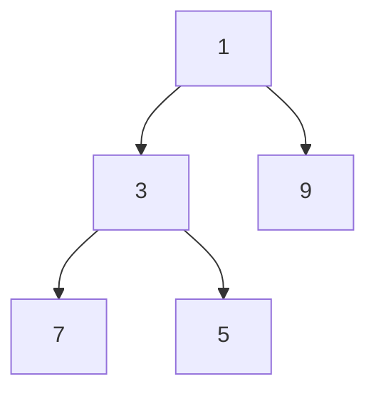
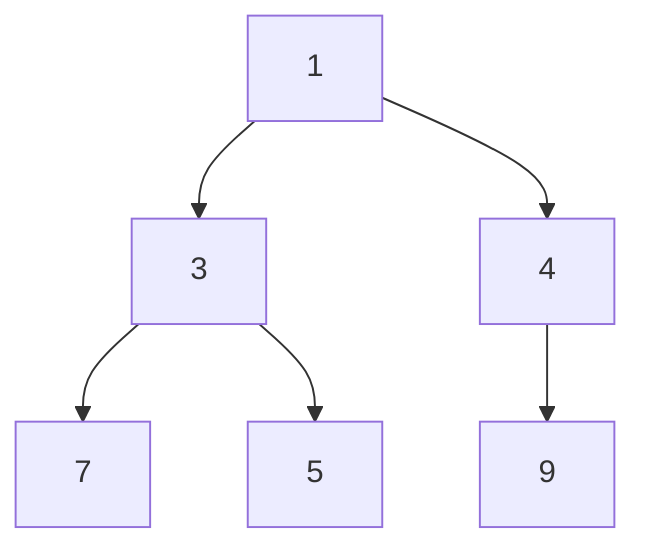
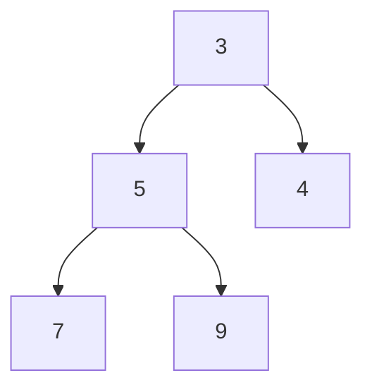

# heapq


## Heapify list : heapify

```python
import heapq

l = [5, 7, 9 ,1 ,3]
heapq.heapify(l)
print(l)
```

> [1, 3, 9, 7, 5]




## Inserting element : push

```python
heapq.heappush(l, 4)
print(l)
```

> [1, 3, 4, 7, 5, 9]




## Pop element : pop

```python
print(heapq.heappop(l))
print(l)
```

>1						/ 맨 앞값을 꺼냄 (= 최소값)
>[3, 5, 4, 7, 9]




## Push and Pop Simultaneously


1. **Push then Pop : heappushpop**

	```python
	l = [3, 5, 4, 7, 9]
	print(heapq.heappushpop(l,2))
	print(l)
	```

	> 2
	> [3, 5, 4, 7, 9]

	

2. **Pop then Push : heapreplace**

	```python
	l = [3, 5, 4, 7, 9]
	print(heapq.heapreplace(l,2))
	print(l)
	```

	>3
	>[2, 5, 4, 7, 9]


## Finding largest/ smallest numbers in heap

```python
l = [6, 7, 9, 4, 3, 5, 8, 10, 1] 
heapq.heapify(l)
print(heapq.nlargest(3, l))
print(heapq.nsmallest(3, l))
```

>[10, 9, 8]
>[1, 3, 4]


## Merging two sorted iterables

```python
l1 = [1, 5, 3, 7, 9]
l2 = [8, 4, 6, 2] 
l1.sort(); l2.sort()
l= list(heapq.merge(l1,l2))
print(l)
```

> [1, 2, 3, 4, 5, 6, 7, 8, 9, 11]